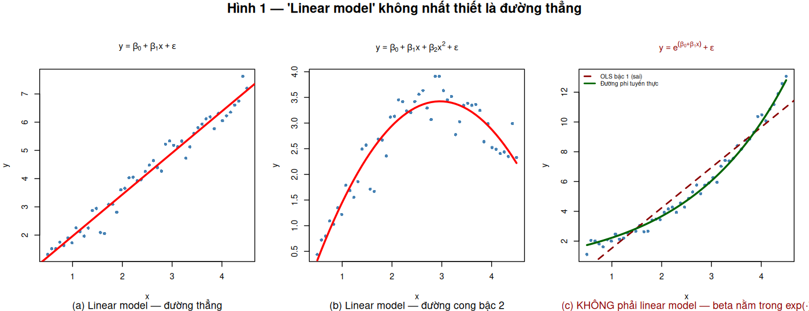
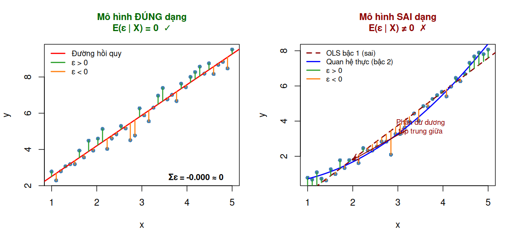
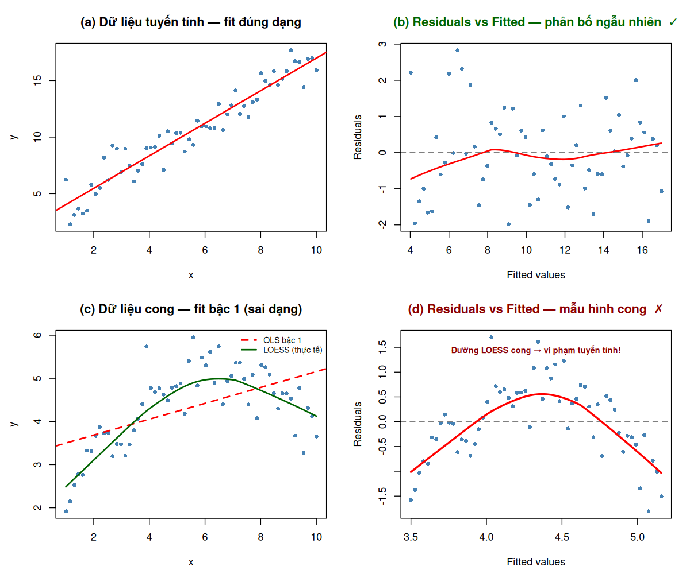
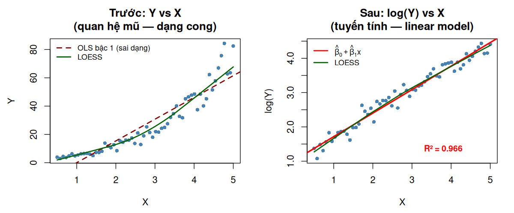

# Giả Định Trong Hồi Quy Bội: Tính Tuyến Tính và Tính Chuẩn

**Đối tượng:** Sinh viên năm cuối / Học viên cao học  
**Phần mềm:** R (>= 4.0)  
**Packages cần cài:** `MASS`, `tseries`, `sandwich`, `lmtest`, `boot`

```r
install.packages(c("MASS", "tseries", "sandwich", "lmtest", "boot"))
```

---

## Mục lục

1. [Giả định Tính Tuyến Tính](#1-giả-định-tính-tuyến-tính)
   - 1.1 Nguồn gốc lịch sử
   - 1.2 Cơ sở lý thuyết
   - 1.3 Phát hiện vi phạm: Residual plots
   - 1.4 Khắc phục: Hồi quy đa thức + So sánh model
   - 1.5 Ví dụ R: dataset `mtcars`
2. [Giả định Tính Chuẩn của Phần Dư](#2-giả-định-tính-chuẩn-của-phần-dư)
   - 2.1 Cơ sở lý thuyết
   - 2.2 Công cụ trực quan
   - 2.3 Kiểm định hình thức
   - 2.4 Hậu quả khi vi phạm
   - 2.5 Giải pháp thay thế
   - 2.6 Ví dụ R: dataset `Boston`

---

## 1. Giả Định Tính Tuyến Tính

### 1.1 Nguồn Gốc Lịch Sử

Giả định về tính tuyến tính gắn liền với sự ra đời của phân tích hồi quy, bắt nguồn từ ba dòng nghiên cứu độc lập ở nửa cuối thế kỷ 19.

**Ứng dụng đầu tiên từ lý thuyết vật lý — James D. Forbes (1857)**  
Trong khoa học tự nhiên, giả định tuyến tính đôi khi được đúc kết trực tiếp từ lý thuyết vật lý có sẵn. Nhà nghiên cứu **James D. Forbes** (1857) có một lý thuyết cho rằng logarit của áp suất khí quyển (log(pres)) có *mối quan hệ tuyến tính* với điểm sôi của nước — quan hệ này có nền tảng vật lý từ phương trình Clausius-Clapeyron. Tài liệu của Forbes được xem là một trong những ví dụ sớm nhất về việc dùng biểu đồ tóm tắt (summary graph) để minh họa hàm trung bình tuyến tính dựa trên mô hình vật lý.

**Nguồn gốc thuật ngữ "Hồi quy" — Sir Francis Galton (1877–1886)**  
Nhiều ý tưởng nền tảng của hồi quy xuất hiện lần đầu trong các công trình của **Sir Francis Galton (1822–1911)** về sự di truyền đặc tính qua các thế hệ. Vào năm 1877, ông bắt đầu bằng các thí nghiệm trên loài đậu hoa ngọt (sweet peas) để quan sát sự di truyền kích thước hạt. Đến năm 1886, khi biểu diễn hàm trung bình bằng đường thẳng cho dữ liệu chiều cao qua các thế hệ, Galton nhận ra một kết quả đáng ngạc nhiên: các giá trị cực đoan ở thế hệ trước có xu hướng "hồi quy" (*regress*) về phía giá trị trung bình quần thể ở thế hệ sau. Đây là nguồn gốc lịch sử của thuật ngữ *regression* trong thống kê.

**Sự tiếp nối — Karl Pearson (1893–1903)**  
Dựa trên ý tưởng của Galton, **Karl Pearson (1857–1936)** mở rộng sang nghiên cứu di truyền học ở người. Trong giai đoạn 1893–1898, ông tổ chức thu thập dữ liệu về chiều cao của các bà mẹ và con gái trưởng thành. Bộ dữ liệu này được Pearson và Lee công bố năm 1903 để kiểm tra liệu các bà mẹ cao có xu hướng sinh con gái cao hay không — thông qua phương trình hồi quy tuyến tính.

> **Lưu ý phạm vi lịch sử:** Ba dòng nghiên cứu trên là lịch sử của việc *mô hình hóa quan hệ bằng đường thẳng*. Nền tảng tính toán — phương pháp bình phương nhỏ nhất (OLS) — được phát triển độc lập bởi Gauss và Legendre từ đầu thế kỷ 19 (~1805–1809), và OLS chỉ đảm bảo ước lượng tối ưu (BLUE theo định lý Gauss-Markov) khi dạng hàm được chỉ định đúng — tức là quan hệ thực sự là tuyến tính.

> **Hệ quả thực tiễn:** Nếu quan hệ thực sự là phi tuyến nhưng ta vẫn dùng mô hình tuyến tính, ước lượng OLS trở nên chệch và không nhất quán — mọi kiểm định và dự báo đều sai.

---

### 1.2 Cơ Sở Lý Thuyết

Mô hình hồi quy bội tổng quát:

```
Y = β₀ + β₁X₁ + β₂X₂ + ... + βₚXₚ + ε
```

Giả định tuyến tính phát biểu rằng:

```
E[Y | X₁, X₂, ..., Xₚ] = β₀ + β₁X₁ + ... + βₚXₚ
```

Hay nói cách khác: **kỳ vọng có điều kiện của Y là một hàm tuyến tính trong các tham số β**.

#### Ý nghĩa cốt lõi 1: Cấu trúc đại số của các tham số β

"Tuyến tính" ở đây là thuộc tính về **cấu trúc đại số của β**, không phải hình dáng của dữ liệu. Cụ thể, các tham số β₀, β₁, ..., βₖ phải:
- Xuất hiện ở **bậc một** (không có β², β³,...)
- Đứng **độc lập**, không lồng trong hàm phi tuyến
- Được **cộng lại** với nhau để tạo thành dự báo

Bạn sẽ không bao giờ thấy dạng β², e^β, hay sin(β) trong một *linear model*.

#### Ý nghĩa cốt lõi 2: Sự tự do của các biến x

Ngược lại, **mô hình không đặt bất kỳ ràng buộc nào lên các biến x**. Bạn hoàn toàn có thể transform x thành bất kỳ dạng phi tuyến nào mà lý thuyết hoặc dữ liệu yêu cầu — bình phương, nghịch đảo, logarit, hàm lượng giác,... — và mô hình vẫn là *linear model*.

Ví dụ, phương trình sau đây chứa đồng thời nghịch đảo (x₂⁻¹), bình phương (x₂²) và hàm sin (sin(x₂)):

```
y = β₀ + β₁x₁ + β₂x₂⁻¹ + β₃x₂² + β₄sin(x₂) + ε
```

Mô hình này **vẫn là linear model** vì β₀, β₁, β₂, β₃, β₄ đều xuất hiện ở bậc một và được cộng lại — chỉ có x bị biến đổi, không phải β.

**Phân biệt nhanh qua ví dụ:**

| Dạng mô hình | Tuyến tính trong β? | Lý do |
|---|---|---|
| Y = β₀ + β₁X + ε | **Có** | β bậc một, cộng tính |
| Y = β₀ + β₁X + β₂X² + ε | **Có** | X² là biến mới — β vẫn bậc một |
| Y = β₀ + β₁log(X) + β₂X⁻¹ + ε | **Có** | log(X), X⁻¹ là biến mới — β vẫn bậc một |
| Y = β₀ · exp(β₁X) + ε | **Không** | β₁ nằm trong exp(·) — phi tuyến trong β |
| Y = β₀ + X^β₁ + ε | **Không** | β₁ là số mũ của X — phi tuyến trong β |

> **Hệ quả thực tiễn:** Nhờ đặc tính này, khuôn khổ hồi quy tuyến tính có thể xấp xỉ vô số quan hệ cong, phức tạp trong thực tế — chỉ bằng cách transform các biến x — trong khi vẫn giữ nguyên phương pháp tính toán OLS. Hồi quy đa thức là ví dụ điển hình: ta chỉ tạo thêm biến X², X³,... rồi đưa vào mô hình tuyến tính thông thường.

**Minh họa hình học — ba trường hợp đặc trưng:**



**(a)** Model bậc 1 → đường thẳng. **(b)** Model bậc 2 → đường parabol — vẫn là linear model vì β₀, β₁, β₂ đều bậc một. **(c)** y = exp(β₀ + β₁x) — β₁ nằm trong exp(·), đây là mô hình phi tuyến trong β, OLS không áp dụng trực tiếp được.

#### Liên hệ với giả định E(ε | X) = 0

Giả định tuyến tính và giả định E(ε | X) = 0 thực chất là **hai mặt của cùng một yêu cầu**: khi dạng hàm E[Y|X] được chỉ định đúng, phần dư chỉ là nhiễu ngẫu nhiên thuần túy — kỳ vọng của chúng bằng 0 tại mọi giá trị X. Khi dạng hàm sai, phần dư mang theo thông tin có hệ thống, và E(ε|X) ≠ 0.



Bên trái: Phần dư dương (xanh) và âm (cam) phân bố đều hai phía — Σε ≈ 0 tại mọi vùng của X. Bên phải: Dùng đường thẳng cho dữ liệu dạng cong → phần dư dương tập trung ở giữa, phần dư âm ở hai đầu — E(ε|X) có mẫu hình hệ thống.

---

### 1.3 Phát Hiện Vi Phạm: Residual Plots

Sau khi fit mô hình, phần dư được định nghĩa là:

```
eᵢ = yᵢ - ŷᵢ
```

Nếu mô hình đúng dạng tuyến tính, phần dư phải **phân bố ngẫu nhiên quanh 0** — không có mẫu hình (pattern) nào.

#### Residuals vs Fitted Plot

Đây là biểu đồ cơ bản nhất để kiểm tra tính tuyến tính. Trục x là giá trị fitted (ŷ), trục y là phần dư (e).

- **Không vi phạm:** Các điểm nằm rải rác ngẫu nhiên quanh đường y = 0, đường LOESS gần thẳng nằm ngang.
- **Vi phạm:** Đường LOESS tạo thành dạng cong (chữ U, chữ S) — dấu hiệu quan hệ phi tuyến bị bỏ sót.

**Minh họa hình học — residual plot tốt vs. xấu:**



**(a)–(b)** Dữ liệu tuyến tính: scatter plot không có xu hướng còn sót, residual plot phân bố ngẫu nhiên quanh 0 — đường LOESS (đỏ) gần nằm ngang. **(c)–(d)** Dữ liệu dạng cong nhưng fit bằng bậc 1: scatter plot đã thấy OLS bỏ lỡ phần giữa, residual plot xác nhận rõ ràng qua đường LOESS cong hình chữ U.

> **Quy tắc đọc:** Nếu đường LOESS trong residual plot lệch khỏi y = 0 một cách có hệ thống (không phải dao động ngẫu nhiên) → vi phạm tính tuyến tính.

#### Partial Regression Plot (Added Variable Plot)

Khi có nhiều biến, residual vs fitted plot chỉ cho thấy vi phạm tổng thể. **Partial regression plot** giúp xác định *biến cụ thể nào* vi phạm tuyến tính.

Ý tưởng: Với biến Xⱼ bất kỳ, hồi quy cả Y và Xⱼ lên tất cả các biến còn lại, lấy hai tập residuals, rồi vẽ scatter plot của hai tập residuals đó. Nếu quan hệ cong → Xⱼ cần được transform hoặc thêm bậc cao hơn.

---

### 1.4 Khắc Phục: Hồi Quy Đa Thức + So Sánh Model

#### Mô hình đa thức bậc k

```
Y = β₀ + β₁X + β₂X² + ... + βₖXᵏ + ε
```

Trong R, dùng hàm `poly(X, k)` thay vì tự tạo X², X³ thủ công. `poly()` tạo ra các đa thức **trực giao** (orthogonal polynomials), giúp tránh đa cộng tuyến (multicollinearity) giữa X, X², X³,...

#### So sánh model: ANOVA (F-test cho nested models)

Khi so sánh model đơn giản hơn (restricted) với model phức tạp hơn (full), ta dùng F-test:

```
H₀: Model đơn giản hơn là đủ (các hệ số bậc cao = 0)
H₁: Model phức tạp hơn cần thiết
```

Nếu p-value < 0.05: model phức tạp hơn cải thiện đáng kể.

#### So sánh model: AIC và BIC

Khi so sánh các model **không nhất thiết lồng nhau** (non-nested), hoặc muốn cân bằng giữa fit và độ phức tạp:

```
AIC = -2·log(L) + 2k        (k = số tham số)
BIC = -2·log(L) + k·log(n)  (phạt nặng hơn khi n lớn)
```

**Quy tắc:** AIC/BIC càng **nhỏ** càng tốt. Chênh lệch ΔAIC > 2 đã có ý nghĩa.

| Tiêu chí | Ưu điểm | Hạn chế |
|---|---|---|
| ANOVA | Kiểm định chính xác cho nested models | Chỉ áp dụng cho nested models |
| AIC | Linh hoạt, tốt cho dự báo | Có thể chọn model quá phức tạp với n nhỏ |
| BIC | Phạt nặng hơn → chọn model đơn giản hơn | Đôi khi quá conservative |

> **Cảnh báo overfitting:** Bậc đa thức quá cao (k ≥ 5) thường overfit — model khớp tốt với dữ liệu training nhưng dự báo kém trên dữ liệu mới. Ưu tiên model đơn giản nhất mà vẫn giải thích được xu hướng chính.

#### Giải pháp thay thế: Biến đổi biến số (Variable Transformation)

Khi quan hệ có dạng **mũ hoặc lũy thừa**, biến đổi logarit thường hiệu quả hơn polynomial. Thay vì thêm bậc cao, ta biến đổi trực tiếp Y hoặc X để "kéo thẳng" quan hệ:

| Dạng quan hệ thực | Biến đổi gợi ý | Model sau transform |
|---|---|---|
| Y = β₀ · exp(β₁X) | log(Y) | log(Y) = γ₀ + γ₁X |
| Y = β₀ · X^β₁ | log(Y) và log(X) | log(Y) = γ₀ + γ₁log(X) |
| Y = β₀ / (β₁ + X) | 1/Y hoặc 1/X | — |

**Minh họa hình học — tác dụng của biến đổi log:**



Bên trái: Y vs X cho thấy dạng cong mũ rõ ràng — OLS bậc 1 (đường đứt đỏ) bỏ lỡ xu hướng. Bên phải: log(Y) vs X cho phân bố tuyến tính — OLS và LOESS trùng khớp, R² tăng đáng kể.

> **Khi nào dùng transform vs. polynomial?** Transform log phù hợp khi dữ liệu có dạng mũ/lũy thừa và cho kết quả diễn giải tự nhiên (ví dụ: hệ số β₁ trong log(Y) ~ X là phần trăm thay đổi của Y). Polynomial phù hợp hơn khi quan hệ có đỉnh/đáy (dạng hình chữ U) hoặc khó đoán dạng hàm.

---

### 1.5 Ví Dụ R: Dataset `mtcars`

**Bài toán:** Dự báo lượng nhiên liệu tiêu thụ (`mpg`) từ công suất động cơ (`hp`). Liệu quan hệ này có tuyến tính không?

#### Bước 1: Khám phá dữ liệu và fit model tuyến tính

```r
# Dataset mtcars có sẵn trong R
data(mtcars)

# Scatter plot ban đầu
plot(mtcars$hp, mtcars$mpg,
     xlab = "Horsepower (hp)",
     ylab = "Miles per gallon (mpg)",
     main = "mpg vs hp",
     pch = 16, col = "steelblue")

# Fit model tuyến tính bậc 1
model_linear <- lm(mpg ~ hp, data = mtcars)
abline(model_linear, col = "red", lwd = 2)
```

```r
# Kiểm tra residual plot
par(mfrow = c(1, 2))

# Residuals vs Fitted
plot(model_linear, which = 1,
     main = "Residuals vs Fitted (Linear)")

# Q-Q plot của residuals (xem trước phần 2)
plot(model_linear, which = 2)
```

> **Quan sát:** Đường LOESS trong Residuals vs Fitted plot có dạng cong (chữ U) — dấu hiệu rõ ràng của vi phạm tuyến tính. Dữ liệu gợi ý quan hệ giảm nhanh rồi chậm dần (dạng lũy thừa hoặc đa thức bậc 2).

#### Bước 2: Fit model đa thức bậc 2 và bậc 3

```r
# Model bậc 2 (quadratic)
model_quad <- lm(mpg ~ poly(hp, 2), data = mtcars)

# Model bậc 3 (cubic)
model_cubic <- lm(mpg ~ poly(hp, 3), data = mtcars)

# Tóm tắt model bậc 2
summary(model_quad)
```

Kết quả mẫu:
```
Coefficients:
             Estimate Std. Error t value Pr(>|t|)
(Intercept)   20.091      0.570  35.24   <2e-16 ***
poly(hp, 2)1 -26.045      3.225  -8.08   8.3e-09 ***
poly(hp, 2)2   8.720      3.225   2.70    0.011 *
```

Hệ số bậc 2 có ý nghĩa thống kê (p = 0.011) → quan hệ phi tuyến được xác nhận.

#### Bước 3: So sánh model bằng ANOVA và AIC/BIC

```r
# F-test: so sánh nested models
anova(model_linear, model_quad, model_cubic)
```

Kết quả mẫu:
```
Analysis of Variance Table

Model 1: mpg ~ hp
Model 2: mpg ~ poly(hp, 2)
Model 3: mpg ~ poly(hp, 3)
  Res.Df    RSS Df Sum of Sq      F    Pr(>F)
1     30 447.67
2     29 360.37  1    87.303  7.309  0.01149 *
3     28 334.55  1    25.816  2.161  0.15261
```

**Diễn giải:** Model bậc 2 cải thiện đáng kể so với bậc 1 (p = 0.011). Model bậc 3 không thêm giá trị (p = 0.153). **Kết luận: chọn model bậc 2.**

```r
# So sánh AIC và BIC
AIC(model_linear, model_quad, model_cubic)
BIC(model_linear, model_quad, model_cubic)
```

Kết quả mẫu:
```
             df      AIC
model_linear  3  181.394
model_quad    4  175.665   ← nhỏ nhất
model_cubic   5  175.880

             df      BIC
model_linear  3  185.887
model_quad    4  181.653   ← nhỏ nhất
model_cubic   5  183.364
```

Cả AIC và BIC đều chỉ model bậc 2 là tốt nhất. Kết quả nhất quán với ANOVA.

#### Bước 4: Trực quan hóa kết quả

```r
# Vẽ fitted curves cho cả 3 model
hp_seq <- seq(min(mtcars$hp), max(mtcars$hp), length.out = 200)
new_data <- data.frame(hp = hp_seq)

pred_linear <- predict(model_linear, newdata = new_data)
pred_quad   <- predict(model_quad,   newdata = new_data)
pred_cubic  <- predict(model_cubic,  newdata = new_data)

plot(mtcars$hp, mtcars$mpg,
     xlab = "Horsepower (hp)", ylab = "mpg",
     main = "So sánh Linear vs Polynomial",
     pch = 16, col = "gray50")

lines(hp_seq, pred_linear, col = "red",    lwd = 2, lty = 2)
lines(hp_seq, pred_quad,   col = "blue",   lwd = 2)
lines(hp_seq, pred_cubic,  col = "green4", lwd = 2, lty = 3)

legend("topright",
       legend = c("Linear", "Quadratic (AIC tốt nhất)", "Cubic"),
       col    = c("red", "blue", "green4"),
       lwd    = 2,
       lty    = c(2, 1, 3))
```

> **Kết luận phần 1:** Với dữ liệu `mtcars`, quan hệ giữa `hp` và `mpg` là phi tuyến. Model đa thức bậc 2 cải thiện đáng kể so với model tuyến tính (ΔAIC ≈ 5.7, F-test p < 0.05) mà không làm tăng độ phức tạp quá mức.

---

## 2. Giả Định Tính Chuẩn Của Phần Dư

### 2.1 Cơ Sở Lý Thuyết

Mô hình hồi quy bội giả định:

```
εᵢ ~ N(0, σ²)  i.i.d.    (i = 1, 2, ..., n)
```

Tức là **phần dư** (không phải Y) phải phân phối chuẩn, có kỳ vọng 0 và phương sai đồng nhất σ².

#### Tại sao giả định này quan trọng?

Các suy diễn thống kê chuẩn trong hồi quy đều *phụ thuộc trực tiếp* vào giả định này:

- **t-test** cho từng hệ số: t = β̂ⱼ / SE(β̂ⱼ) ~ t(n-p-1) **chỉ khi** ε chuẩn
- **F-test** cho mô hình tổng thể: tương tự
- **Confidence intervals**: β̂ⱼ ± t* · SE(β̂ⱼ) chỉ chính xác khi ε chuẩn

Khi n đủ lớn, **Định lý Giới hạn Trung tâm (CLT)** giúp suy diễn vẫn gần đúng ngay cả khi ε không chuẩn hoàn toàn. Tuy nhiên, "đủ lớn" phụ thuộc vào mức độ vi phạm — không có ngưỡng tuyệt đối.

#### Điểm dễ nhầm: Normality của Y ≠ Normality của residuals

> **Sai lầm phổ biến:** Nhiều người kiểm tra phân phối của Y thay vì residuals.

Xét ví dụ đơn giản: Y = 2X + ε, với X ~ Uniform(0, 10) và ε ~ N(0, 1). Biến Y sẽ **không** phân phối chuẩn (nó trông gần như Uniform). Nhưng residuals từ mô hình đúng vẫn chuẩn.

**Quy tắc:** Luôn kiểm tra phân phối của **residuals sau khi fit mô hình**, không phải của Y trước khi fit.

---

### 2.2 Công Cụ Trực Quan

#### Histogram của residuals

```r
hist(residuals(model),
     breaks = 20,
     freq   = FALSE,
     col    = "lightblue",
     border = "white",
     main   = "Histogram of Residuals",
     xlab   = "Residuals")

# Thêm đường cong chuẩn lý thuyết
curve(dnorm(x, mean = mean(residuals(model)),
            sd   = sd(residuals(model))),
      add = TRUE, col = "red", lwd = 2)
```

Dấu hiệu vi phạm qua histogram:
- **Lệch phải/trái** (skewed): đuôi một bên dài hơn
- **Đuôi nặng** (heavy-tailed / leptokurtic): đỉnh nhọn, đuôi dày
- **Đa đỉnh** (bimodal): gợi ý có biến phân loại bị bỏ qua hoặc dữ liệu từ 2 quần thể

#### Q-Q Plot (Quantile-Quantile Plot)

Q-Q plot so sánh quantile của residuals thực tế với quantile của phân phối chuẩn lý thuyết. Nếu residuals chuẩn, các điểm nằm **trên đường thẳng chéo**.

```r
qqnorm(residuals(model), main = "Normal Q-Q Plot")
qqline(residuals(model), col = "red", lwd = 2)
```

**Cách đọc Q-Q plot:**

| Mẫu hình quan sát | Diễn giải |
|---|---|
| Các điểm trên đường thẳng | Phân phối chuẩn |
| Điểm hai đầu lệch lên trên (S-shape) | Heavy-tailed (đuôi nặng hai phía) |
| Điểm hai đầu lệch xuống dưới | Thin-tailed |
| Đuôi phải lệch lên | Lệch phải (right-skewed) |
| Đuôi trái lệch xuống | Lệch trái (left-skewed) |

> **Lưu ý thực hành:** Q-Q plot nhạy hơn histogram trong việc phát hiện lệch ở đuôi phân phối — ưu tiên dùng Q-Q plot khi mẫu nhỏ.

---

### 2.3 Kiểm Định Hình Thức

#### Shapiro-Wilk Test

Kiểm định mạnh nhất cho **mẫu nhỏ** (n < 50, một số tài liệu cho phép đến n ≈ 2000).

```
H₀: Dữ liệu có phân phối chuẩn
H₁: Dữ liệu không có phân phối chuẩn
```

Thống kê W nằm trong [0, 1]. W càng gần 1 → dữ liệu càng gần chuẩn.

```r
shapiro.test(residuals(model))
```

Kết quả mẫu:
```
Shapiro-Wilk normality test

data:  residuals(model)
W = 0.94823, p-value = 0.1349
```

p-value = 0.135 > 0.05 → không đủ bằng chứng bác bỏ H₀ → residuals tương thích với phân phối chuẩn.

> **Hạn chế quan trọng của Shapiro-Wilk với n lớn:** Khi n > 200-300, test trở nên **quá nhạy** — phát hiện những lệch nhỏ không có ý nghĩa thực tế. Với mẫu lớn, dựa vào Q-Q plot và CLT quan trọng hơn kết quả kiểm định.

#### Jarque-Bera Test

Phù hợp cho **mẫu lớn**, đặc biệt phổ biến trong kinh tế lượng.

Ý tưởng: Phân phối chuẩn có **skewness = 0** và **excess kurtosis = 0**. Jarque-Bera kiểm tra đồng thời cả hai:

```
JB = (n/6) · [S² + (K²/4)]

Trong đó:
  S = skewness của residuals
  K = excess kurtosis = kurtosis - 3
  JB ~ χ²(2) dưới H₀
```

```r
library(tseries)
jarque.bera.test(residuals(model))
```

Kết quả mẫu:
```
Jarque Bera Test

data:  residuals(model)
X-squared = 2.6713, df = 2, p-value = 0.2629
```

p-value = 0.263 > 0.05 → không bác bỏ H₀ chuẩn tắc.

#### Bảng so sánh hai kiểm định

| Tiêu chí | Shapiro-Wilk | Jarque-Bera |
|---|---|---|
| Cỡ mẫu phù hợp | n nhỏ (< 50) đến vừa | n lớn |
| Loại sai lệch phát hiện | Tổng quát | Skewness + Kurtosis |
| Độ nhạy với n lớn | Quá nhạy | Ổn định hơn |
| Package R | Base R | `tseries` |
| Phổ biến trong | Thống kê tổng quát | Kinh tế lượng |

> **Khuyến nghị thực hành:** Dùng cả hai kiểm định kết hợp với trực quan (histogram + Q-Q plot). Kết luận cuối cùng nên dựa trên sự nhất quán giữa các phương pháp, không chỉ một p-value.

---

### 2.4 Hậu Quả Khi Vi Phạm

Khi ε không phân phối chuẩn:

**1. p-value bị sai lệch:**  
t-statistic và F-statistic không còn theo phân phối t và F lý thuyết. p-value tính ra có thể nhỏ hơn hoặc lớn hơn giá trị thực → kết luận về ý nghĩa thống kê không đáng tin.

**2. Confidence interval không chính xác:**  
CI dạng `β̂ ± t* · SE` dựa trên giả định chuẩn. Khi vi phạm, khoảng tin cậy thực sự có thể hẹp hơn hoặc rộng hơn dự kiến → độ phủ (coverage) thực tế không đạt 95%.

**3. Mức độ nghiêm trọng phụ thuộc vào n:**

| Cỡ mẫu | Hậu quả khi vi phạm |
|---|---|
| n nhỏ (< 30) | Nghiêm trọng — cần xử lý |
| n vừa (30–100) | Đáng lo ngại nếu vi phạm nặng |
| n lớn (> 200) | Nhẹ hơn nhờ CLT — robust SE thường đủ |

> **Ước lượng OLS (β̂) vẫn không chệch ngay cả khi vi phạm chuẩn tắc.** Vấn đề nằm ở *suy diễn* (p-value, CI), không phải ở *ước lượng điểm*.

---

### 2.5 Giải Pháp Thay Thế

#### Bootstrap Confidence Intervals

Bootstrap là phương pháp **resampling** — không cần giả định phân phối của ε. Thay vì dựa vào phân phối lý thuyết, ta ước lượng phân phối mẫu của β̂ trực tiếp từ dữ liệu.

```r
library(boot)

# Định nghĩa hàm để extract hệ số
boot_coef <- function(data, indices) {
  d <- data[indices, ]  # resample
  fit <- lm(medv ~ lstat + rm, data = d)
  return(coef(fit))
}

# Chạy bootstrap với B = 1000 lần resample
set.seed(42)
boot_results <- boot(data    = Boston,
                     statistic = boot_coef,
                     R       = 1000)

# Bootstrap CI cho hệ số của lstat (index 2)
boot.ci(boot_results, type = "perc", index = 2)
```

Kết quả mẫu:
```
BOOTSTRAP CONFIDENCE INTERVALS CALCULATIONS

Intervals :
Level     Percentile
95%   (-0.6248, -0.4763 )
```

**Ưu điểm:** Không cần giả định phân phối, phù hợp với vi phạm bất kỳ.  
**Nhược điểm:** Chậm hơn, cần chọn B đủ lớn (B ≥ 1000, tốt nhất 5000+).

#### Robust Standard Errors (HC Standard Errors)

Robust SE (Heteroscedasticity-Consistent SE) điều chỉnh sai số chuẩn mà không cần giả định phân phối cụ thể.

```r
library(sandwich)
library(lmtest)

model <- lm(medv ~ lstat + rm, data = Boston)

# So sánh: OLS thông thường vs Robust SE
# OLS chuẩn
coeftest(model)

# Robust SE (HC3 - khuyến nghị mặc định)
coeftest(model, vcov = vcovHC(model, type = "HC3"))
```

Kết quả so sánh mẫu:
```
--- OLS Standard ---
             Estimate Std. Error t value  Pr(>|t|)
(Intercept)  -1.3583    2.8746  -0.473   0.637
lstat        -0.5424    0.0472 -11.491  <2e-16 ***
rm            5.0947    0.4442  11.469  <2e-16 ***

--- Robust SE (HC3) ---
             Estimate Std. Error t value  Pr(>|t|)
(Intercept)  -1.3583    3.2017  -0.424   0.671
lstat        -0.5424    0.0548  -9.898  <2e-16 ***
rm            5.0947    0.5210   9.779  <2e-16 ***
```

SE tăng lên với Robust SE, nhưng kết luận về ý nghĩa thống kê giữ nguyên trong ví dụ này.

#### Khi nào dùng phương pháp nào?

| Tình huống | Khuyến nghị |
|---|---|
| Vi phạm nhẹ, n vừa/lớn | Robust SE (HC3) — đơn giản, nhanh |
| Vi phạm nặng, n bất kỳ | Bootstrap CI |
| n rất nhỏ (< 30), vi phạm nặng | Xem xét transform Y (log, sqrt) hoặc mô hình khác |
| n lớn (> 200), vi phạm nhẹ | CLT đủ mạnh — OLS thông thường chấp nhận được |

---

### 2.6 Ví Dụ R: Dataset `Boston`

**Bài toán:** Dự báo giá trị nhà trung vị (`medv`) từ tỷ lệ dân số thu nhập thấp (`lstat`) và số phòng trung bình (`rm`).

#### Bước 1: Fit mô hình và lấy residuals

```r
library(MASS)
data(Boston)

model_boston <- lm(medv ~ lstat + rm, data = Boston)
summary(model_boston)

# Lấy residuals
resid_boston <- residuals(model_boston)

cat("Skewness:", round(moments::skewness(resid_boston), 3), "\n")
cat("Excess Kurtosis:", round(moments::kurtosis(resid_boston) - 3, 3), "\n")
```

#### Bước 2: Trực quan hóa

```r
par(mfrow = c(1, 2))

# Histogram với đường chuẩn
hist(resid_boston,
     breaks = 30, freq = FALSE,
     col = "lightblue", border = "white",
     main = "Histogram of Residuals",
     xlab = "Residuals")
curve(dnorm(x, mean = 0, sd = sd(resid_boston)),
      add = TRUE, col = "red", lwd = 2)

# Q-Q plot
qqnorm(resid_boston, main = "Normal Q-Q Plot")
qqline(resid_boston, col = "red", lwd = 2)
```

> **Quan sát:** Histogram lệch phải, Q-Q plot có đuôi phải nằm cao hơn đường thẳng — dấu hiệu phân phối lệch phải (right-skewed).

#### Bước 3: Kiểm định hình thức

```r
# Shapiro-Wilk (cẩn thận với n = 506)
shapiro.test(resid_boston)

# Jarque-Bera (phù hợp hơn với n lớn)
library(tseries)
jarque.bera.test(resid_boston)
```

Kết quả mẫu:
```
Shapiro-Wilk: W = 0.9266, p-value = 2.7e-17  ← bác bỏ H₀
Jarque-Bera:  X-squared = 256.8, p-value < 2.2e-16  ← bác bỏ H₀
```

> **Lưu ý:** Cả hai test đều bác bỏ chuẩn tắc với n = 506. Đây là ví dụ thực tế về "test quá nhạy với n lớn". Ta cần xem xét thêm liệu vi phạm có đủ nghiêm trọng để ảnh hưởng đến suy diễn không.

#### Bước 4: So sánh OLS vs Robust SE

```r
library(sandwich)
library(lmtest)

# Kết quả OLS chuẩn
cat("=== OLS Standard Errors ===\n")
coeftest(model_boston)

# Robust SE
cat("\n=== Robust Standard Errors (HC3) ===\n")
coeftest(model_boston, vcov = vcovHC(model_boston, type = "HC3"))
```

#### Bước 5: Bootstrap CI

```r
library(boot)

boot_fn <- function(data, indices) {
  fit <- lm(medv ~ lstat + rm, data = data[indices, ])
  coef(fit)
}

set.seed(123)
boot_out <- boot(Boston, boot_fn, R = 2000)

cat("\n=== Bootstrap 95% CI cho lstat ===\n")
boot.ci(boot_out, type = c("perc", "bca"), index = 2)

cat("\n=== Bootstrap 95% CI cho rm ===\n")
boot.ci(boot_out, type = c("perc", "bca"), index = 3)
```

```r
# Tóm tắt so sánh 3 phương pháp
cat("\n=== Tóm tắt: CI cho hệ số 'lstat' ===\n")
cat("OLS    :", round(confint(model_boston)["lstat",], 4), "\n")
cat("Robust :", round(coefci(model_boston,
                             vcov = vcovHC(model_boston))["lstat",], 4), "\n")
cat("Boot   : xem boot.ci output ở trên\n")
```

> **Kết luận phần 2:** Dataset `Boston` vi phạm giả định chuẩn tắc ở mức đáng chú ý (lệch phải). Với n = 506, Robust SE là lựa chọn hợp lý — đơn giản, hiệu quả, không cần giả định phân phối. Bootstrap CI cho kết quả tương tự và cung cấp thêm xác nhận độc lập.

---

## Tổng Kết

| | Giả định Tuyến tính | Giả định Chuẩn tắc |
|---|---|---|
| **Phát biểu** | E[Y\|X] = Xβ | ε ~ N(0, σ²) |
| **Ảnh hưởng khi vi phạm** | Ước lượng β̂ chệch | p-value, CI không chính xác |
| **Phát hiện** | Residuals vs Fitted plot | Q-Q plot, histogram |
| **Kiểm định** | — | Shapiro-Wilk, Jarque-Bera |
| **Khắc phục** | Polynomial regression | Robust SE, Bootstrap |
| **Dataset ví dụ** | `mtcars`: hp → mpg | `Boston`: lstat + rm → medv |

> **Lời khuyên tổng quát:** Không có mô hình nào thỏa mãn hoàn hảo tất cả giả định trong thực tế. Mục tiêu là đánh giá *mức độ vi phạm* và *hậu quả thực tế* của nó, không phải tìm kiếm sự hoàn hảo về mặt thống kê.
