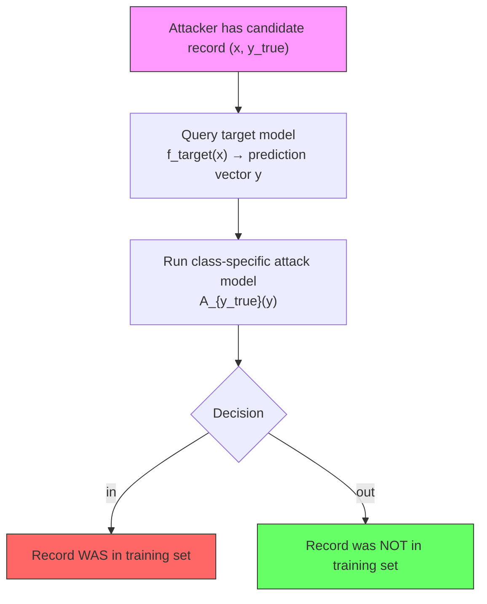
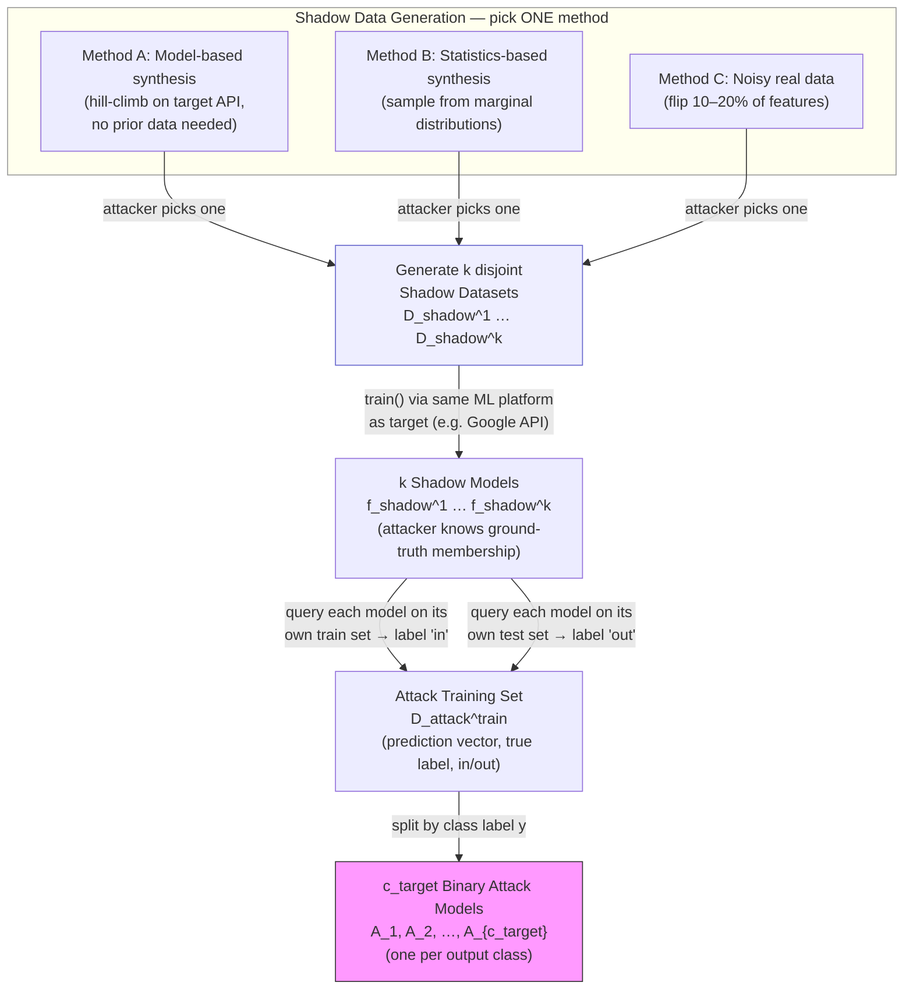
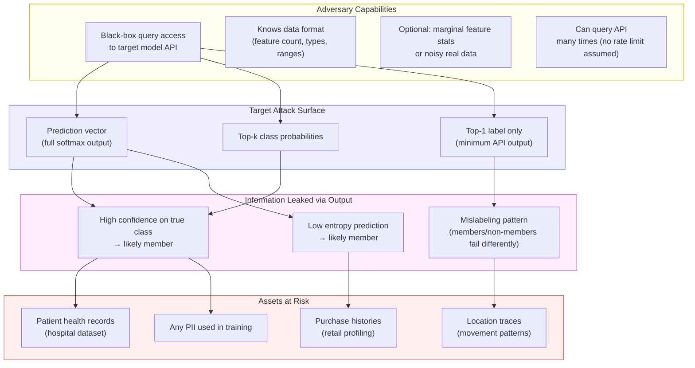
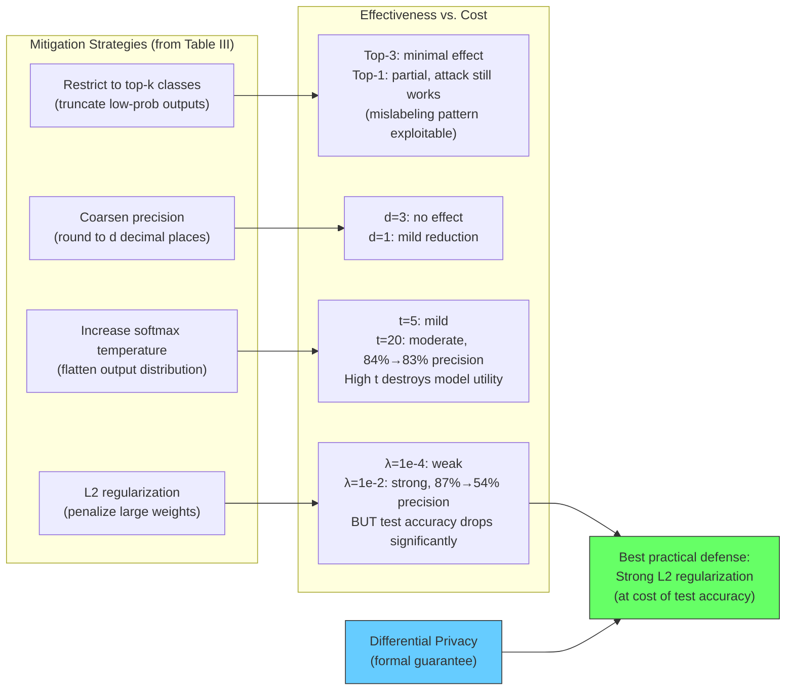
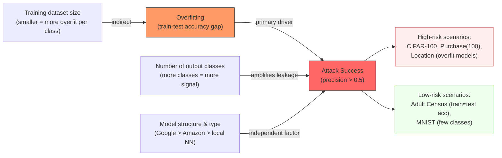

# Paper Review: Membership Inference Attacks Against Machine Learning Models

> **Reviewed:** 2026-06-08
> **Source:** `03. Privacy Attacks/membership_inference_shokri_2017.pdf`
> **Authors:** Reza Shokri, Marco Stronati, Congzheng Song, Vitaly Shmatikov (Cornell Tech / INRIA)
> **Venue:** IEEE S&P 2017
> **Reviewer lens:** Senior Security Architect + Senior AI Researcher

---

## 1. Motivation — Why Should We Care?

Machine learning models trained on sensitive data are increasingly exposed as black-box APIs by commercial providers (Google Prediction API, Amazon ML, Azure ML). The fundamental question this paper raises is: **does querying a model's outputs leak information about whether a specific individual's record was used for training?**

This is not an abstract concern. The paper demonstrates it concretely on:
- **Texas hospital discharge data** (patient diagnoses, procedures, demographics) — attack precision >70% on Google-trained models
- **Purchase histories** (Kaggle retail data, 10,000 users) — precision up to 93.5% with real shadow data
- **Location traces** (Foursquare Bangkok check-ins) — precision 60–80%, recall near 1.0

The stakes are high and concrete. Knowing that a patient's clinical record was in the training dataset of a disease-prediction model can directly reveal a diagnosis (e.g., "this model was trained on HIV patients, and your record was used to train it"). The same applies to financial and behavioral profiling. The model owner may have consented to train on the data but not to disclose membership — yet the API enables exactly that.

The motivation is **well-founded and not oversold**. The threat is real, the datasets are realistic, and the commercial API framing is a genuine deployment scenario, not a toy. This is one of the foundational papers in the ML privacy field and the threat it documents is still unresolved in production systems today.

---

## 2. Proposal — What Do the Authors Propose and Why?

The authors propose a **membership inference attack** that, given only black-box query access to a target model and a data record, determines whether that record was part of the model's training set. The core technical contribution is the **shadow training technique**: instead of directly attacking the target model (for which no labeled membership data exists), the attacker trains multiple surrogate "shadow models" that mimic the target model's behavior. Since the attacker controls the shadow models' training sets, ground-truth membership labels are available and can be used to train a binary **attack model** — one per output class — that distinguishes "in-training" from "out-of-training" behavior.

The authors' reasoning for this approach is principled: the fundamental observation is that ML models behave *differently* on training data versus unseen data — specifically, they produce higher-confidence, lower-entropy predictions on training data (a direct consequence of overfitting). The shadow models learn to reproduce this behavioral signature. The attack is then reduced to a standard binary classification problem.

The alternative they implicitly reject is white-box attacks requiring model internals (gradients, weights), which are unavailable from APIs. They also avoid statistical membership tests (e.g., likelihood ratio tests), which require explicit distributional knowledge. The black-box formulation is the right choice for the threat model they describe — it matches real API access patterns exactly. Whether the implicit assumptions about the shadow model's data distribution are realistic is a separate concern addressed in the weaknesses section.

---

## 3. Method — How Does It Work?

### 3.1 Problem Formulation

The target model `f_target` is a multi-class classifier trained on private dataset `D_target^train`. It outputs a **prediction vector** `y = f_target(x)` — a probability distribution over `c_target` classes summing to 1. The attacker has:
- Black-box query access to `f_target`
- A candidate data record `(x, y_true)`
- No knowledge of model architecture, hyperparameters, or training algorithm

**Attack goal:** binary classify `(x, y_true)` as `in` (member) or `out` (non-member).

Attack success is measured per-class by **precision** (fraction of inferred members that are true members) and **recall** (fraction of true members correctly inferred). Baseline random precision = 0.5.

### 3.2 Shadow Models

The attacker creates `k` shadow models `{f_shadow^i}`, each trained on a dataset `D_shadow^i` of the same format as `D_target^train` but **disjoint from it** (worst-case assumption for the attacker; the attack improves if they overlap).

Shadow training datasets are generated via three methods:

**Method 1 — Model-based synthesis** (Algorithm 1): A hill-climbing search that queries the target model to find inputs classified with high confidence. Starting from a random record `x`, it iteratively proposes new records by flipping/resampling `k` features. A proposal is accepted if it increases `y_c` (confidence in class `c`). After finding a high-confidence region, synthetic records are sampled by accepting with probability `y_c*`. This does **not** require any prior knowledge of the data distribution, only the syntactic format.

**Method 2 — Statistics-based synthesis**: If the attacker knows marginal feature distributions, they sample each feature independently. This produces effective shadow data even with no real records.

**Method 3 — Noisy real data**: Attacker has access to real data from the same population, corrupted by random feature flips (10–20%). Simulates the case where an attacker buys or accesses a related dataset.

### 3.3 Attack Model Training

For each shadow model `f_shadow^i`:
1. Query it on `D_shadow^i` (training set) → label outputs `"in"`
2. Query it on a disjoint test set of equal size → label outputs `"out"`
3. Collect `(prediction_vector, true_label, in/out_label)` triples

This produces `D_attack^train`. Split it by class label into `c_target` partitions. For each class `y`, train a separate binary attack model `A_y` that takes `(f_target(x), y)` and predicts `in` or `out`.

The attack model can be any binary classifier. The paper uses neural networks locally and also Google Prediction API itself as the attack model backend — demonstrating the attack is implementation-agnostic.

### 3.4 Inference

At attack time: given `(x, y_true)`, compute `y = f_target(x)`, then run `A_{y_true}(y)` to predict membership. The per-class structure is important — the prediction vector distribution is strongly conditioned on the true class, so a single global attack model would conflate these signals.

---

### Diagrams

#### Diagram 1 — End-to-End Attack Overview


*End-to-end membership inference: the attacker queries the target black-box and passes the output to a pre-trained attack model to decide membership.*

---

#### Diagram 2 — Shadow Training Pipeline


*The shadow training pipeline: the attacker picks ONE data generation method to produce k shadow datasets, trains k shadow models (using the same ML platform as the target), then queries each shadow model on its known train/test split to produce labeled attack training data — one binary attack model is trained per output class.*

---

#### Diagram 3 — Algorithm 1: Model-Based Synthesis (Hill Climbing)

```mermaid
flowchart TD
    A["Initialize: x ← RandRecord()\nx* ← x, y_c* ← 0\nk ← k_max, j ← 0"] --> B["Query target:\ny ← f_target(x)"]
    B --> C{y_c ≥ y_c* ?\nimprovement?}

    C -->|Yes — improvement| D{y_c > conf_min\nAND c = argmax y ?}
    D -->|Yes — confident enough| E{rand() < y_c ?\nsample?}
    E -->|Yes| F["RETURN x\n(accepted synthetic record)"]
    E -->|No — not sampled| G

    D -->|No — not confident enough| G["Update best:\nx* ← x, y_c* ← y_c, j ← 0\n(lines 14–16: always runs on improvement)"]

    G --> H["Propose new record:\nx ← RandRecord(x*, k)"]

    C -->|No — regression| I["j ← j + 1\n(count consecutive rejects)"]
    I --> J{j > rej_max ?}
    J -->|Yes — too many rejects| K["Shrink step size:\nk ← max(k_min, ⌈k/2⌉)\nj ← 0"]
    K --> H
    J -->|No| H

    H --> B
    B -.->|iter_max exceeded| Z["RETURN ⊥\n(synthesis failed)"]

    style F fill:#6f6,stroke:#333
    style Z fill:#f66,stroke:#333
    style G fill:#ffe,stroke:#c90
```
*Algorithm 1 (model-based synthesis): the key invariant is that the "update best" block (G, lines 14–16) executes on ANY improvement — whether or not the confidence threshold was met. Only when y_c decreases (C→No) does j increment and the search radius shrink.*

---

#### Diagram 4 — Threat Model (Security Architect View)


*Threat model: what the attacker needs, what surface they exploit, what signals they extract, and what real-world assets are at risk.*

---

#### Diagram 5 — Mitigation Strategies and Effectiveness


*Mitigation strategies evaluated in the paper: L2 regularization is the most effective practical defense, but strong regularization hurts model utility. Differential privacy provides a formal guarantee but is not evaluated experimentally.*

---

#### Diagram 6 — Key Factors Driving Attack Success


*Three independent factors drive attack precision: overfitting is primary but not sufficient alone — the number of output classes and the model architecture/platform also independently determine how much information leaks.*

---

## 4. Strengths and Weaknesses

### Strengths

**1. Foundational and well-scoped contribution.** This is the first paper to formally define, implement, and empirically validate membership inference against ML models at scale. The problem formulation is clean, the threat model is precisely stated, and the experimental scope is extensive across 6 datasets, 3 commercial platforms, and hundreds of model configurations. The paper does not overclaim — it is careful about what "membership inference" means versus model inversion.

**2. The shadow training idea is genuinely clever.** Reducing membership inference to supervised binary classification via shadow models is non-obvious and elegant. The insight that "similar models trained on similar data behave similarly" is empirically validated, not just assumed. The three methods for generating shadow data (model-based, statistics-based, noisy real) cover a realistic range of adversary capabilities.

**3. Black-box setting is the right threat model.** Attacking white-box models is mostly a theoretical exercise for cloud APIs. The authors correctly target the scenario where the model architecture, weights, and hyperparameters are completely hidden — matching real MLaaS deployment. Testing on actual Google and Amazon APIs rather than simulated services is a significant validation strength.

**4. Practical analysis of mitigations.** Section VIII is unusually thorough for a 2017 security paper. The authors test multiple defenses quantitatively and identify their costs — they don't just propose mitigations and leave evaluation as future work. The finding that restricting output to top-1 label is *still insufficient* to prevent attack (via mislabeling patterns) is a particularly important negative result.

**5. Honest about failure cases.** The Adult Census dataset (train accuracy 0.848, test accuracy 0.842) produces precision of 0.503 — essentially random. MNIST produces 0.517. The authors analyze *why* (low overfitting, few classes) rather than hiding these results. This honesty increases credibility.

---

### Weaknesses / Red Flags

**1. No rate limiting or query cost model considered.** The attack requires querying the target model many times — 10,000 shadow model training runs, each shadow model generating thousands of synthetic records via hill climbing (avg. 156 queries per synthetic record). This translates to potentially millions of API queries. Real commercial APIs impose rate limits, query costs, and increasingly deploy anomaly detection for unusual query patterns. The paper does not address whether the attack is detectable or cost-feasible in practice. This is a significant gap in the threat model from a deployment perspective.

**2. Data synthesis doesn't scale to high-dimensional structured data.** Algorithm 1 (model-based synthesis) works by flipping binary features or resampling values. The paper explicitly acknowledges it "may not work if the inputs are high-resolution images and the target model performs a complex image classification task." The location and purchase datasets have 128–600 binary features, which is tractable. But the experiment on CIFAR uses the *noisy real data* method, not model-based synthesis — quietly sidestepping this limitation for the most visually compelling benchmark.

**3. Evaluation is per-class with high variance; aggregate numbers obscure this.** The paper reports median precision across classes, but within-dataset variance is enormous (Fig. 4 shows CIFAR-10 precision ranging from ~0.55 to ~0.98 per class). Reporting medians without confidence intervals or per-dataset distributions makes it hard to assess how reliably the attack works for a randomly chosen target record. A privacy practitioner cares about worst-case, not median.

**4. Overfitting-as-root-cause is underexplored.** The authors correctly observe that overfitting correlates with attack success, but the causal claim is incomplete. Table I shows that Amazon-trained models are more overfitted than Google-trained models in some configurations, yet Google-trained models leak *more*. The authors note that "model structure and type also contribute" (Section VII) but do not explain *why* Google's model structure causes more leakage. This is a significant gap — it means reducing overfitting alone is not a reliable defense strategy.

**5. Differential privacy mitigation is not empirically evaluated.** Section VIII mentions that differentially private training formally prevents membership inference but defers to existing literature rather than testing it. Given that this paper's attack is the motivating threat for DP-SGD adoption, this omission is frustrating — it would have been the most important mitigation result.

**6. Threat model assumes the adversary knows which class a record belongs to.** The attack model takes `(prediction_vector, true_label)` as input — the attacker must know the true class of the candidate record. For some sensitive datasets (e.g., hospital diagnoses), knowing the true class of a patient's record may itself require prior knowledge that the attacker does not always have. This assumption is stated but not examined for sensitivity.

**7. No statistical significance testing.** Precision and recall values throughout the paper are point estimates with no confidence intervals, p-values, or variance across experimental runs. For an attack paper making quantitative claims about security, this is a methodological weakness.

---

## 5. Trustworthiness Assessment

| Dimension | Rating | Justification |
|---|---|---|
| Reproducibility | **Medium** | No code released in the paper; methodology is detailed enough to reimplement but shadow model count (up to 100) and synthesis hyperparameters require effort to reproduce exactly. Code was released later by the community, not the original authors. |
| Evaluation rigor | **Medium** | Six datasets and three platforms is broad coverage, but no statistical significance testing, high per-class variance obscured by medians, and some key baselines (DP training) are absent. |
| Novelty vs. incremental | **High** | This is the founding paper of the membership inference attack literature. The shadow training technique is a genuinely novel mechanism, not a repackaging of prior art. |
| Practical deployability | **Medium** | The attack is real and the threat is demonstrated on live APIs, but the query volume required and the assumption of no API-side detection limit real-world applicability without modification. |
| Security posture | **High** | The paper takes the attack seriously as a security problem, models the adversary carefully, tests multiple defenses, and explicitly identifies what fails. No meaningful threat is swept under the rug. |
| Venue & author credibility | **High** | IEEE S&P 2017 (the top security systems venue, acceptance rate ~8%). Shokri and Shmatikov are well-established privacy and security researchers; Shmatikov co-authored foundational work on de-anonymization of Netflix and social graphs. |

**Overall verdict:** This is a foundational paper that you must read and cite in any work touching ML privacy. The shadow training contribution is durable — it became the standard attack methodology and spawned hundreds of follow-on papers. The empirical evaluation on real commercial APIs is a genuine contribution that moves the threat from theoretical to demonstrated. However, cite it with the caveat that the threat model underestimates operational costs (query volume, detection risk), the causal story about overfitting is incomplete, and the most important defense (differential privacy) is not evaluated. Build on it, but do not treat its attack precision numbers as tight bounds — the per-class variance is high and the aggregate statistics are optimistic about attack reliability.
