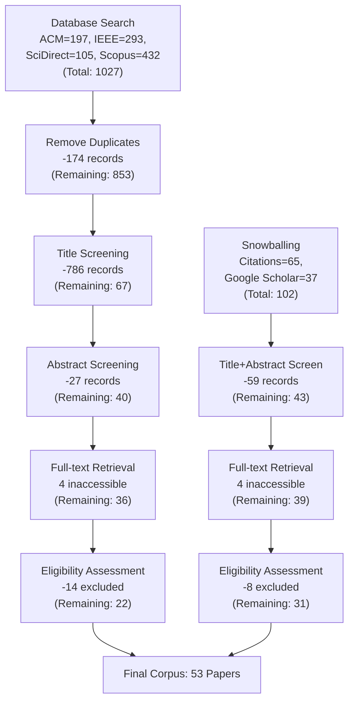
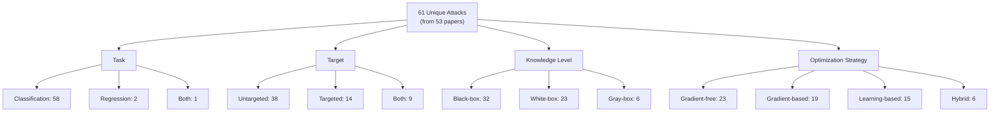
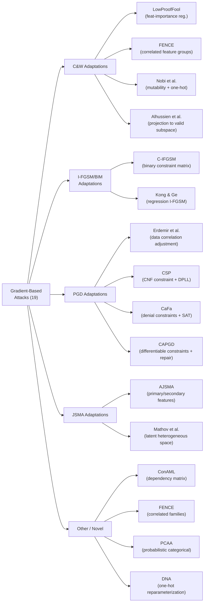
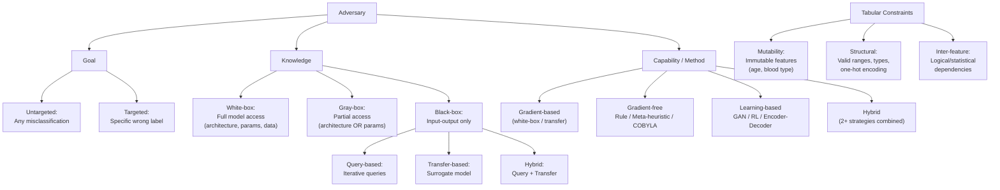
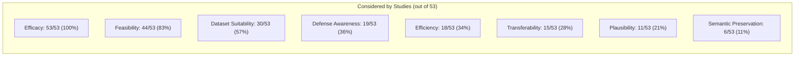
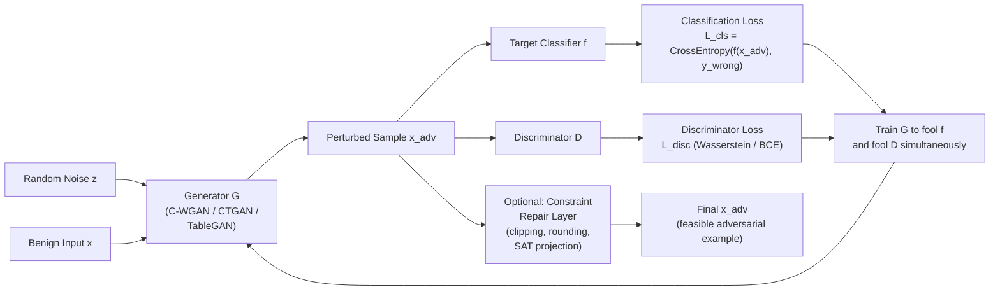
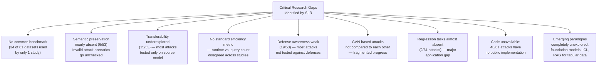

# Paper Review: Insights on Adversarial Attacks for Tabular Machine Learning via a Systematic Literature Review

> **Reviewed:** 2026-06-09
> **Source:** `/home/nhatquang/Desktop/HCMUS Course/4. Taiwan MS Prep/14. Tabular ML Security/adversarial_attacks_tabular_survey_2025.pdf`
> **Reviewer lens:** Senior Security Architect + Senior AI Researcher
> **Authors:** Salijona Dyrmishi, Mohamed Djilani, Thibault Simonetto, Maxime Cordy (University of Luxembourg), Salah Ghamizi (Luxembourg Institute of Health / RIKEN AIP)
> **Venue:** arXiv:2506.15506v1 [cs.LG], submitted to ACM, June 2025

---

## 1. Motivation — Why Should We Care?

Tabular data is the quiet backbone of high-stakes decision-making. Credit scoring models decide loan eligibility. Fraud detection systems flag or clear billions in transactions. Network intrusion detection systems gate access to critical infrastructure. Medical diagnostic models influence treatment pathways. All of these are Tabular ML systems, and all of them are adversarially attackable — an attacker who can nudge a handful of feature values can silently flip model predictions with real financial, safety, or security consequences.

The adversarial ML community has produced a rich body of work on images and text, with well-established benchmarks (ImageNet, GLUE), canonical attacks (FGSM, PGD, C&W), and mature defenses (adversarial training, certified robustness). The tabular domain has received no such consolidation. Research is published across 46 distinct venues for only 53 papers — nearly one venue per paper. Methods are domain-siloed (NIDS here, fraud there, credit scoring somewhere else), evaluation protocols are incompatible, and many published attacks have no public code. This fragmentation means practitioners deploying tabular ML in banks, hospitals, or security operations centers have no coherent guidance on which attack vectors are realistic, which defenses work, and how to evaluate robustness.

The gap the paper fills is real: there has been no domain-agnostic systematic literature review of adversarial attacks on tabular ML. Prior surveys either focus exclusively on cybersecurity applications (NIDS, spam, intrusion) or are generic adversarial ML surveys that treat tabular data as a footnote. The authors claim this is the first PRISMA-compliant SLR for this specific intersection. That claim appears credible based on the literature cited; the closest prior work (Ballet et al. [13], the "LowProofFool" paper) is itself a primary paper, not a survey.

The practical stakes are concrete: a fraud detection system deceived by a transaction amount of 101 euros instead of 100 euros (the paper's opening example) is not a theoretical toy — it is a published vulnerability class. Healthcare ML models with adversarially perturbed lab values causing misdiagnoses, NIDS models bypassed by crafted network traffic, and credit models gamed by strategic feature manipulation are not hypothetical; they have all appeared in the literature the paper reviews.

---

## 2. Proposal — What Do the Authors Propose and Why?

The authors propose a Systematic Literature Review (SLR) following the PRISMA 2020 methodology. The core contribution is not a new attack or defense; it is a structured synthesis of 53 papers spanning 2018–2024, organized around three research questions: (RQ1) publication and citation trends, (RQ2) a taxonomy of attack methods categorized by optimization strategy, and (RQ3) an assessment of how well existing attacks address eight practical considerations critical for real-world deployment.

The eight practical considerations — efficacy, efficiency, transferability, feasibility, semantic preservation, plausibility, defense awareness, and dataset suitability — form the analytical backbone of the paper. Each reviewed paper is coded on a three-point scale (Considered / Acknowledged / Not Considered) for each dimension. This produces a structured gap analysis that no previous work has provided for tabular adversarial ML.

The choice of PRISMA as the methodological scaffold is principled: it provides a reproducible, documented selection process that is standard in medical and social science systematic reviews and increasingly adopted in CS. The search query, inclusion/exclusion criteria, and snowballing strategy are all documented. The authors explicitly state what they exclude: defense-only papers, robustness benchmarking using pre-existing attacks, and random perturbation baselines. These exclusions are reasonable — the scope is intentionally attack-focused.

The authors' implicit justification for this specific approach is that the field needs a diagnosis before it can be fixed. By mapping the current landscape and exposing its systematic gaps (e.g., only 6 of 53 papers seriously address semantic preservation; only 15 test transferability), the paper creates a shared vocabulary and a gap register that future researchers can use to self-assess their contributions. This is the right framing for a survey paper, and it is largely executed well.

---

## 3. Method — How Does It Work?

### 3.1 PRISMA-Based Study Selection

The search covered four databases (ACM Digital Library, IEEE Xplore, Scopus, Semantic Scholar) plus Google Scholar, using the query:

```
AllField:(("adversarial attack*" OR "adversarial example*") AND "tabular data")
AND Title:(NOT (survey OR review))
```

Starting from 1,027 raw records (853 from databases + 174 after deduplication, plus 102 from snowballing), the process filtered to 53 final papers. Title filtering removed 786, abstract filtering removed 27, eligibility assessment removed 22 more. The process is transparent and documented in a PRISMA flowchart (Figure 1 in the paper).

Key exclusion criteria:
- Papers focused on defense strategies (not attacks)
- Papers evaluating robustness with previously established attacks (no novel contribution)
- Random perturbation baselines without principled adversarial formulation

**Critical observation:** The search cutoff was February 24 – March 4, 2025. Data collection lasted only 8 days. This is a minor but real limitation: the window is narrow, and any paper published after early March 2025 is missed.

### 3.2 Attack Taxonomy

The 53 papers contain 61 distinct attacks (some papers propose multiple). The taxonomy organizes them along four axes:

- **Task:** Classification (58/61) vs. Regression (2/61) vs. Both (1/61)
- **Target:** Untargeted (38) vs. Targeted (14) vs. Both (9)
- **Knowledge:** Black-box (32) vs. White-box (23) vs. Gray-box (6)
- **Optimization strategy:** Gradient-free (23) vs. Gradient-based (19) vs. Learning-based (15) vs. Hybrid (6)

Within each optimization category:

**Gradient-based attacks (19):** Mostly adaptations of C&W [21], I-FGSM/BIM [71], PGD [81], and JSMA [99] from the image domain, with tabular-specific modifications:
- *C&W adaptations:* LowProofFool adds feature-importance regularization; FENCE groups correlated features; Alhussien et al. project adversarial examples back into a constraint-valid subspace.
- *PGD adaptations:* CAPGD embeds differentiable constraints in the loss and uses SAT/DPLL projection; CSP combines PGD with learned CNF constraints.
- *JSMA adaptations:* AJSMA classifies features as primary/secondary and filters constraint-violating perturbations; Mathov et al.'s latent JSMA embeds heterogeneous inputs in continuous space before applying JSMA.

Key formula — adversarial example definition: given classifier f: R^d → Y, input x with true label y, adversarial example x^adv satisfies ||x^adv - x||_p ≤ ε and f(x^adv) ≠ y, where ε > 0 controls perturbation magnitude under the l_p-norm.

**Gradient-free attacks (23):** Three sub-families:
- *Rule-based:* Combinatorial feature substitution (e.g., phishing-specific feature swaps), logical/mathematical transforms (FIGA perturbs top-k features by information gain), statistical pattern-based (A2PM maintains moving-average intervals).
- *Meta-heuristic:* Evolutionary/swarm optimization (CoEVa2 uses 4-objective genetic algorithm; MOEVA abstracts this to any tabular task; Alhajjar et al. compare GA and PSO for NIDS).
- *Other:* COBYLA-based constrained optimization (OptAttack, AdverSPAM); graph-based cheapest-path search (Kireev et al.); SHAP-guided binary search (MISLEAD).

**Learning-based attacks (15):** Dominated by GANs (12 of 15):
- Most use (C-)WGANs or CTGAN as generators, with noise injected to mutable features.
- Notable exception: Parfenov et al. train a CGAN with deliberately wrong labels to generate realistic but misclassified examples.
- Non-GAN approaches: RL-based attack (de Witt et al. [32]) trains an agent with reward = 1 if classifier is fooled; Duan et al. [35] use an encoder-decoder with KNN-selected candidate perturbations.

**Hybrid attacks (6):** Combine two or more strategies. Examples: OMPGS (gradient + greedy search for discrete data), ESPA (encoders + genetic algorithm), CAA (CAPGD first, then MOEVA if CAPGD fails), FEAT (OMP + multi-armed bandit with UCB).

### 3.3 Practical Considerations Assessment

For each of the 53 papers, the authors code coverage of 8 dimensions as Considered / Acknowledged / Not Considered (defined precisely in Table 8):

- **Efficacy:** 53/53 Considered (trivially required for publication)
- **Feasibility:** 44/53 Considered, 8 Not Considered
- **Efficiency:** 18 Considered, 11 Acknowledged, 24 Not Considered
- **Transferability:** 15 Considered, 5 Acknowledged, 33 Not Considered
- **Defense awareness:** 19 Considered, 15 Acknowledged, 19 Not Considered
- **Dataset suitability:** 30 Considered, 2 Acknowledged, 21 Not Considered
- **Plausibility:** 11 Considered, 5 Acknowledged, 37 Not Considered
- **Semantic preservation:** 6 Considered, 1 Acknowledged, 46 Not Considered

The gap analysis is the most actionable section of the paper. The finding that 46/53 papers ignore semantic preservation (whether perturbed instances remain in the same class — a malware file stays malicious after perturbation) is a genuine empirical finding with security implications: attacks that flip the semantic class are generating invalid threat scenarios, yet they are being published as valid.

### Diagrams

**Diagram 1: PRISMA Study Selection Pipeline**


*The PRISMA selection funnel: starting from 1,027 database records + 102 snowballed, arriving at 53 papers via multi-stage filtering.*

---

**Diagram 2: Attack Taxonomy — Four Axes**


*The four classification axes used to characterize all 61 attacks in the corpus; numbers indicate how many attacks fall into each category.*

---

**Diagram 3: Gradient-Based Attack Family Tree**


*Gradient-based attacks on tabular data: 13 of 19 are direct adaptations of image-domain attacks with tabular constraint layers added.*

---

**Diagram 4: Threat Model Space**


*The full threat model space for tabular adversarial attacks, including the three constraint types that distinguish tabular from image-domain attacks.*

---

**Diagram 5: Practical Considerations Coverage Heatmap**


*Coverage of eight practical deployment dimensions across the 53 reviewed papers. Efficacy (attack success rate) is universally covered; semantic preservation is nearly absent.*

---

**Diagram 6: Learning-Based Attack Architecture (GAN Dominant Pattern)**


*Dominant architecture for learning-based tabular attacks: a GAN generator is trained to simultaneously fool the target classifier and the discriminator. Many implementations skip the constraint repair layer, producing infeasible adversarial examples.*

---

**Diagram 7: Research Gap Summary — What the Field is Missing**


*The nine most significant research gaps exposed by the systematic review.*

---

## 4. Strengths and Weaknesses

### Strengths

**S1 — First principled, domain-agnostic synthesis.** The claim of being the first PRISMA-compliant SLR specifically for adversarial attacks on tabular ML is credible. Prior surveys either restrict to NIDS/spam ([9], [58], [63], [84]) or treat tabular data as a sub-case of general adversarial ML. This paper fills a genuine gap.

**S2 — The eight-dimension practical framework is the paper's most valuable contribution.** Coding 53 papers against 8 operationalized criteria (with explicit definitions in Table 8 for what constitutes "Considered" vs. "Acknowledged" vs. "Not Considered") produces an actionable gap register. The finding that 46/53 papers ignore semantic preservation is a concrete, startling result that the community needs to confront.

**S3 — Transparent, reproducible methodology.** The PRISMA flowchart, the explicit search query, the documented inclusion/exclusion criteria, the 8-day collection window — all of these are reproducible. This is rare in ML surveys, which often describe methodology vaguely.

**S4 — Honest about the GAN problem.** Section 5.2.3 directly states that GAN-based attacks "rarely compare against each other or acknowledge existing work," that "similar contributions are often positioned as novel," and that "marginal gains and no comparative benchmarking" characterize the learning-based attack family. This is a damning but accurate observation that the authors deserve credit for stating clearly.

**S5 — Conceptual clarity on tabular-specific challenges.** The framing of three constraint types (mutability, structural, inter-feature) and their distinction from image-domain Lp-norm constraints is tight and useful. The observation that Lp-norms are a poor proxy for plausibility in tabular data — because a single binary flip can be Lp-minimal yet semantically catastrophic — is correct and underexplored.

**S6 — The TabularBench [113] pointer is useful.** The authors identify this as a step toward standardized evaluation and use it as a reference point. Pointing to emerging infrastructure is good survey practice.

**S7 — Identifies the regression gap explicitly.** Only 2 of 61 attacks target regression tasks. For healthcare models predicting continuous outcomes (lab values, risk scores, drug dosages), this is a critical blind spot. The paper names it.

### Weaknesses / Red Flags

**W1 — 53 papers is a small corpus for a definitive "first SLR."** The paper screens 853 database records and arrives at 53. The exclusion of defense-only papers and robustness benchmarking papers is principled, but it means the survey cannot speak to how attacks and defenses co-evolve — a central question for any security-minded reader. The scope is intentionally narrow; this is stated honestly, but a practitioner needs the attack-defense interaction to make deployment decisions.

**W2 — The search query excludes plausible relevant terms.** The query requires "tabular data" as a literal string. Papers that study adversarial attacks on "structured data," "relational data," "credit scoring," "fraud detection," or "intrusion detection" without using the phrase "tabular data" would be missed. The snowballing partially compensates, but the initial seed is query-constrained. The authors acknowledge this briefly but do not quantify the potential miss rate.

**W3 — The practical considerations coding is subjective and unvalidated.** Table 8 provides operational definitions for each level, but the coding is done by the authors without reported inter-rater reliability scores. For a PRISMA-compliant review, inter-rater reliability (Cohen's kappa or similar) should be reported. Its absence means the coding could be systematically biased in ways the reader cannot detect.

**W4 — The GAN-based attack section exposes a deeper problem than stated.** The paper reports that up to 99% of GAN-generated samples violate feasibility constraints (citing Stoian et al. [115]). This is not a minor footnote — it means that a large fraction of the "learning-based" attacks in this survey are generating invalid adversarial examples that would be caught by any basic data validation layer. The authors acknowledge this but do not re-analyze the efficacy claims of GAN-based attacks through this lens. An attack with 90% ASR that produces 99% infeasible examples has an effective ASR near zero in any real deployment. This needs a sharper treatment.

**W5 — Defense awareness analysis is shallow.** The 19 papers that test against defenses are largely testing against adversarial training only. The paper notes this but does not analyze whether the adversarial training implementations are adaptive (i.e., the defense knows the attack's structure) or non-adaptive (the defense was trained on a different attack). Non-adaptive adversarial training provides weak security guarantees. A security architect reading this paper cannot determine from the survey how many of the 19 "defense aware" papers actually test adaptive robustness.

**W6 — No meta-analysis of attack success rates.** The paper codes efficacy as Considered/Not-Considered but does not aggregate ASR values across studies. A reader cannot answer "what is the typical attack success rate on tabular ML models?" from this paper. The diversity of datasets, metrics, and model types makes direct aggregation difficult, but the paper does not even attempt a conditional comparison (e.g., "gradient-based attacks on NIDS models achieve median ASR of X%"). This is a significant missed opportunity.

**W7 — The classification bias (58/61 attacks are classification) is mentioned but not interrogated.** The paper hypothesizes three explanations for the regression gap, but does not analyze whether the classification bias might also distort the practical considerations analysis. Feasibility constraints are different in regression settings; the entire mutability/structural/inter-feature framework may need recalibration for regression. This cross-cutting issue is mentioned in the future work section but not developed.

**W8 — Venue fragmentation (46 venues for 53 papers) is presented as a diagnostic observation but the implications for quality are not drawn.** With nearly one venue per paper, there is no dominant peer review community setting standards. This means the quality bar for the 53 papers is highly variable. The survey treats a NeurIPS paper and an arXiv preprint as equivalent data points. A quality-weighted analysis (perhaps using citation-adjusted impact or tier-based venue classification) would have been more rigorous.

**W9 — No reproducibility audit.** 40 of 61 attacks have no public code. The survey codes this in the "Code" column of Tables 3-6 but does not attempt to reproduce or verify results from any attack. For a survey claiming to provide a reliable landscape of the field, the inability to verify even a sample of the efficacy claims is a genuine weakness. The paper is comprehensive as a literature catalog but cannot vouch for the correctness of the results it summarizes.

**W10 — Foundation models, LLMs for tabular data, and retrieval-augmented systems are mentioned only in the future work section.** Given that TabPFN [60] appeared in Nature in 2025 and represents a paradigm shift in tabular ML, and that retrieval-augmented tabular inference is entering production systems, their complete absence from the attack taxonomy is a gap the survey correctly identifies but cannot address. Future adversarial attacks on foundation tabular models will look nothing like PGD-on-XGBoost, and the survey provides no scaffolding for that transition.

---

## 5. Trustworthiness Assessment

| Dimension | Rating | Justification |
|---|---|---|
| Reproducibility | Medium | The PRISMA process is documented and reproducible; however, no inter-rater reliability is reported for the practical considerations coding, and 40/61 attacks in the corpus have no public code, so the underlying claims cannot be independently verified. |
| Evaluation rigor | Medium | Coverage analysis is thorough and operationalized with explicit rubrics (Table 8, Table 9). However, no quantitative meta-analysis of ASR or efficiency metrics is attempted, and subjective coding is not statistically validated. |
| Novelty vs. incremental | High | The combination of PRISMA methodology, domain-agnostic scope, and the eight-dimension practical framework applied systematically to 53 papers is genuinely new. The observation that 46/53 papers ignore semantic preservation is a novel empirical finding with immediate implications. |
| Practical deployability | Medium | The gap analysis is directly actionable for researchers and practitioners designing new attacks or robustness evaluations. However, the absence of a common benchmark recommendation and the weak coverage of defenses limit its usefulness as a practitioner's guide to securing deployed systems. |
| Security posture | Medium | The paper correctly identifies that most attacks are not tested against defenses, that transferability is underexplored, and that GAN-based attacks routinely generate infeasible examples. However, it does not escalate these findings into concrete threat model recommendations, and the adaptive robustness gap is underemphasized for a security audience. |
| Venue & author credibility | Medium-High | Submitted to ACM (specific track not yet shown, preprint stage). The University of Luxembourg group (Dyrmishi, Simonetto, Cordy) has produced primary papers in this area (LowProofFool [13], CAPGD [114], TabularBench [113], MOEVA [111]) that are among the most cited works in the corpus — the survey authors are active primary researchers in the field, which adds credibility but also raises the question of whether their own work receives more favorable treatment in the coding. Ghamizi (RIKEN AIP) adds institutional breadth. |

**Overall verdict.** This is a useful and honestly executed survey paper that fills a genuine gap. The PRISMA methodology, the eight-dimension practical framework, and the quantified coverage statistics make it a citable reference for anyone entering the tabular adversarial ML space. The finding that semantic preservation is nearly universally ignored (6/53) and that transferability is systematically understudied (15/53) are the paper's two most actionable empirical contributions.

However, the survey has three structural limitations that a careful reader must internalize. First, the small corpus (53 papers, 61 attacks) means patterns can be driven by a few outlier papers; the near-absence of inter-rater reliability reporting undermines confidence in the coding. Second, the GAN infeasibility problem (up to 99% of GAN-generated adversarial examples violate constraints) is mentioned but not reanalyzed to correct the efficacy statistics — a significant oversight that inflates the apparent state of the art for learning-based attacks. Third, the defense analysis is too thin for a security-oriented audience: the distinction between adaptive and non-adaptive adversarial training is not drawn, and the 19 "defense-aware" papers are not interrogated for the quality of their robustness claims.

Build on this paper as a starting point and citation resource. Cite it with the caveat that the GAN-based attack efficacy numbers are likely overstated in real deployments, and that the practical considerations coding is unvalidated for inter-rater agreement. Do not treat the 53-paper corpus as an exhaustive field map — the query string likely misses a non-trivial fraction of domain-specific adversarial work that does not use the phrase "tabular data" verbatim.
