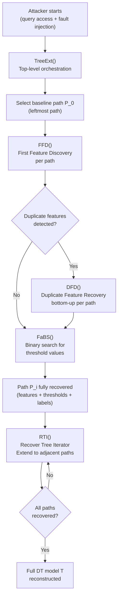
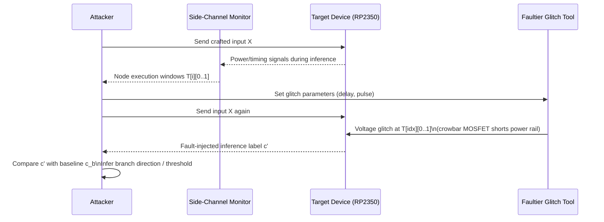
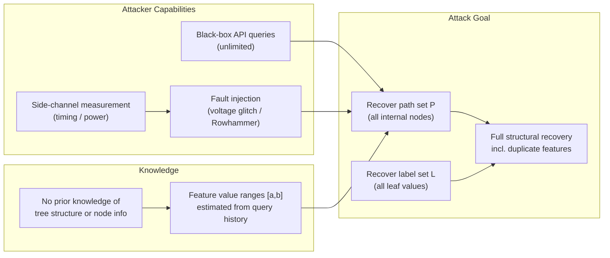
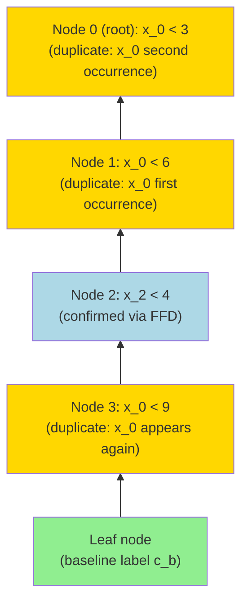

# Paper Review: BarkBeetle: Stealing Decision Tree Models with Fault Injection

> **Reviewed:** 2026-06-09
> **Source:** `/home/nhatquang/Desktop/HCMUS Course/4. Taiwan MS Prep/14. Tabular ML Security/barkbeetle_tree_stealing_2025.pdf`
> **Reviewer lens:** Senior Security Architect + Senior AI Researcher
> **Venue:** ACM Asia CCS 2026, Bangalore, India
> **Authors:** Qifan Wang (Univ. of Birmingham / Durham), Jonas Sander (Univ. of Luebeck), Minmin Jiang (Queen's Univ. Belfast), Thomas Eisenbarth (Univ. of Luebeck), David Oswald (Univ. of Birmingham / Durham)

---

## 1. Motivation — Why Should We Care?

Decision tree (DT) models occupy a privileged niche in deployed ML: they are interpretable, lightweight enough to run on microcontrollers (TensorFlow Lite, Emlearn, Edge Impulse), and increasingly used in privacy-sensitive domains such as healthcare diagnostics and fraud detection. Their structure is also foundational to ensemble methods (Gradient Boosted Decision Trees, XGBoost) and, strikingly, to tree-based cryptographic constructions such as zero-knowledge proofs and function secret sharing schemes.

The threat is real and growing. Cloud MLaaS providers (Amazon, Google, BigML) expose DT inference via black-box APIs. Embedded IoT devices run DT inference with physical access available to an adversary. Prior model-extraction attacks on DTs (Tramèr et al. 2016 [46] being the primary baseline) could recover decision boundaries but missed a structurally critical artifact: **repeated feature usage within a path** (duplicate features). This gap is not cosmetic. A feature appearing multiple times along a path encodes its conditional relevance at successive partitions, which is exactly the kind of information an adversary needs to reconstruct training data distributions, craft adversarial examples, or audit models for fairness violations.

BarkBeetle closes this gap by combining two previously separate attack surfaces — black-box model extraction and physical fault injection — into a single coherent attack pipeline. The practical stakes are significant:

- An adversary who steals a healthcare DT model can reconstruct which features (age, BMI, glucose) are reused in diagnosis paths and at what thresholds, enabling targeted membership inference or patient re-identification.
- An adversary targeting embedded DT inference (e.g., a medical device or a smart sensor) can use voltage glitching — a low-cost, widely accessible technique — to extract the full model from the chip.
- The paper also reveals a new attack surface for tree-based cryptographic schemes, where fault injection at specific nodes during a zero-knowledge proof evaluation can leak secret values.

**Bottom line for practitioners:** Any DT deployed on hardware with physical access (IoT, embedded medical, smart cards) is potentially fully extractable with commodity equipment. Cloud-hosted DTs are partially protected (no physical access), but the paper extends its analysis to software-based fault injection (Rowhammer, compiler-level, binary modification), which can apply in cloud contexts.

---

## 2. Proposal — What Do the Authors Propose and Why?

The authors propose **BarkBeetle**, a model extraction attack that fuses fault injection into the query loop of a black-box DT extraction pipeline. The core insight is this: if you can force a DT to take a specific branch at a specific internal node (regardless of what the input actually implies), you can isolate the comparison performed at that node and recover its feature index and threshold value through a binary search over the feature dimension.

**Why fault injection, not just clever queries?** Prior work ([46]) uses the leaf identifier as a path fingerprint and then searches around it. This works for unique-threshold features but fails when the same feature is split on multiple times along a path, because varying that feature's value changes which of the repeated comparisons is determinative — you cannot unambiguously attribute a label change to a specific node. Fault injection breaks this degeneracy: by forcing one specific node to always branch left (or right), the attacker surgically isolates that node's comparison from all others.

**Why bottom-up recovery?** The algorithm reconstructs paths from the leaves toward the root. This order matters: when a feature appears multiple times on a path, its deepest (leaf-closest) occurrence has the smallest threshold value (in the left subtree). Recovering from the bottom up means earlier recoveries constrain the search space for subsequent ones, reducing the number of required queries.

The proposed attack achieves three goals simultaneously:
1. Full structural recovery (all internal nodes, all thresholds, the complete tree topology).
2. Duplicate feature recovery (repeated splits on the same feature within a path).
3. Query efficiency improvement over the state of the art on large trees.

---

## 3. Method — How Does It Work?

### 3.1 Formal Setup

The DT is modeled as a set of root-to-leaf paths P = {P_0, P_1, ..., P_{alpha-1}}. Each path P contains beta internal nodes V = (s, t, br) where s is the feature index, t is the threshold, and br is the branch direction (0 = left child, 1 = right child). Leaves store class labels L = {c_0, c_1, ..., c_{alpha-1}}.

The attacker A operates under a **black-box threat model** with three capabilities:
1. Unlimited API access to query the model.
2. Ability to inject controlled, transient faults at specific nodes by varying supply voltage (voltage glitching).
3. Ability to measure side-channel signals (timing, power) to identify node execution windows and synchronize glitch timing.

### 3.2 Algorithm Overview

The attack is composed of six algorithms:

| Algorithm | Purpose |
|---|---|
| F_Inf() | Fault-based inference: forces branch left or right at a target node |
| FaBS() | Fault-assisted binary search: recovers threshold t at a node |
| FFD() | First Feature Discovery: recovers features that appear once on a path |
| DFD() | Duplicate Features Discovery: recovers repeated features on a path |
| RTI() | Recover Tree Iterator: iterates over all paths using baseline/extended path strategy |
| TreeExt() | DT Extraction: top-level orchestration of the full tree recovery |

### 3.3 Key Sub-procedures

**Fault-based Inference (F_Inf):** Given a target node index and a flag (left/right), injects a fault during the execution window of that node to flip the comparison result. The attacker uses side-channel timing to identify the window T[i][0]..T[i][1] for node i. The glitch forces the branch to take the desired direction regardless of the input, then the inference result is returned.

**Fault-assisted Binary Search (FaBS):** For a feature s_i with known value range [a, b], applies binary search. At each step, it constructs an input X with X[idx] = (low + high) / 2. In normal search mode, it performs vanilla inference and observes label changes. In fault-assisted mode, it injects faults at preceding nodes to force the traversal to always reach the target node, then observes whether the label matches the baseline — thereby isolating the target node's threshold from interference by earlier split nodes on the same feature.

**First Feature Discovery (FFD):** Iterates over all features i. For each, it constructs an input where feature i is set to its maximum or minimum value (depending on branch direction). It then injects faults at each node in the path and observes label changes. A label change at node j when feature i is perturbed indicates feature i is present at node j. If the label is also different from the baseline path, feature i is marked as a duplicate (it appeared earlier in the path and is now split again).

**Duplicate Features Discovery (DFD):** Given a confirmed set of duplicate features S_DF, works bottom-up. For each duplicate feature s_i, it locates the node containing s_i's first threshold (closest to the leaf), confirms it via fault injection, then uses FaBS() to recover the next threshold value for s_i at the next node up, updating baseline labels accordingly at each step.

### 3.4 Diagrams

**Attack Pipeline (Full BarkBeetle flow):**

**Fault Injection Process:**

**Threat Model:**

**Bottom-up Recovery of Duplicate Features:**

**Query Complexity Comparison:**

```mermaid
xychart-beta
    title "Query Count: BarkBeetle vs [46] (UCI Datasets)"
    x-axis ["Iris", "Diabetes", "Med. Provider", "Bitcoin", "Appliances"]
    y-axis "Queries" 0 --> 25000
    bar [164, 248, 1718, 4092, 5355]
    bar [243, 662, 10092, 23315, 24904]
```

---

## 4. Strengths and Weaknesses

### Strengths

**S1. Genuinely novel attack primitive.** Applying fault injection to DT model extraction is, to the reviewers' knowledge, truly new. Prior DT extraction work ([46], [10], [38]) stays entirely in the query domain. Bridging hardware security (FIA) and ML security (model extraction) in a single unified attack pipeline is a meaningful contribution.

**S2. Duplicate feature recovery is a real gap.** The prior baseline ([46]) explicitly cannot recover duplicate features. BarkBeetle's bottom-up FaBS construction elegantly handles the interference problem caused by repeated splits on the same feature. The algorithmic insight — isolate a node's comparison by injecting faults at all preceding nodes that share the same feature — is clean and correct.

**S3. Complexity improvement is substantial for large trees.** On the Bitcoin Price dataset (147 leaves, depth 17), BarkBeetle uses 4,092 total queries versus 23,315 for [46] under normal conditions — an 82% reduction. For the Appliances Energy dataset (158 leaves, depth 17), the ratio is 5,355 vs. 24,904 — a 78% reduction. The improvement scales super-linearly with tree depth and number of paths, which is exactly where practical DTs live.

**S4. Physical validation is solid for a conference paper.** Running the attack on a Raspberry Pi RP2350 using the Faultier voltage glitching tool goes well beyond simulation. The RP2350 Security Playground board is designed specifically for fault injection research, making the setup reproducible. Reporting successful glitch parameter pairs (Figure 9) at sub-microsecond precision is credible evidence of practical feasibility.

**S5. Code release commitment.** The authors commit to releasing source code (anonymized version already on GitHub: https://github.com/DylanWangWQF/BarkBeetle). The Docker image for reproducing [46]'s baseline is a commendably thorough reproducibility practice.

**S6. Extensions to cryptographic schemes are provocative.** The observation that BarkBeetle's targeted fault injection can compromise tree-based zero-knowledge proofs (ZKFault [34]) and function secret sharing (FSS) protocols extends the attack's impact well beyond ML model theft. This cross-domain implication deserves more attention from the cryptographic community.

### Weaknesses

**W1. The fault injection success rate is the paper's soft underbelly.** The paper reports that 703 additional "overhead" runs were required for the Diabetes Diagnosis experiment (depth 5, 11 leaves, 29 fault targets), representing a fault success rate that varies substantially with glitch parameters. The paper acknowledges this but does not provide a systematic characterization: what is the average number of attempts per node? Does this vary with tree depth, branch direction, or feature index? Without a fault success rate model, the 703-run overhead figure is anecdotal. For a depth-17 tree (Bitcoin Price), the overhead could be orders of magnitude larger. The paper sidesteps this by reporting only "required fault runs" (lower bound assuming 100% success rate), which significantly understates real-world cost.

**W2. Timing synchronization is assumed but not fully modeled.** The threat model states the attacker "can exploit measurable variations to infer execution windows of individual nodes." In practice, this requires that each internal node has a distinguishable timing signature — an assumption that holds for simple sequential inference on a microcontroller but may not hold for optimized compiled DTs (branch prediction, pipelining, cache effects), vectorized implementations, or DTs running inside a TEE. The paper notes this assumption can be relaxed in a grey-box setting but does not demonstrate it experimentally.

**W3. Classification tree limitations are underexplored.** The attack performs best on regression trees (unique leaf outputs = unique path identifiers). For classification trees with multiple paths sharing the same class label, the paper offers two mitigations (node count distinguishing via timing, confidence scores). However, the evaluation is conducted almost entirely on regression trees or classification trees with very few classes (Iris: 3 classes, Diabetes: 2 classes). The authors acknowledge that trees with many shared labels may require "further investigation" — but given that many real-world DTs are multi-class classifiers, this is a significant gap.

**W4. Scalability to ensemble methods is speculative.** The extension to GBDT/XGBoost is described as a research direction, not a demonstrated result. The paper notes that recovering individual tree parameters in a boosted ensemble is impractical because only the final aggregated prediction is observed. The proposed approach (analogous to [47]'s AES last-round key attack or [8]'s NN bias recovery) is conceptually sketched but entirely unvalidated. For a paper whose title targets "Decision Tree Models" broadly, this leaves the most commercially relevant deployment targets (XGBoost in production MLaaS) unaddressed.

**W5. Countermeasure analysis is shallow.** Section 6.2 covers differential privacy (acknowledged to be limited against sophisticated extraction), hardware glitch detectors (not universally deployed on IoT), and redundancy-based computation (viable but not quantitatively analyzed). There is no formal treatment of detection thresholds: how many fault injection attempts does it take before a glitch monitor flags the device? No analysis of timing-based anomaly detection. No discussion of whether differential privacy noise in the threshold output (rounding t to ±ε) would break BarkBeetle's binary search convergence.

**W6. The granularity parameter ε is chosen experimentally and treated as given.** The paper sets ε = 10^{-3} for all experiments based on feature ranges, with the note that ε should be "experimentally tuned." In a real attack, the attacker does not know the training data distribution a priori. The paper briefly mentions using historical query patterns to estimate [a, b] but does not analyze how sensitivity of ε affects recovery accuracy when the estimate is off.

**W7. The comparison with [46] involves a reconstruction step that introduces confounds.** Since the original code of [46] is no longer maintained, the authors reconstructed it inside Docker and converted BigML trees to Emlearn format. This transformation step — which they acknowledge cannot guarantee structural equivalence — means that the query count comparison may partially reflect structural differences introduced by the conversion, not purely algorithmic differences.

---

## 5. Trustworthiness Assessment

| Dimension | Rating | Justification |
|---|---|---|
| Reproducibility | **High** | ~500 LoC C implementation, Docker environment for baseline reproduction, code release promised and partially available on GitHub. RP2350 Security Playground board is commercially available hardware. The authors explicitly provide the Docker image for [46]'s reconstruction. |
| Evaluation rigor | **Medium** | Query count comparisons are thorough and use controlled synthetic trees (depth 1-14, 0-7 duplicate features). However, fault success rate is not characterized systematically. Real-world overhead (703 glitch attempts for a depth-5 tree) is reported but not extrapolated. Classification trees with shared labels are evaluated only on small datasets. The comparison with [46] has a reconstruction confound (Section 5.2). |
| Novelty vs. incremental | **High** | First paper to apply fault injection to DT model extraction. The duplicate feature recovery algorithm (DFD + FaBS) is a genuine algorithmic contribution, not present in any prior work. The extension to tree-based cryptographic schemes is a novel threat framing. The bottom-up recovery ordering is a non-obvious design choice that is well-motivated. |
| Practical deployability | **Medium** | Works convincingly on a Raspberry Pi RP2350 with commodity Faultier hardware (~$150 tool). However, requires physical access to the target device (not applicable to cloud APIs without software fault injection augmentation). Voltage glitching is probabilistic and parameter-sensitive; the 703-run overhead for a shallow 5-leaf tree suggests deeper trees could require thousands of fault attempts. Software fault injection paths (Rowhammer) are discussed but not demonstrated. |
| Security posture | **Medium-High** | The threat model is clearly stated and the assumptions are explicit. The attack targets a specific hardware deployment context (embedded inference on microcontrollers) where the assumptions are realistic. However, the countermeasure analysis lacks quantitative rigor — no formal analysis of detection probability, no exploration of DP noise thresholds that would defeat binary search, no analysis of secure enclave deployments. The cryptographic threat extension (FSS, ZKP) deserves a dedicated threat model, not a single paragraph. |
| Venue and author credibility | **High** | ACM Asia CCS is a strong Tier-A security venue. David Oswald (Birmingham/Durham) and Thomas Eisenbarth (Luebeck) are established figures in hardware security and side-channel analysis with sustained publication records at top-tier venues (USENIX Security, CCS, CHES). The multi-institution collaboration (Birmingham, Luebeck, Belfast) is a positive signal. The ArXiv preprint (2507.06986v2) shows active revision prior to publication. |

**Overall verdict.** BarkBeetle is a well-executed, genuinely novel paper that makes a clean contribution at the intersection of hardware fault injection and ML model security. The core algorithmic idea — using targeted fault injection to isolate individual node comparisons and recover duplicate feature splits — is technically sound, correctly analyzed for complexity, and empirically validated on real hardware. The weaknesses are real but are the expected limitations of a first-published attack rather than fundamental flaws: the fault success rate characterization is incomplete, the extension to ensemble models is speculative, and the countermeasure analysis is superficial. For a 15-page conference paper, the scope is appropriate. This work should prompt practitioners deploying DTs on IoT/embedded hardware to revisit their threat models and seriously evaluate hardware-level fault protection mechanisms.

**Recommended action if reviewing for a program committee: Accept.** The paper earns its place at Asia CCS and will be a useful reference for both the ML security and hardware security communities. The authors should be asked to: (1) provide a fault success rate characterization across multiple nodes and depths, and (2) clarify the limits of the [46] reconstruction in the comparison experiment.
