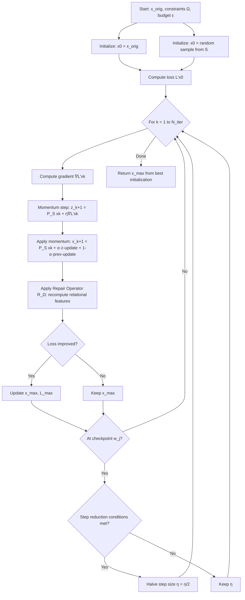
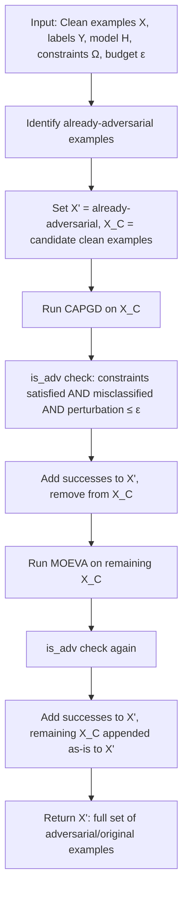
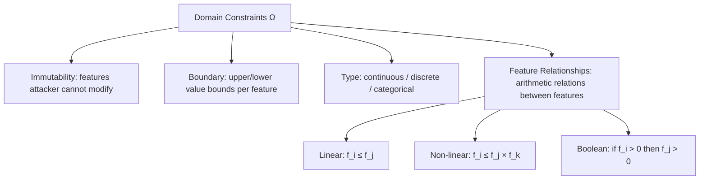
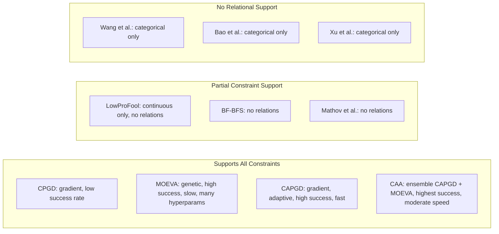
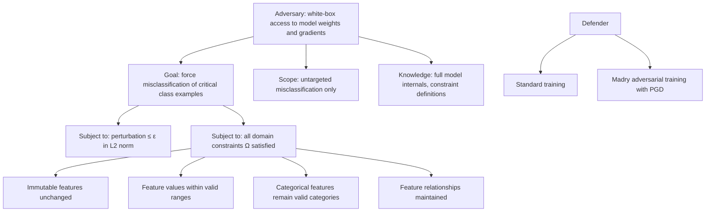

# Paper Review: Constrained Adaptive Attack: Effective Adversarial Attack Against Deep Neural Networks for Tabular Data

> **Reviewed:** 2026-06-09
> **Source:** /home/nhatquang/Desktop/HCMUS Course/4. Taiwan MS Prep/14. Tabular ML Security/constrained_adaptive_attack_simonetto_2024.pdf
> **Reviewer lens:** Senior Security Architect + Senior AI Researcher

---

## 1. Motivation — Why Should We Care?

The paper targets a genuine and underappreciated gap: adversarial robustness evaluation for deep learning models on **tabular data**. While the adversarial ML literature has produced thousands of papers on images and text, tabular data — the dominant format in finance, healthcare, and cybersecurity — has received scant rigorous treatment. The reason is nontrivial: tabular features carry **domain constraints** (immutability, feature type, boundary, and relational constraints) that make naive image-domain attacks (e.g., vanilla PGD) produce physically nonsensical perturbations. A financial fraud detection model that is "fooled" only by examples with negative loan amounts or impossible credit histories provides no useful robustness signal.

The real-world stakes are concrete: credit scoring systems deciding loan approvals, ICU patient survival models, botnet detection classifiers, and phishing URL detectors. All four of the paper's benchmark domains have deployed ML systems, and all are targets of active adversarial manipulation. If robustness evaluations use ineffective attacks, defenders will overclaim safety and underfund hardening.

The existing prior-art attack landscape is stark: only two attacks — CPGD and MOEVA (both from the same research lineage as this paper's lead author) — properly handle domain constraints. CPGD suffers from low success rates due to poor convergence behavior; MOEVA is genetically based, effective but computationally prohibitive and hyperparameter-heavy. This is a legitimate, well-framed problem. The motivation is **not oversold** — the authors are careful not to claim real-world attack deployment, framing the contribution as a benchmarking tool rather than an active exploit.

---

## 2. Proposal — What Do the Authors Propose and Why?

The authors propose two attack algorithms. First, **CAPGD** (Constrained Adaptive PGD): a gradient-based attack that retrofits the AutoAttack adaptive step-size mechanism (Croce & Hein, 2020) with tabular-specific extensions — a repair operator that re-enforces feature relationship constraints after each gradient step, dual initialization (original example plus random perturbation), and momentum. Second, **CAA** (Constrained Adaptive Attack): an ensemble attack that runs CAPGD first to cheaply solve "easy" examples, then falls back to MOEVA (genetic search) for the residual hard cases.

The reasoning is principled rather than ad hoc. The authors rigorously diagnose four specific failure modes of CPGD — fixed step decay, no trend awareness, no constraint re-projection, deterministic initialization — and address each with a targeted mechanism borrowed or adapted from the non-tabular adversarial ML literature. The ensemble design is driven by an empirical observation (Venn diagram analysis) that gradient and search attacks generate complementary sets of adversarial examples. The choice to combine with MOEVA rather than BF* is justified by a coverage/cost tradeoff analysis showing BF* adds very little unique coverage at high computational cost. The overall argument is internally consistent.

---

## 3. Method — How Does It Work?

### Problem Formulation

The paper formalizes the constrained evasion problem. Given input $x \in \mathbb{R}^d$ with true label $y$, a classifier $h: \mathbb{R}^d \to \mathbb{R}^C$, and a constraint set $\Omega$, the attacker seeks:

$$\delta^* = \arg\min_{\delta \in \Delta_p(x)} \text{ s.t. } \arg\max_c h_c(x+\delta) \neq y$$

where the perturbation set is constrained to:

$$\Delta_p(x) = \{\delta \in \mathbb{R}^d : \|\delta\|_p \leq \epsilon \;\wedge\; x + \delta \models \Omega\}$$

The constraint language $\Omega$ is inherited from Simonetto et al. [33] and supports four types: **immutability** (features the attacker cannot change), **boundary** (upper/lower value bounds), **type** (continuous, discrete, categorical), and **feature relationships** (arithmetic relations between features, e.g., $f_i \leq f_j + f_k$).

### CPGD Baseline

CPGD translates each constraint $\omega_i \in \Omega$ into a differentiable penalty function and augments the misclassification loss:

$$\mathcal{L}(x, y, h, \Omega) = l(h(x), y) - \sum_{\omega_i \in \Omega} \text{penalty}(x, \omega_i)$$

The gradient step is then projected back onto the $\ell_p$-ball $\mathcal{S}$. The fixed step-size decay schedule is $\eta^{(k)} = \epsilon \times 10^{-(1 + \lfloor k / \lfloor K/M \rfloor \rfloor)}$ with $M=7$. The paper's diagnosis: this schedule is blind to optimization progress, causing premature step decay or stagnation.

### CAPGD Components

**1. Adaptive Step-Size Selection (borrowed from AutoAttack [12]):**
Checkpoints $w_0, w_1, \ldots, w_n$ are defined at positions $p_{j+1} = p_j + \max\{p_j - p_{j-1} - 0.03, 0.06\}$. Step size $\eta$ is halved at checkpoint $w_j$ if either:
- Fewer than $\rho = 0.75$ of steps since the last checkpoint improved the loss:
$$\sum_{i=w_{j-1}}^{w_j - 1} \mathbf{1}_{\mathcal{L}'(x^{(i+1)}) > \mathcal{L}'(x^{(i)})} < \rho \cdot (w_j - w_{j-1})$$
- The step size and max-loss value have not changed since the last checkpoint (stagnation detection).

**2. Repair Operator $R_\Omega$:** After each gradient update, any feature $f$ appearing in a relational constraint $f = \psi$ is recomputed as $\psi$ evaluated on the current example. This projects the iterate back into the feasible constraint space without requiring it to be differentiable — it handles the non-convex constraint geometry that breaks pure penalty-based methods.

**3. Dual Initialization:** The attack is launched from both $x_{\text{orig}}$ and a random point uniformly sampled from $\mathcal{S}$. The best result across both runs is returned. This reduces sensitivity to local optima in the invalid region.

**4. Momentum:** Following [13], the gradient update incorporates momentum:
$$z^{(k+1)} = P_\mathcal{S}(x^{(k)} + \eta^{(k)} \nabla\mathcal{L}'(x^{(k)}))$$
$$x^{(k+1)} = R_\Omega\left(P_\mathcal{S}\left(x^{(k)} + \alpha(z^{(k+1)} - x^{(k)}) + (1-\alpha)(x^{(k)} - x^{(k-1)})\right)\right)$$
with $\alpha = 0.75$.

### CAA Ensemble Algorithm

CAA runs CAPGD first (cheap), marks successfully attacked examples, removes them from the candidate set, then runs MOEVA on remaining examples. The key insight: ~5299 examples are attacked successfully by CAPGD alone, 953 by MOEVA alone, and 953 overlap — meaning the attacks are strongly complementary. BF* contributes only 5 unique examples at disproportionate cost and is excluded.

### Evaluation Setup

- **4 datasets:** URL phishing (11K samples, 63 features, 14 constraints), LCLD credit scoring (1.2M samples, 28 features, 10 constraints), CTU-13 botnet detection (198K samples, 756 features, 360 constraints), WiDS ICU survival (91K samples, 186 features, 30 constraints)
- **5 architectures:** TabTransformer, TabNet, RLN, STG, VIME
- **Attack budget:** $\epsilon = 0.5$ (L2), 5 random seeds
- **Metric:** Robust accuracy (misclassified or invalid adversarial examples count as model surviving)
- **Hardware:** 32-core AMD EPYC cluster, 64 GB RAM per node

---

### Diagrams

**Diagram 1: CAPGD Algorithm Flow**

*CAPGD iterative optimization loop with adaptive step-size, repair operator, and dual initialization.*

---

**Diagram 2: CAA Ensemble Pipeline**

*CAA sequentially applies CAPGD then MOEVA, maximizing attack coverage while minimizing computation.*

---

**Diagram 3: Constraint Type Taxonomy**

*Four constraint types supported; only attacks in this paper and CPGD/MOEVA handle all four.*

---

**Diagram 4: Attack Comparison Landscape**

*Attack landscape for tabular ML; only attacks in the top group satisfy all four constraint types.*

---

**Diagram 5: Threat Model**

*Threat model: white-box attacker, untargeted, constrained to domain-valid perturbations.*

---

## 4. Strengths and Weaknesses

### Strengths

**1. Principled diagnostic approach.** The authors do not just propose a new attack — they first dissect why CPGD fails. The four failure modes are individually verified through ablation studies (Table 7, Figure 4), and each mechanism addresses a specific failure mode. This is methodologically clean.

**2. Subsumption property.** The Venn diagram analysis (Figure 1) showing that CAPGD's successful attack set entirely contains CPGD's and LowProFool's successful sets is a strong claim, and one that is properly supported. A new attack that is strictly better than all predecessors on all test cases (not just on average) is a meaningful contribution.

**3. Ablation study is thorough.** Table 7 and Figure 4 cover all four components of CAPGD across all 20 dataset-model combinations. The heatmap (Figure 4) demonstrating that all components are necessary and complementary is the right analysis — not just reporting the full model performance.

**4. Efficiency gain is material.** CAA being 5x faster than MOEVA while outperforming it is not a marginal gain. For security practitioners who need to evaluate models over large held-out sets, this matters enormously in practice. The 418x speedup over BF* is decisive.

**5. Honest adversarial training results.** Section 5.4 does not hide failures: adversarial training with Madry PGD genuinely improves robustness for some architecture/dataset combinations (TabTransformer on URL: +47.8 percentage points). The authors acknowledge the mixed picture rather than cherry-picking.

**6. Dataset diversity.** Four domains (cybersecurity, finance, healthcare, networking) with very different constraint counts (14 to 360) and sizes (11K to 1.2M) provide meaningful coverage.

### Weaknesses / Red Flags

**1. Paper is under review (preprint, arXiv:2406.00775v1).** The work has not yet passed peer review. Some claims should be treated with commensurate caution.

**2. White-box only — no transferability analysis.** The entire evaluation assumes full access to model weights and gradients. In real-world deployments, attackers frequently operate in black-box or transfer settings. There is zero analysis of whether CAPGD/CAA adversarial examples transfer across architectures or to production models. For the credit scoring and healthcare use cases claimed in the motivation, the actual attack surface is typically grey-box or black-box.

**3. CTU dataset near-ceiling robustness is unexplained.** For CTU, virtually all models (TabTransformer, RLN, VIME, STG) maintain ~95% robust accuracy under all attacks, while TabNet collapses to 0%. The authors briefly note "gradient attacks are ineffective" but provide no mechanistic explanation. This could indicate that the CTU constraint set (360 constraints) is so tight that the feasible perturbation space is trivially small — which would be an important finding about constraint density, not model robustness.

**4. L2-only evaluation.** The perturbation norm is fixed at L2 with $\epsilon = 0.5$ across all datasets. There is no justification for why $\epsilon = 0.5$ is the appropriate operational budget for each domain. For a financial feature vector, an L2 perturbation of 0.5 applied to normalized features could be large or trivially small depending on preprocessing. The sensitivity analysis (Table 8) varies $\epsilon$ from 0.25 to 5.0 but only for CAA, not for competing methods — making it impossible to assess whether CAPGD's advantage is $\epsilon$-dependent.

**5. No comparison under matched computational budget.** MOEVA with its default hyperparameters uses 100 generations × 100 offspring = ~10,000 model evaluations per example. CAPGD uses 10 iterations. When CAPGD is "5x faster," it is partly because fewer evaluations are performed. A fairer comparison would be: given the same wall-clock time budget, how does MOEVA perform if allowed more iterations? Table 10 (MOEVA iterations) shows limited gains from more MOEVA iterations for many settings, which is consistent with the authors' claim — but this analysis is in the appendix and not foregrounded.

**6. Repair operator is a greedy projection, not exact constraint satisfaction.** The repair operator $R_\Omega$ recomputes relational features $f = \psi$ by evaluating $\psi$ on the current example. For chains of relational constraints or non-linear constraints, this is applied sequentially, and there is no guarantee that the result satisfies all constraints simultaneously or that it is the nearest valid point. The paper does not analyze cases where the repair operator fails or cycles.

**7. Hyperparameter sensitivity of MOEVA is not a solved problem.** CAA inherits MOEVA as a component. While the paper argues that CAPGD is parameter-free, MOEVA (the bottleneck for hard examples) still requires tuning $n_{gen}$, $n_{off}$, $n_{pop}$, $n_{bin}$. In the adversarial training analysis (Table 4), large standard deviations (e.g., 47.8±80.8 for VIME/URL Clean) suggest high variance that is not discussed.

**8. Adversarial training evaluation is incomplete.** Only Madry PGD-based adversarial training is evaluated as a defense. The paper does not test certified defenses, randomized smoothing adaptations, or constraint-aware training methods. Given the paper claims CAA should be "the minimal test for any new defense," the defense evaluation baseline is too narrow.

**9. Dataset preprocessing choices introduce potential leakage.** For LCLD, the authors note they perform their own feature engineering from the raw Lending Club dataset because "most versions proposed present data leakage." Their custom preprocessing is described but the resulting 47 features differ from common benchmark versions, making external comparison difficult.

---

## 5. Trustworthiness Assessment

| Dimension | Rating | Justification |
|---|---|---|
| Reproducibility | **Medium** | Code and pretrained models are promised "upon acceptance" but not yet publicly available at preprint stage; algorithmic descriptions are complete enough to reimplement, and hyperparameters are fully documented in Appendix A.5. |
| Evaluation rigor | **Medium-High** | 5 random seeds, standard errors reported, 4 datasets × 5 architectures × 5 attacks is a genuinely large grid; however, white-box-only evaluation and single perturbation norm limit scope. |
| Novelty vs. incremental | **Medium** | CAPGD is an incremental but well-motivated adaptation of AutoAttack to the constrained tabular setting; CAA is essentially an ensemble of two existing attacks with a routing heuristic. Neither is a conceptual breakthrough, but both close a real gap competently. |
| Practical deployability | **Medium** | CAA is faster than MOEVA and parameter-free in its gradient component, making it more usable; but white-box assumption and HPC-cluster hardware (32-core AMD EPYC) limit accessibility for practitioners without compute. |
| Security posture | **Medium** | Threat model is explicitly defined and realistic for internal red-team evaluation; however, the absence of transferability analysis and black-box scenarios is a serious gap for any claim about real-world attack applicability. |
| Venue & author credibility | **Medium** | ArXiv preprint under review as of June 2024, not yet peer-reviewed; the research group (University of Luxembourg / LIST / RIKEN AIP, Simonetto, Ghamizi, Cordy) is the same group that produced CPGD and MOEVA, giving them deep domain expertise but also raising a mild concern about self-comparison bias. |

### Overall Verdict

This paper makes a solid, honest engineering contribution to a neglected subfield. The problem is real, the diagnosis of CPGD's failures is rigorous, and the ablation evidence is credible. CAA will likely become a standard benchmarking tool for constrained tabular ML robustness once the code is publicly released.

However, it should be **cited with caveats** rather than built upon uncritically. The white-box assumption severely limits deployment relevance — the paper is a benchmarking tool, not an attack model for production systems. The CTU results are unexplained in a way that could conceal a confound (constraint tightness masquerading as model robustness). The adversarial training analysis with its massive standard deviations (Table 4) is not sufficiently interrogated. The repair operator's correctness for complex constraint graphs is unproven. Any researcher using CAA as "the minimal robustness test" as the authors recommend should understand they are measuring white-box gradient-based robustness with a specific L2 budget — not real-world adversarial robustness.

For Taiwan MS program context: this is a technically competent methods paper suitable for understanding the state of constrained adversarial attacks on tabular data. It is useful background for anyone working on ML security in finance, healthcare, or cybersecurity, but should be read alongside the CPGD/MOEVA paper [33] and the AutoAttack paper [12] to understand what is novel versus adapted.
