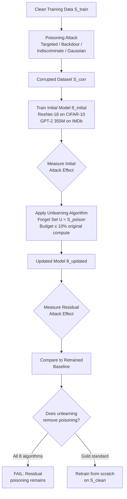
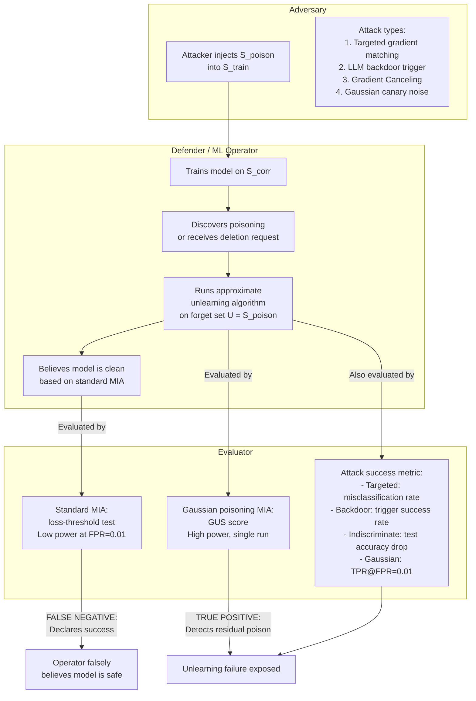
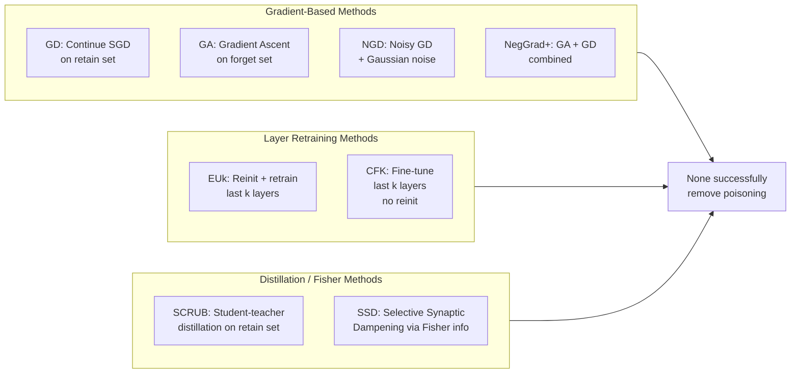

# Paper Review: Machine Unlearning Fails to Remove Data Poisoning Attacks

> **Reviewed:** 2026-06-09
> **Source:** /home/nhatquang/Desktop/HCMUS Course/4. Taiwan MS Prep/14. Tabular ML Security/machine_unlearning_poisoning_pawelczyk_2025.pdf
> **Reviewer lens:** Senior Security Architect + Senior AI Researcher

---

## 1. Motivation — Why Should We Care?

Machine unlearning has become a flagship capability in the ML trustworthiness toolkit. Regulators (GDPR, CCPA, Canada's CPPA) mandate the ability to selectively delete training data from deployed models. The implicit promise embedded in that regulatory framing is that deleting the data deletes its influence — a promise approximate unlearning algorithms routinely market themselves as fulfilling.

This paper directly attacks that promise from a security angle: **can approximate machine unlearning actually neutralize data poisoning?** The stakes are concrete. If a model has been corrupted by a backdoor or indiscriminate poisoning attack and the operator requests deletion of the poison samples, a working unlearning procedure should restore the model to a pre-poisoning state. If it cannot, then:

1. Any organization relying on unlearning as a remediation tool for poisoning incidents is operating with a false sense of security.
2. "GDPR-compliant" deletion of maliciously crafted training data may leave the model's behavior unchanged — meaning the attack persists even after nominal compliance.
3. The entire benchmark machinery used to certify unlearning success (standard membership inference attacks, MIAs) is shown to be a weak and misleading proxy for actual data removal.

Real-world systems in scope: content moderation models, medical diagnostic models, financial fraud detectors — any setting where poisoning is plausible and retraining from scratch is computationally prohibited. The paper fills an underexplored gap: prior work on "poisoning unlearning systems" mostly dealt with attacking the unlearning *pipeline* (making deletion hard to perform), not evaluating whether unlearning *succeeds* on standard poisoned training data.

The motivation is tight and well-grounded. It is not oversold.

---

## 2. Proposal — What Do the Authors Propose and Why?

The authors propose a **four-step evaluation protocol** and a **new evaluation metric** — the Gaussian Unlearning Score (GUS) — to rigorously test whether approximate machine unlearning algorithms remove the influence of data poisoning attacks. They evaluate eight state-of-the-art unlearning algorithms (GD, NGD, GA, EUk, CFK, SCRUB, NegGrad+, SSD) across four types of poisoning attacks (targeted/Witch's Brew, backdoor, indiscriminate/Gradient Canceling, and the newly introduced Gaussian poisoning) on two model families (ResNet-18 on CIFAR-10; GPT-2 355M on IMDB). Their core empirical finding: **none of the tested algorithms reliably removes data poisoning effects**, even when given up to 10% of the original training compute budget — a budget the authors acknowledge is already quite generous.

The rationale for a new evaluation metric is principled and important. Standard MIAs (Shokri et al., 2017, Eq. 1 in the paper) are loss-threshold classifiers that have low statistical power at the FPR=0.01 regime typical for privacy auditing. Because approximate unlearning algorithms tend to degrade the model's loss on the forget set by other mechanisms (noise injection, fine-tuning on the retain set), MIAs spuriously declare success. The Gaussian poisoning attack is explicitly engineered so that the residual signal — gradient correlation with the injected noise — is measurable with a single model run, bypassing the need for hundreds of shadow models. This is methodologically elegant.

The authors also introduce two mechanistic hypotheses explaining *why* unlearning fails: (H1) poison samples induce large model shifts that cannot be reversed within a limited compute budget; (H2) the required unlearning direction lies in a subspace orthogonal to the span of clean gradients, so clean-data-based gradient updates cannot undo poisoning. Both hypotheses are validated with controlled logistic/linear regression experiments on ResNet-18 features.

The framing is largely principled. The only ad hoc element is the choice of 10% compute budget as the "generous" threshold — a reasonable but not formally justified cutoff.

---

## 3. Method — How Does It Work?

### 3.1 Formal Setup

Let $S_{\text{train}}$ be the full training set. The learner trains initial model $\theta_{\text{initial}}$ on $S_{\text{train}}$. Given forget set $U \subseteq S_{\text{train}}$ (here, all poison samples), the unlearner produces $\theta_{\text{updated}}$. The goal: $\theta_{\text{updated}}$ should behave as if trained on $S_{\text{train}} \setminus U$.

### 3.2 Poisoning Attack Types

**Targeted (Witch's Brew, Geiping et al. 2021):** Gradient matching attack for image classification. Crafts perturbations $\Delta(x)$ added to poison samples so that a model trained on the corrupted dataset misclassifies specific test targets $x_{\text{target}}$ to adversarial label $y_{\text{adv}}$.

**Backdoor (Wan et al. 2023):** For LLMs — sentence-level trigger injection. Training samples containing `special_token` are relabeled. At test time, any prompt containing the trigger causes prediction of $y_{\text{adv}}$.

**Indiscriminate (Gradient Canceling, Lu et al. 2022/2023/2024):** Perturbations force gradients to cancel, driving the model toward a degenerate local minimum $\theta_{\text{low}}$ that has near-zero generalization.

**Gaussian Poisoning (novel, this paper):** The adversary adds i.i.d. Gaussian noise $\xi_z \sim \mathcal{N}(0, \epsilon_p^2 \mathbf{I}_d)$ to each poisoned input. The noise is imperceptible and does not significantly affect model performance. However, the noise leaks into model gradients during training, creating a measurable correlation. The evaluation metric (GUS) measures this correlation:

$$I_z = \frac{\langle g_z, \xi_z \rangle}{\epsilon_p \|g_z\|_2}, \quad g_z = \nabla_x \ell(\theta, (x_{\text{base}}, y))$$

Under perfect unlearning: $I_z \sim \mathcal{N}(0,1)$ for all $z$. Under imperfect unlearning: $\mathbb{E}[I_z] = \mu > 0$. The Gaussian Unlearning Score is $\hat{\mu} = \frac{1}{|S_{\text{poison}}|} \sum_z I_z$. This is essentially a per-sample membership test using the known noise as a canary key — making it far more statistically powerful than standard MIAs.

### 3.3 Unlearning Algorithms Evaluated

| Algorithm | Core Mechanism |
|---|---|
| GD (Gradient Descent) | Continue SGD on retain set $S_{\text{train}} \setminus U$ |
| NGD (Noisy GD) | GD + Gaussian noise on gradient steps (Chien et al. 2025) |
| GA (Gradient Ascent) | Ascend on forget set loss to "reverse" learning |
| EUk (Exact Unlearn last k) | Reinitialize + retrain last k layers from scratch on retain set |
| CFK (Catastrophic Forget k) | Fine-tune last k layers on retain set (no reinit) |
| SCRUB | Student-teacher framework; student trained on retain set, distilled away from forget set |
| NegGrad+ | Combination of GA and GD |
| SSD (Selective Synaptic Dampening) | Dampen weights with high Fisher information w.r.t. forget set |

All methods are allocated up to 10% of the original training compute (1–10 epochs for CIFAR-10; 1 epoch for IMDB GPT-2).

### 3.4 Evaluation Protocol (4-Step)

Step 1: Generate corrupted dataset $S_{\text{corr}}$ via poisoning attack.
Step 2: Train $\theta_{\text{initial}}$ on $S_{\text{corr}}$; measure attack effect.
Step 3: Run unlearning algorithm on $\theta_{\text{initial}}$ with forget set $U = S_{\text{poison}}$ to get $\theta_{\text{updated}}$.
Step 4: Measure residual attack effect on $\theta_{\text{updated}}$; compare to retrained baseline.

### 3.5 Mechanistic Hypotheses

**H1 — Large Model Shift:** Poison samples induce a larger $\ell_1$ shift in model parameters than random clean samples. Unlearning within a constrained compute budget cannot cover the required shift. Validated via logistic regression on ResNet-18 features (Fig. 5): the distance $\|\theta(S_{\text{corr}}) - \theta(S_{\text{corr}} \setminus S_{\text{poison}}^{(\beta)})\|_1$ grows faster than the corresponding distance for random clean samples.

**H2 — Orthogonal Subspace:** The gradient direction required to unlearn poison samples is near-orthogonal to the gradient span of clean samples. Thus, any gradient-based unlearning that only uses clean samples cannot correct the poisoning direction. Validated via cosine similarity measurement between gradient descent update direction (using clean samples) and the desired model shift direction (Fig. 14 in Appendix).

---

### Diagrams

**Diagram 1: Overall Experimental Pipeline**



*The four-step evaluation protocol applied to all eight unlearning algorithms. The key finding is that no algorithm reaches the retrained-from-scratch baseline.*

---

**Diagram 2: Gaussian Poisoning Attack and GUS Metric**

```mermaid
flowchart LR
    A[Clean sample\nx_base, y] --> B[Sample Gaussian noise\nξ_z ~ N 0, ε_p² I_d]
    B --> C[Poison sample\nx_corr = x_base + ξ_z]
    C --> D[Train model θ\non S_corr]
    D --> E[Compute input gradient\ng_z = ∇_x ℓ θ, x_base, y]
    E --> F[Compute score\nI_z = g_z·ξ_z / ε_p ||g_z||]
    F --> G{Distribution of I_z}
    G -->|Perfect unlearning| H[I_z ~ N 0,1\nμ̂ ≈ 0]
    G -->|Imperfect unlearning| I[I_z ~ N μ,1 with μ>0\nμ̂ >> 0: GUS detects failure]
```

*The Gaussian Unlearning Score (GUS) uses the known injected noise as a canary key to detect whether gradient correlation persists after unlearning. The metric requires only a single model evaluation pass.*

---

**Diagram 3: Attack-Defense Interaction and Threat Model**



*The threat model: an attacker poisons training data; the defender attempts unlearning; standard MIAs give false confidence; the new GUS metric correctly identifies residual poisoning. The paper's central claim is that the gap between D1 and D2 is universal across all tested algorithms.*

---

**Diagram 4: Why Unlearning Fails — Two Mechanistic Hypotheses**

```mermaid
graph TD
    subgraph H1_Large_Shift[Hypothesis 1: Large Model Shift]
        H1A[Poison samples require\nlarge parameter displacement\n||θ_corr - θ_clean||_1 >> random]
        H1B[Constrained compute budget\n≤ 10% of training]
        H1A --> H1C[Unlearning algorithm\ncannot cover required shift\nin allocated steps]
        H1B --> H1C
        H1C --> H1D[Residual poison\ninfluence persists]
    end
    subgraph H2_Orthogonal[Hypothesis 2: Orthogonal Gradient Subspace]
        H2A[Desired unlearning direction\nfor poison samples]
        H2B[Gradient updates using\nclean samples only]
        H2A --> H2C[Cosine similarity ≈ 0\nDirections near-orthogonal]
        H2B --> H2C
        H2C --> H2D[Clean-data gradients\ncannot undo poisoning direction]
        H2D --> H2E[Must use poison\ngradients explicitly\nto unlearn poison]
    end
    H1D --> FAIL[Unlearning fails\nto remove poisoning]
    H2E --> FAIL
```

*The two complementary hypotheses explaining the failure mode. H1 is a compute-budget argument; H2 is a geometric argument about gradient directions in parameter space.*

---

**Diagram 5: Algorithm Taxonomy**



*Taxonomy of the eight evaluated unlearning methods. All three broad families fail across at least some poisoning attack types.*

---

## 4. Strengths and Weaknesses

### Strengths

**1. Principled, novel evaluation metric.** The Gaussian Unlearning Score is genuinely clever. It exploits the fact that gradient updates during training create a learnable correlation between model gradients and the injected noise. The hypothesis-testing framing (H0 vs H1, with GUS as the test statistic) is clean, statistically grounded, and computationally efficient — one training run suffices, versus hundreds of shadow models for standard MIAs. This is probably the paper's most durable contribution.

**2. Breadth of evaluation.** Testing eight algorithms across two modalities (vision, language), four attack types, multiple compute budgets (2%, 4%, 6%, 8%, 10%), and multiple forget-set sizes (1.5%, 2%, 2.5% of training data) is thorough. The conclusion — "none work" — is robust because it holds across this combinatorial space, not just cherry-picked configurations.

**3. Mechanistic explanations.** The two hypotheses (large shift, orthogonal subspace) move beyond "method X fails" to "here is a geometric reason why the entire class of gradient-based unlearning must fail on poisoned data." This is a more useful contribution to future algorithm designers than a pure empirical negative result.

**4. Exposes MIA evaluation washing.** Figure 2 is a damning result: standard MIAs declare all eight methods successful at FPR=0.01 (TPR ≈ FPR), while GUS reveals they all fail. This directly challenges the methodology of dozens of prior unlearning papers that use MIAs as their primary success criterion. This point alone justifies the paper's publication at ICLR.

**5. Code released.** The Gaussian poisoning evaluation code is released at `https://github.com/MartinPawel/OpenUnlearn`, enabling reproducibility and adoption.

**6. Author pedigree.** Authors from Harvard, Waterloo, Vector Institute, MIT, and Google with multiple first-author papers at ICLR/ICML/NeurIPS in machine unlearning. The lead author (Pawelczyk) has prior work specifically on MIA-based unlearning evaluation, giving credibility to the claim that existing MIA methodology is insufficient.

---

### Weaknesses / Red Flags

**1. The "oracle" forget set assumption is unrealistic for deployment.** The entire experimental setup gives the unlearning algorithm U = S_poison — every poisoned sample, perfectly labeled. In practice, an operator does not know which samples are poisoned unless they run a separate poison detection algorithm. The paper acknowledges this briefly but does not test the scenario where only a partial or noisy forget set is available. Goel et al. (2024), cited in the paper, specifically studies incomplete forget sets and finds worse failure — this paper's results are thus an upper bound on unlearning performance, which is already terrible.

**2. Narrow model scope.** ResNet-18 and GPT-2 (355M) are reasonable choices but not representative of the full deployment landscape. ResNet-18 is relatively small for vision (most deployed models are ViT-based or larger CNNs). GPT-2 355M is far smaller than production LLMs (GPT-4, Llama-3, Claude). The orthogonal subspace hypothesis (H2) may behave differently in highly overparameterized regimes where gradient subspaces are much higher-dimensional. The authors do not test on transformers for vision or on instruction-tuned LLMs, which are the actual deployment targets of unlearning regulations.

**3. Compute budget choice lacks formal justification.** Capping unlearning at 10% of training compute is motivated by reference to "Google's NeurIPS 2023 unlearning challenge," but there is no theoretical argument for why 10% is the right threshold. Some poisoning attacks (e.g., Gradient Canceling) may require less compute to reverse than full training. The authors acknowledge that some methods (NGD) improve with more steps, and that 10% of LLM training compute is already very expensive — but this creates a confound: are the methods failing because of the attack or because of an artificially tight budget?

**4. The GUS metric assumes white-box access to the poison noise vectors.** Computing $I_z = \langle g_z, \xi_z \rangle / (\epsilon_p \|g_z\|_2)$ requires knowing $\xi_z$ — the exact noise added to each poison sample. This assumes the evaluator is also the attacker (or has full access to the attack artifacts). In a third-party auditing scenario, this is reasonable. In an adversarial deployment scenario where the attacker does not reveal $\xi_z$, GUS is unavailable to the defender. The paper acknowledges this only obliquely; the metric is best understood as an auditor's tool, not a live production monitor.

**5. Hypothesis validation is limited to simplified (convex) settings.** H1 and H2 are validated on logistic regression using ResNet-18 features and on linear regression — both convex settings. The behavior in the deep learning setting (the actual target) is only shown empirically via the main failure results; the mechanistic validation does not extend to the non-convex case. The authors note this limitation but do not quantify how well the convex insights transfer.

**6. No adaptive attacks against unlearning.** The poisoning attacks used were designed to attack standard training, not to specifically resist unlearning. An adversary who knows that unlearning will be applied could craft poisons that are specifically adversarial against the unlearning algorithms (e.g., optimizing for persistence under gradient ascent). Marchant et al. (2022a), cited in the paper, shows this is possible in the convex setting. The paper does not evaluate such adaptive threats, meaning the reported failure rates may *underestimate* the severity of the vulnerability.

**7. The Gaussian poisoning attack as an evaluation tool has a circularity risk.** The attack is simultaneously introduced as (a) a new poisoning attack and (b) a new evaluation metric. The metric is powerful precisely because the noise is designed to create a gradient correlation that is easy to detect. But this means the metric is essentially measuring "did the model forget this specific type of canary injection?" — a question the attack was engineered to make answerable. Whether GUS generalizes as a proxy for other, more complex poisoning attacks is assumed but not formally proven. The authors provide empirical correlation evidence between GUS and attack success for targeted/indiscriminate attacks, but the causal chain is not tight.

**8. Statistical reporting is thin for some experiments.** The paper reports ±1 standard deviation over 8 runs for vision models and 5 runs for language models. For the targeted and backdoor experiments (Figures 4), error bars are visible but the text does not discuss statistical significance of differences between algorithms. Given that some methods cluster near both the "No Unlearning" and "Perfect Unlearning" baselines with overlapping variance, stronger statistical claims (e.g., paired t-tests or confidence intervals) would strengthen the negative result.

---

## 5. Trustworthiness Assessment

| Dimension | Rating | Justification |
|---|---|---|
| Reproducibility | **High** | Code released on GitHub; hyperparameters detailed in Appendix D; experiments on standard public datasets (CIFAR-10, IMDB); Algorithm 1 and 2 fully specified in pseudocode. |
| Evaluation rigor | **Medium-High** | 8 algorithms × 4 attack types × 2 modalities × multiple compute budgets is genuinely broad; statistical uncertainty reported via standard deviation; however, significance tests are absent and some cross-algorithm comparisons are ambiguous. |
| Novelty vs. incremental | **High** | GUS metric is a technically original contribution; framing approximate unlearning evaluation via Gaussian canary noise is new; the two mechanistic hypotheses and their controlled validation are substantive additions beyond prior empirical studies. |
| Practical deployability | **Medium** | GUS is deployable for third-party auditing where poison artifacts are known; the 4-step evaluation protocol is a clear operational template; however, the white-box noise requirement limits GUS to post-hoc auditing, not live deployment monitoring. |
| Security posture | **Medium** | The paper correctly identifies that MIA-based certification is a false sense of security; however, it does not evaluate adaptive adversaries who craft poisons specifically to survive unlearning — this is the more dangerous real-world threat and is left to future work. |
| Venue & author credibility | **High** | ICLR 2025 (top-tier ML venue); authors are from Harvard, MIT, Google, Vector Institute; Pawelczyk has prior ICLR/ICML papers on unlearning evaluation; Kamath and Sekhari are known researchers in ML theory and privacy. |

**Overall verdict.** This is a sound, important paper that you should cite and build on, with clearly stated caveats. Its core negative result — that no current approximate unlearning algorithm removes data poisoning effects — is well-evidenced across a broad experimental sweep. The GUS metric is a genuine methodological contribution that should replace or supplement MIA-based evaluation in future unlearning work. The two mechanistic hypotheses provide a useful theoretical scaffold for the next generation of unlearning algorithms. The weaknesses are real: the oracle forget-set assumption flatters the tested methods, adaptive adversaries are not evaluated, and the convex-setting hypothesis validation does not fully transfer to the deep learning setting. Practitioners should read this paper as a warning against deploying approximate unlearning as a poisoning remediation tool without provable guarantees — but should not read it as evidence that unlearning is inherently impossible for this task, since the algorithms tested were not designed with adversarial poison removal in mind. The paper's own conclusion — that "provably correct unlearning or provably sufficient evaluation" is needed — is the right takeaway.
