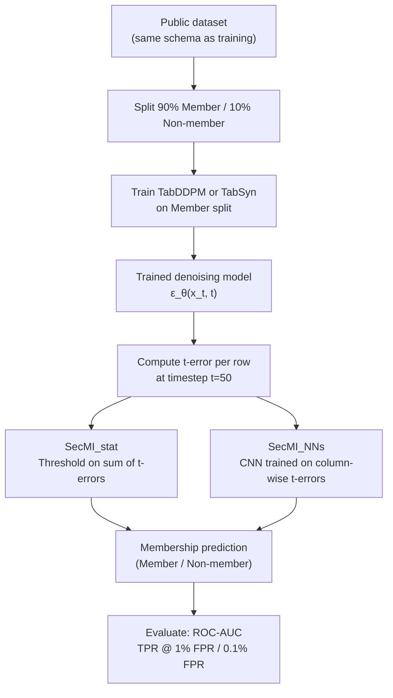
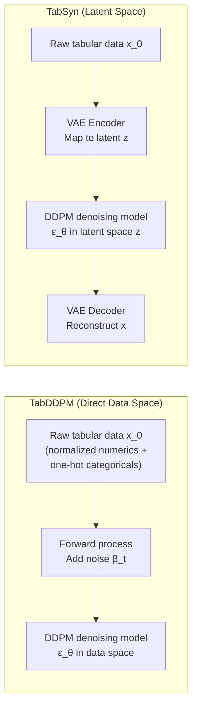
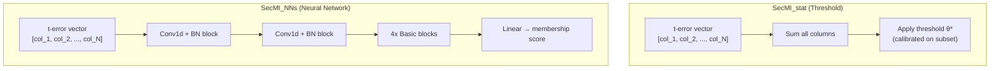
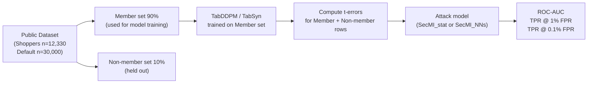

# Paper Review: Membership Inference over Diffusion-models-based Synthetic Tabular Data

> **Reviewed:** 2026-06-09
> **Source:** `/home/nhatquang/Desktop/HCMUS Course/4. Taiwan MS Prep/14. Tabular ML Security/mia_diffusion_synthetic_tabular_2025.pdf`
> **Reviewer lens:** Senior Security Architect + Senior AI Researcher
> **ArXiv:** 2510.16037v1 [cs.CR] 16 Oct 2025
> **Authors:** Peini Cheng, Amir Bahmani — University of Alberta (course project, supervised by Dr. Bailey Kacsmar)

---

## 1. Motivation — Why Should We Care?

Synthetic tabular data is being actively marketed as a GDPR-compliant substitute for real sensitive data in healthcare, finance, and education. The implicit regulatory argument is that synthetic data is "anonymous" and thus falls outside GDPR's scope (Recital 26). Two high-profile diffusion-based models — **TabDDPM** and **TabSyn** — have been promoted by their authors as privacy-safe, with the Distance to Closest Record (DCR) metric offered as evidence.

This paper challenges that safety claim directly: if a diffusion model memorizes training records, releasing the model (or synthetic samples derived from it) enables an attacker to infer whether a specific individual's record was part of the training set — a Membership Inference Attack (MIA). Successful MIAs:

1. Invalidate the GDPR Recital 26 exemption for the data controller.
2. Open the door to downstream Attribute Inference Attacks (AIAs).
3. Erode trust in the entire synthetic data ecosystem.

The practical stakes are real: regulators and practitioners rely on DCR as an implicit privacy certificate. Showing that DCR gives a false sense of security while MIA still works is a meaningful contribution to the field.

---

## 2. Proposal — What Do the Authors Propose and Why?

The authors adapt **SecMI** (Duan et al., 2023) — a query-based MIA originally designed for image diffusion models — to attack tabular diffusion models. The two specific targets are:

- **TabDDPM**: a Denoising Diffusion Probabilistic Model (DDPM) operating directly in data space.
- **TabSyn**: a VAE + latent-space DDPM hybrid.

They propose two attack variants, both adapted from SecMI:

- **SecMI_stat**: A threshold-based classifier using the sum of column-wise t-errors at a chosen timestep (t=50). No training required.
- **SecMI_NNs**: A small CNN trained on column-wise t-error vectors to predict membership probability.

Their core argument for adaptation: the SecMI t-error assumption (member data yields lower reconstruction error than non-member data) should transfer from pixels to tabular columns, since the denoising loss is the same mathematical object (Equation 4).

Their evaluation uses two UCI datasets (Shoppers: 12,330 rows; Default: 30,000 rows), a 90/10 member/non-member split, ROC-AUC, and TPR at low FPR (1% and 0.1%) as the primary attack-success metrics.

---

## 3. Method — How Does It Work?

### 3.1 Diffusion Model Foundations

The forward process adds Gaussian noise to data over T timesteps:

$$q(x_t | x_{t-1}) = \mathcal{N}(x_t; \sqrt{1-\beta_t} x_{t-1}, \beta_t I)$$

The reverse (denoising) process is parameterized by a neural network $\epsilon_\theta(x_t, t)$ that estimates added noise. Training minimizes:

$$\ell_{x_0,t} = \mathbb{E}_{x_0,t} \|\epsilon - \epsilon_\theta(x_t, t)\|_2^2$$

### 3.2 The SecMI t-error Signal

The key insight from Duan et al.: member samples are slightly better reconstructed by the denoising model at small timesteps because the model has (over)fit them. The t-error at timestep t for a sample $x_0$ is:

$$\hat{t}_{t,x_0} = \|\psi_\theta(\phi_\theta(\hat{x}_t, t), t) - \hat{x}_t\|^2$$

where $\phi_\theta$ applies one forward step and $\psi_\theta$ applies one reverse step. A lower t-error signals membership.

For tabular data, the authors sum this error across all numerical columns for a single row.

### 3.3 Attack Pipeline

*Figure A: End-to-end attack pipeline. The attacker only requires query access to the denoising model.*

### 3.4 Target Model Architecture Contrast

*Figure B: Architectural difference between TabDDPM and TabSyn. TabSyn's VAE latent space abstracts away individual column signals, making t-error-based membership inference harder.*

### 3.5 Attack Variant Architecture

*Figure C: The two attack classifiers. SecMI_NNs uses a shallow 1D-CNN architecture, converting the per-column t-error profile into a membership score.*

### 3.6 Dataset Split and Evaluation Strategy

*Figure D: Experimental evaluation setup. Note the severe class imbalance — 90% members, 10% non-members.*

---

## 4. Strengths and Weaknesses

### Strengths

**S1. Practically relevant threat model.**
The attacker assumption — white-box access to the denoising model (as would occur if an organization releases the trained generator) — is realistic. Many organizations publicly release trained generative models for reproducibility.

**S2. Effective differentiation of SecMI_stat vs. SecMI_NNs.**
The paper correctly identifies that the statistical attack's aggregation (sum of t-errors) discards column-specific structure, while the neural attack exploits per-column overfitting signals. This nuance explains a major performance gap and is a genuine analytical contribution.

**S3. DCR critique is the most valuable contribution.**
The discussion in Section 7.1 directly targets the dominant privacy evaluation practice. Showing that DCR scores near 50% (Table 6) coexist with high attack success (AUC 97% on Shoppers for TabDDPM) is a striking finding that should concern practitioners who rely on DCR alone.

**S4. Training-size as vulnerability factor is clearly argued.**
Section 7.2's analysis that smaller training sets increase overfitting and therefore MIA success is methodologically sound and aligns with prior MIA theory (Yeom et al., 2018).

**S5. Honest about TabSyn's resilience.**
The authors do not oversell. They clearly report that SecMI fails against TabSyn (AUC ~51%, TPR barely above FPR) and correctly attribute this to the latent-space architecture abstracting away column-level memorization signals.

---

### Weaknesses

**W1. Thin empirical base — only two datasets.**
Shoppers (12,330 rows) and Default (30,000 rows) are both small, relatively clean UCI datasets with modest dimensionality (10-14 numerical + 11-18 categorical columns). Healthcare or financial tabular data often has hundreds of columns, rare events, and extreme class imbalance. No claim generalizes beyond these two datasets without additional evidence. The authors acknowledge this but do not attempt a third dataset despite the experimental simplicity.

**W2. The 90/10 member/non-member split is problematic for evaluation.**
Using 90% of the data as members creates an extreme class imbalance. ROC-AUC under imbalance is misleading (known to overestimate performance). The TPR-at-low-FPR metric is more honest, but the choice of 90/10 inflates AUC figures and complicates comparison with baseline MIA literature, which typically uses 50/50 splits.

**W3. SecMI assumption fails for TabSyn but the authors do not propose an alternative.**
Section 7.2 concludes that TabSyn's latent-space design naturally defeats the attack. But "the attack fails" is not the same as "TabSyn is private." The paper does not design a latent-space MIA for TabSyn, which would be the natural next step. Calling TabSyn "resilient" based solely on a failed attack is a false negative risk — absence of evidence is not evidence of absence.

**W4. No statistical significance testing.**
Results in Tables 4 and 5 are point estimates with no confidence intervals, no p-values, and no repeated trials over different random seeds or train/test splits. This is particularly concerning given the small non-member set size (1,233 rows for Shoppers, 3,000 for Default).

**W5. Attack model architecture is borrowed without validation.**
The 1D-CNN architecture (Tables 2 and 3) is directly copied from the image-domain SecMI without ablation. Why Conv1d over a simple MLP? Tabular data has no spatial structure, making Conv1d a questionable choice. No ablation is provided.

**W6. Threshold calibration leakage.**
SecMI_stat's threshold is calibrated using samples from the same evaluation pool (the membership likelihood output is threshold-selected on the test data, Section 5.4). If any labeled data is used to select the threshold, this constitutes a train/test leakage. The paper does not clearly describe whether the threshold is set on a held-out validation subset or directly on the test set.

**W7. Course project provenance.**
The footnote "This work is a course project under the supervision of Dr. Bailey Kacsmar" is a significant credibility qualifier. The paper has not been peer-reviewed and is an ArXiv preprint. The experimental design reflects the constraints of a course project (two datasets, borrowed architecture, limited ablation).

**W8. Categorical column handling is an unresolved gap.**
TabDDPM uses Multinomial diffusion for categorical columns. The authors explicitly exclude categorical data from SecMI and only attack numerical columns (Section 5.2). In datasets where the most sensitive attributes are categorical (e.g., medical diagnosis, loan status), this is a major blind spot.

---

## 5. Trustworthiness Assessment

| Dimension | Rating | Justification |
|---|---|---|
| Reproducibility | 3/5 | Uses public UCI datasets, public TabDDPM/TabSyn repositories, and SecMI codebase. Key hyperparameters reported (batch size, epochs, noise schedulers). However, no code released, threshold selection procedure is ambiguous, and CNN architecture ablation is absent. |
| Evaluation rigor | 2/5 | Two datasets only; 90/10 split inflates AUC; no confidence intervals or repeated trials; no latent-space attack for TabSyn; AUC on Default looks high but TPR at low FPR is near-random — the paper correctly highlights this tension but does not resolve it. |
| Novelty vs. incremental | 2/5 | The core method is a direct transplant of SecMI from image to tabular domain with minimal modification (sum over columns instead of pixels). The genuine novelty is the DCR critique and the architectural explanation for TabSyn's resilience. Incremental by academic standards. |
| Practical deployability | 2/5 | Requires white-box access to the denoising model, which is only realistic if the generator is released publicly. More common deployments expose only synthetic output data, against which SecMI cannot be run. Authors acknowledge this in Section 8 but understate its practical impact. |
| Security posture | 3/5 | The threat model is well-motivated and directionally correct. The finding that DCR is insufficient is important. However, the incomplete coverage of TabSyn, exclusion of categorical columns, and lack of a black-box variant leave significant attack surface uncharacterized. |
| Venue & author credibility | 2/5 | ArXiv preprint only; explicitly a course project; two graduate students with no other listed publications in this domain. Supervisor (Dr. Bailey Kacsmar) has privacy research credentials, which partially offsets. No peer review. |

**Overall verdict.**

This is a competent, honest course project that makes one genuinely useful point: DCR is not a sufficient privacy metric for diffusion-based tabular data generators, and TabDDPM can be successfully attacked by adapting SecMI. The experimental evidence supporting this claim is credible within its narrow scope (two datasets, white-box setting, numerical columns only).

The paper should not be cited as strong evidence that TabSyn is privacy-preserving — the authors merely failed to attack it with an ill-suited tool. From a security architecture perspective, the white-box attack assumption limits operational relevance; most deployed synthetic data pipelines expose only the output data, not the model weights. A practitioner reading this paper should take away: (1) release trained generative models with caution, (2) do not rely on DCR alone, and (3) the privacy resilience of latent-space diffusion (TabSyn-style) under a properly adapted latent-space MIA remains an open and urgent question. As a research contribution, it is a solid starting point, not a definitive result.
