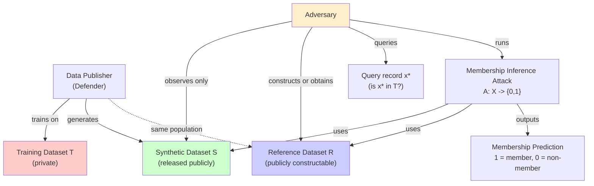
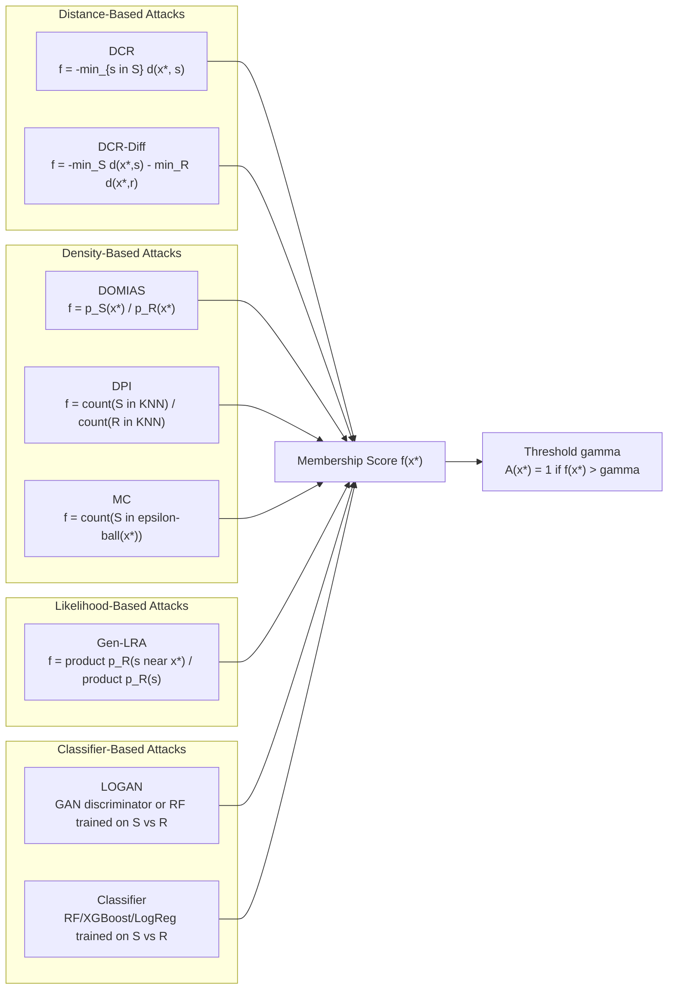
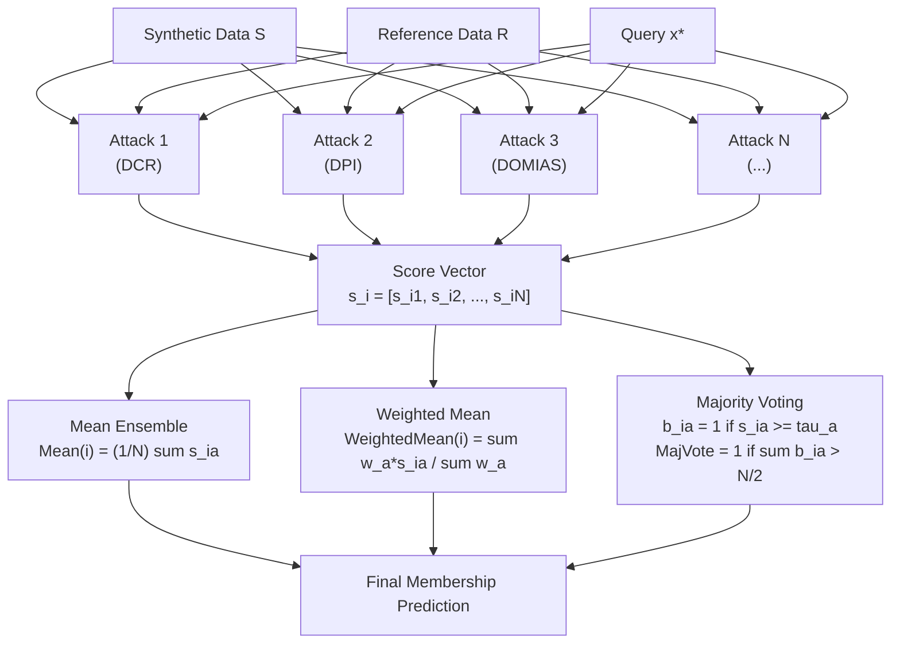
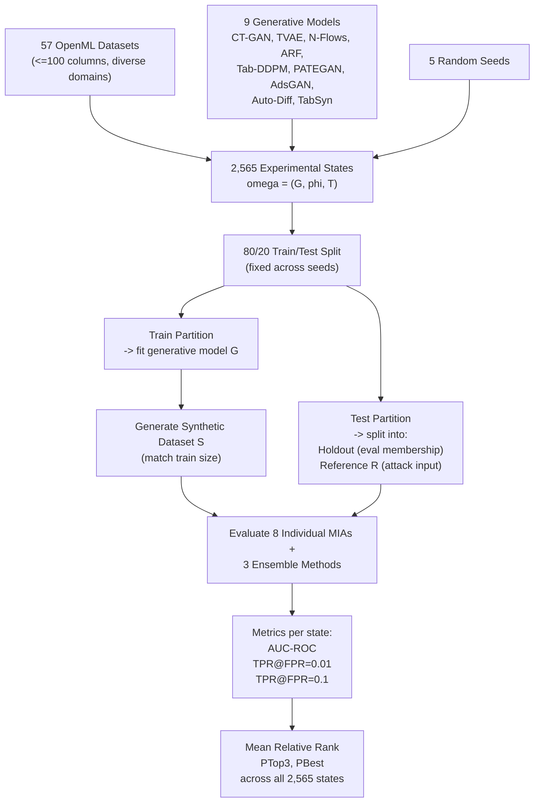
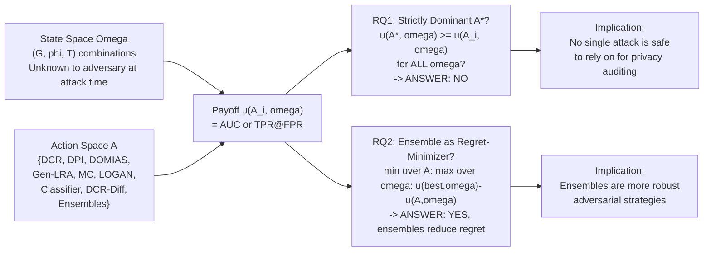
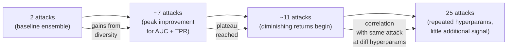

# Paper Review: Ensembling Membership Inference Attacks Against Tabular Generative Models

> **Reviewed:** 2026-06-09
> **Source:** /home/nhatquang/Desktop/HCMUS Course/4. Taiwan MS Prep/14. Tabular ML Security/mia_tabular_generative_ward_2025.pdf
> **Reviewer lens:** Senior Security Architect + Senior AI Researcher

---

## 1. Motivation — Why Should We Care?

Tabular synthetic data generation has become a practical tool for privacy-preserving data release in healthcare, finance, and education — domains where individual records carry legally and ethically significant sensitivity. Organizations increasingly release synthetic datasets as proxies for real patient or customer data, under the implicit assumption that doing so provides meaningful privacy protection.

The gap this paper targets is specific and important: while Membership Inference Attacks (MIAs) exist as the primary audit mechanism for synthetic data privacy, practitioners face a choice problem. There are at least eight distinct MIA strategies in the literature (DCR, DPI, DOMIAS, Gen-LRA, MC, LOGAN, Classifier, DCR-Diff), each designed around different hypotheses about how generative models leak information. No prior systematic evidence exists to guide which attack a practitioner — or a real adversary — should use against an unknown target model on an unknown dataset. If a defender calibrates their privacy guarantees against the wrong attack, they may declare a dataset safe when it is not.

The concrete failure mode is serious: a hospital releases a synthetic cancer dataset. An adversary runs the "wrong" single MIA, sees low risk, but a different MIA they didn't try would have found significant membership leakage. The paper also frames the inverse threat: adversaries themselves face uncertainty about which attack to deploy, and a suboptimal choice reduces their ability to discover privacy violations.

This is a well-scoped, genuinely practical problem. The motivation is not oversold — the authors are careful not to claim existing attacks are broken, only that no single one is reliably dominant, which is a falsifiable and meaningful empirical claim.

---

## 2. Proposal — What Do the Authors Propose and Why?

The authors make two core contributions. First, they conduct the largest systematic MIA benchmark to date for tabular generative models: 9 generative models, 57 datasets, 5 random seeds, yielding 2,565 distinct experimental states. They use this benchmark to empirically test whether any single MIA constitutes a strictly dominant strategy — and find that no such strategy exists (DPI, the best individual attack, leads in only 16.2% of AUC states and 19.1% of TPR@FPR=0.01 states). Second, motivated by the absence of a dominant attack, they propose treating individual MIAs as weak learners in an ensemble framework and evaluate three unsupervised aggregation strategies: Mean ensemble, Weighted Mean ensemble, and Majority Voting ensemble.

The ensemble framing is principled rather than ad hoc. The authors draw explicitly from ensemble learning theory (weak learner combination, error-diversity decomposition) and show empirically that MIA scores are weakly correlated across methods (Figure 2) with high pairwise disagreement rates of 20-40% (Figure 3), which satisfies the diversity condition necessary for ensemble gains. The justification for unsupervised ensembles specifically — rather than trained meta-learners — is also principled: in realistic deployment, the adversary has no labeled ground truth to train a combiner on. The choice of No-box threat model (adversary sees only synthetic data S and a reference dataset R from the same population) is well-argued as the most practically relevant scenario, since defenders have no obligation to release model details.

The key claim is regret minimization: ensembles may not always achieve the highest absolute attack performance on any given state, but they consistently reduce the worst-case regret across unknown states. This is the right objective function for the adversarial setting described.

---

## 3. Method — How Does It Work?

### 3.1 Formal Setup

The attack selection problem is framed as decision-making under uncertainty. The state space Omega consists of all (generative model G, initialization phi, training dataset T) combinations — 2,565 states in the benchmark. The action space A contains the available MIA strategies. The payoff function u: A x Omega -> R maps (attack, state) pairs to a performance measure (AUC, TPR at fixed FPR).

Strict dominance of attack A* requires: u(A*, omega) >= u(Ai, omega) for all Ai in A and all omega in Omega. The paper empirically tests this condition across the benchmark.

### 3.2 Individual Attacks (the Weak Learners)

Eight attacks are evaluated:

- **DCR (Distance to Closest Record)**: Scoring function f_DCR(x*) = -min_{s in S} d(x*, s). Tests the hypothesis that training members have nearby synthetic records.
- **DCR-Diff**: Calibrates DCR against a holdout reference: f_DCR-Diff(x*) = -min_{s in S} d(x*, s) - min_{r in R} d(x*, r). Reduces false positives from naturally dense regions.
- **DOMIAS**: Density ratio of estimated p_S(x*) / p_R(x*). Uses KDE or deep density estimators. Attacks overfitting by comparing synthetic density in local regions to reference density.
- **DPI (Data Plagiarism Index)**: Local density ratio in K-nearest-neighbor neighborhoods: f_DPI(x*) = [sum_{z in D(x*)} 1(z in S)] / [sum_{z in D(x*)} 1(z in R)]. Interpretable: DPI=0 is underfitting, DPI=1 is balanced, DPI>1 suggests memorization.
- **Gen-LRA**: Likelihood ratio using KDE: f_Gen-LRA(x*) = product_{s in S, s near x*} p_R(s) / product_{s in S} p_R(s). Evaluates influence of x* on likelihood of synthetic data.
- **MC (Monte Carlo)**: Approximates P(s in U_epsilon(x*)) by counting synthetic samples in epsilon-neighborhood. Direct count-based density estimation.
- **LOGAN**: Trains a GAN discriminator or Random Forest to distinguish S from R; uses discriminator score as membership signal.
- **Classifier**: Trains a supervised classifier on S vs R, uses prediction probability as score.

All attacks operate under the No-box threat model. The binary classification threshold for Majority Voting uses each attack's median score as a heuristic (following [5, 37]).

### 3.3 Ensemble Methods

Given N individual attacks producing score vectors s_i = [s_{i1}, ..., s_{iN}] for each data point i:

**Mean Ensemble**: Mean(i) = (1/N) * sum_{a=1}^{N} s_{ia}

**Weighted Mean Ensemble**: WeightedMean(i) = sum_{a=1}^{N} w_a * s_{ia} / sum_{a=1}^{N} w_a, where weights w_a are derived from each attack's proportion of top-AUC states (Figure 1).

**Majority Voting Ensemble**: Each attack converts score s_{ia} to binary b_{ia} = 1 if s_{ia} >= tau_a, else 0. MajorityVote(i) = 1 if sum_{a=1}^{N} b_{ia} > N/2.

### 3.4 Experimental Design

- **State space**: 9 generative models (CT-GAN, TVAE, N-Flows, ARF, Tab-DDPM, PATEGAN, AdsGAN, Auto-Diff, TabSyn) x 57 datasets (OpenML-CC18 filtered to <=100 columns) x 5 seeds = 2,565 states.
- **Data split**: 80:20 train/test; test further split into equal holdout and reference sets. Continuous variables scaled, categorical one-hot encoded for distance attacks, ordinally encoded for KDE attacks.
- **Evaluation metric**: Mean Relative Rank across all states (lower is better), PTop3 (proportion of states where method ranks in top 3), PBest (proportion of states where method achieves highest absolute performance). AUC-ROC and TPR@FPR=0.01/0.1 reported.
- **Ensemble size analysis**: Majority Voting ensembles of size 2 to 25 evaluated over 100 random runs (Section 5.3).

### 3.5 Attack Contribution Analysis

Leave-one-out marginal contribution C_{a,omega} = u(E, omega) - u(E_{-a}, omega) quantifies each attack's contribution to ensemble performance. Averaged across all states and ensemble runs.

---

### Diagrams

**Diagram 1: No-Box Threat Model**

*The No-box threat model: the adversary has access only to released synthetic data S and a reference dataset R from the same underlying distribution, but not the generative model or its weights.*

---

**Diagram 2: Individual MIA Signal Types and Scoring Functions**

*Eight MIA strategies organized by signal type, all producing a scalar membership score fed into a binary threshold classifier.*

---

**Diagram 3: Ensemble Construction Pipeline**

*Unsupervised ensemble pipeline: all N individual attacks score query x* independently; three aggregation strategies combine scores without requiring labeled training data.*

---

**Diagram 4: Experimental State Space and Evaluation Design**

*Experimental design: 2,565 states formed by combining 9 models, 57 datasets, and 5 seeds; each state produces AUC and TPR metrics aggregated by relative rank.*

---

**Diagram 5: Decision Theory Framework — Strategy Selection Under Uncertainty**

*Decision theory framing: the adversary must commit to an attack strategy without knowing which (model, dataset) state will be encountered; ensembles minimize worst-case regret.*

---

**Diagram 6: Ensemble Size vs. Performance (Section 5.3 Findings)**

*Ensemble size scaling: performance improves up to ~7 diverse individual attacks, then plateaus as added attacks become correlated instantiations of the same method.*

---

## 4. Strengths and Weaknesses

### Strengths

**Scale and scope of benchmark.** The 2,565-state experiment is the largest systematic MIA benchmark for tabular generative models reported. Spanning 9 generative models and 57 OpenML datasets across economics, healthcare, and social sciences creates genuine breadth. Prior work typically evaluates on 3-5 datasets with 1-3 generative models, making their conclusions dataset-specific.

**Principled framing of the research question.** The decision-theoretic formulation (strict dominance, regret minimization) is the correct lens for this problem. It avoids the common trap of claiming "Attack X is best" based on cherry-picked datasets and instead asks the operationally meaningful question: what should an adversary do without knowing the deployment context?

**Empirical honesty about ensemble limitations.** The authors do not overclaim. They explicitly note that ensembles never achieve the highest PBest score (Table 2) — individual attacks still win the most states outright. The value proposition is specifically reduced regret (mean rank, PTop3), not absolute dominance. This is a defensible and accurate characterization.

**Unsupervised design choice is well-justified.** Requiring no labeled ground truth for ensemble construction is not a compromise — it is a requirement of the realistic threat model. A supervised combiner would require knowledge of true training membership, which defeats the purpose of the attack.

**Signal diversity analysis is compelling.** Figures 2 and 3 (pairwise correlation and disagreement) provide mechanistic evidence for why ensembles work. The correlation heatmap shows most off-diagonal pairs have near-zero correlation, and disagreement rates of 20-40% are high enough to provide ensemble benefit. This is not hand-waving; it is the theoretical condition for ensemble effectiveness.

**Code release.** The authors provide a GitHub repository (github.com/joshward96/Ensemble-MIA), which is essential for a benchmark paper claiming to establish a standard.

**Useful guidance on attack contribution.** Table 3 (leave-one-out marginal contribution analysis) is practically valuable: it shows that DCR and DCR-Diff, which perform poorly individually, contribute disproportionately to ensemble effectiveness due to their low correlation with other attacks. This directly informs which attacks to include in a practical ensemble.

### Weaknesses and Red Flags

**No-box threat model is simultaneously the most realistic and the most limiting assumption.** The paper correctly argues No-box attacks are the most practically relevant, but this comes at the cost of excluding white-box and shadow-box attacks that are theoretically stronger. The claim that defenders "can simply choose not to release model details" is plausible in industry but often false in academic settings, open-source deployments, or audited environments. The paper dismisses non-No-box attacks too quickly without quantifying how much additional privacy leakage they would reveal. A defender using the paper's ensemble-based audit might declare a model safe against No-box ensembles when it is significantly vulnerable to shadow-box attacks they did not evaluate.

**Absolute attack performance is low throughout.** From Table 2, the best-performing ensemble (Weighted Mean) achieves a mean AUC of approximately 3.68 (rank-based, not raw AUC). The raw AUC values are not explicitly reported per method — only ranks — which obscures the actual privacy risk magnitude. Figures in Section 3 (Figure 1) show "proportion of best" metrics, but the best individual attack DPI achieves top AUC rank in only 16.2% of states. This raises a concern: if ALL attacks perform only marginally above random, ensembling marginally-above-random weak learners may produce a result that is still practically insignificant for real privacy auditing. The paper uses relative rank as the primary metric precisely to sidestep this issue, but it should directly report and discuss absolute AUC distributions.

**Threshold heuristic for Majority Voting is ad hoc.** Using median score as the classification threshold (following [5, 37]) is a heuristic with no theoretical grounding. The paper does not evaluate sensitivity to threshold choice. In practice, median-thresholding on a bimodal or right-skewed score distribution can produce wildly different false positive rates, which matters enormously for TPR@FPR=0.01 metrics. This is a significant methodological gap.

**Weighted Mean uses post-hoc knowledge.** The weights for the Weighted Mean ensemble are derived from Figure 1 — the proportion of states each attack achieved best AUC across the entire benchmark. This is computed using the experimental outcomes and is therefore unavailable to a real adversary prior to running the benchmark. The paper acknowledges this ("adversary could now use this information as some set of priors") but this creates a circularity: the weights depend on running the 2,565-state experiment first. A real adversary has none of this prior. Weighted Mean thus conflates a post-hoc oracle with a practical attack strategy.

**No statistical significance testing.** The paper reports mean ranks with standard errors but does not conduct formal hypothesis tests (e.g., Wilcoxon signed-rank or Friedman tests) to establish that ensemble ranks are significantly better than individual attacks. The standard errors in Table 2 overlap substantially between some ensemble and individual methods. "Broadly lower mean ranks" is not the same as statistically significant improvement.

**Dataset filtering removes high-dimensional cases.** Filtering out datasets with >100 columns (from 72 down to 57) removes the regime where tabular data privacy is often most critical in practice — high-dimensional medical records, genomic data, electronic health records. The 57 remaining datasets have relatively low dimensionality, which may favor distance-based attacks (DCR, DCR-Diff) that degrade in high dimensions due to the curse of dimensionality. This limits generalizability to real healthcare/finance use cases.

**No analysis of data size effects.** The 57 datasets range enormously in size (from n=15 to n=90,320 per Table 4). Attack performance on tabular MIA is known to be highly sensitive to training set size (small datasets memorize more). The paper evaluates by relative rank across all datasets without stratifying by size, which may obscure systematic failure modes.

**Ensemble method diversity is limited.** Three aggregation methods (Mean, Weighted Mean, Majority Vote) are all simple linear combiners. No nonlinear ensemble strategies (stacking, boosting-style reweighting, learned rank aggregation) are evaluated. The paper acknowledges this as future work but it means the ensemble contribution is methodologically thin — the hard problem of how to combine attacks optimally is not solved.

**Threat model does not address adaptive adversaries against the ensemble.** If a defender knows their adversary uses an ensemble, they might optimize their generative model specifically to defeat ensemble diversity (e.g., minimizing the disagreement between attacks). The paper treats the ensemble purely as an offensive tool without analyzing the game-theoretic equilibrium between an ensemble-aware adversary and an ensemble-aware defender.

**The claim that "weaker attacks contribute more to ensembles" is surprising and under-explained.** Table 3 shows DCR (mean rank contribution 2.66) contributes more than DPI (4.76) to ensemble AUC, despite DPI being the best individual attack. The intuition is diversity — DCR exploits different signal than DPI — but this result warrants a deeper mechanistic explanation. Why does DCR's lower-dimensional distance signal complement DPI's local density ratio? The paper notes the correlation with diversity but stops short of a full explanation.

---

## 5. Trustworthiness Assessment

| Dimension | Rating | Justification |
|---|---|---|
| Reproducibility | **High** | Code released at github.com/joshward96/Ensemble-MIA; 57 datasets are public OpenML datasets; hyperparameters fully specified in Appendix 8.3; 5-seed repetition is appropriate. Main concern: 9 generative model implementations — some use Synthcity defaults, others (Auto-Diff, TabSyn) use original codebases, which could introduce version-specific behavior. |
| Evaluation rigor | **Medium** | Largest benchmark to date (2,565 states) is a genuine strength. However, primary metric is relative rank, which can obscure that all attacks perform near-chance on many datasets. No formal significance tests. Weighted Mean ensemble uses post-hoc oracle weights. Absolute AUC distributions never shown directly. |
| Novelty vs. incremental | **Medium** | The ensemble framework is a natural and principled application of ensemble learning to MIA, but not a deep technical innovation. The larger genuine contribution is the benchmark and the empirical finding that no dominant attack exists — this is significant for the field but more empirical than methodological novelty. The decision-theoretic framing is a nice conceptual contribution but lightweight in theory. |
| Practical deployability | **Medium** | Unsupervised ensembles are practically deployable — they require only S and R and no labeled data. However, the Weighted Mean requires running the full benchmark first to derive weights, and the Majority Voting threshold selection is ad hoc. Compute cost of running 8 attacks is non-trivial for large datasets (DOMIAS and Gen-LRA use KDE which scales poorly). No wall-clock timing reported. |
| Security posture | **Medium-Low** | The paper focuses entirely on offensive capability (improving attacks). From a security architect perspective, critical gaps remain: no analysis of adaptive defenders, no quantification of attack accuracy in absolute terms (not just ranks), no evaluation of the ensemble against differentially private generative models (only mentioned as future direction). The dismissal of white-box threat models underestimates real-world adversary capability in open-source deployment contexts. |
| Venue & author credibility | **Medium-High** | Published at AISec 2025 (ACM Workshop on AI and Security, co-located with CCS), which is a reputable security venue. Ward, Wang, and Cheng are from UCLA (Guang Cheng's group has prior work on tabular MIA: DPI [38], Gen-LRA [39], DOMIAS-adjacent methods). Yang is from Stanford. The authors are essentially evaluating and ensembling partly their own prior attacks, which creates a mild self-citation bias, though the evaluation is sufficiently comprehensive to mitigate this. |

**Overall verdict.** This paper makes a solid, practically useful empirical contribution: it establishes that no single MIA dominates for tabular synthetic data and that simple unsupervised ensembles reduce regret compared to any individual attack. The benchmark scale is genuinely impressive for a workshop paper. However, the work has important gaps that prevent it from being definitive. The exclusive focus on No-box attacks is a principled but limiting choice that leaves the most powerful attack strategies uncharacterized. The use of relative rank as the primary metric without reporting absolute AUC distributions is a red flag — it is possible that all methods are performing only marginally above random on many datasets, which would substantially undercut the practical significance of ensemble "improvements." The Weighted Mean ensemble relies on post-hoc oracle knowledge that a real adversary would not have. I would cite this paper as strong empirical motivation for ensemble-based privacy auditing, recommend using it as a benchmark baseline, but not treat it as a complete solution to the MIA strategy selection problem. A practitioner deploying this for real privacy auditing should supplement it with differential privacy guarantees, not treat ensemble MIA performance as a sufficient privacy certificate.
