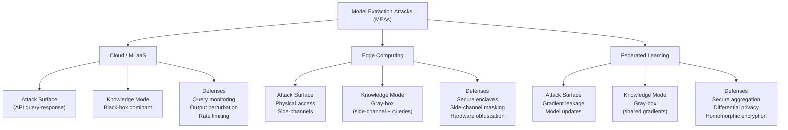
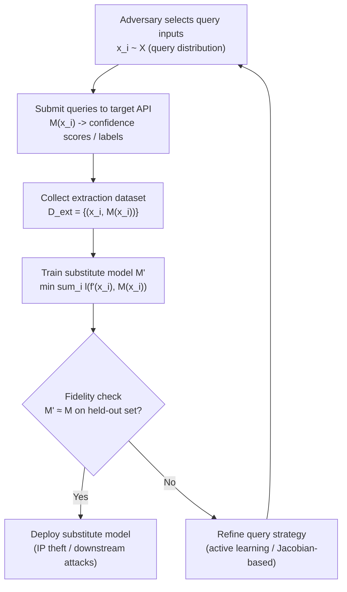
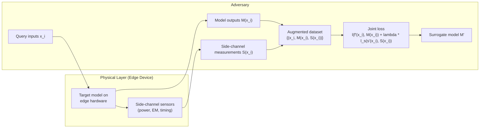
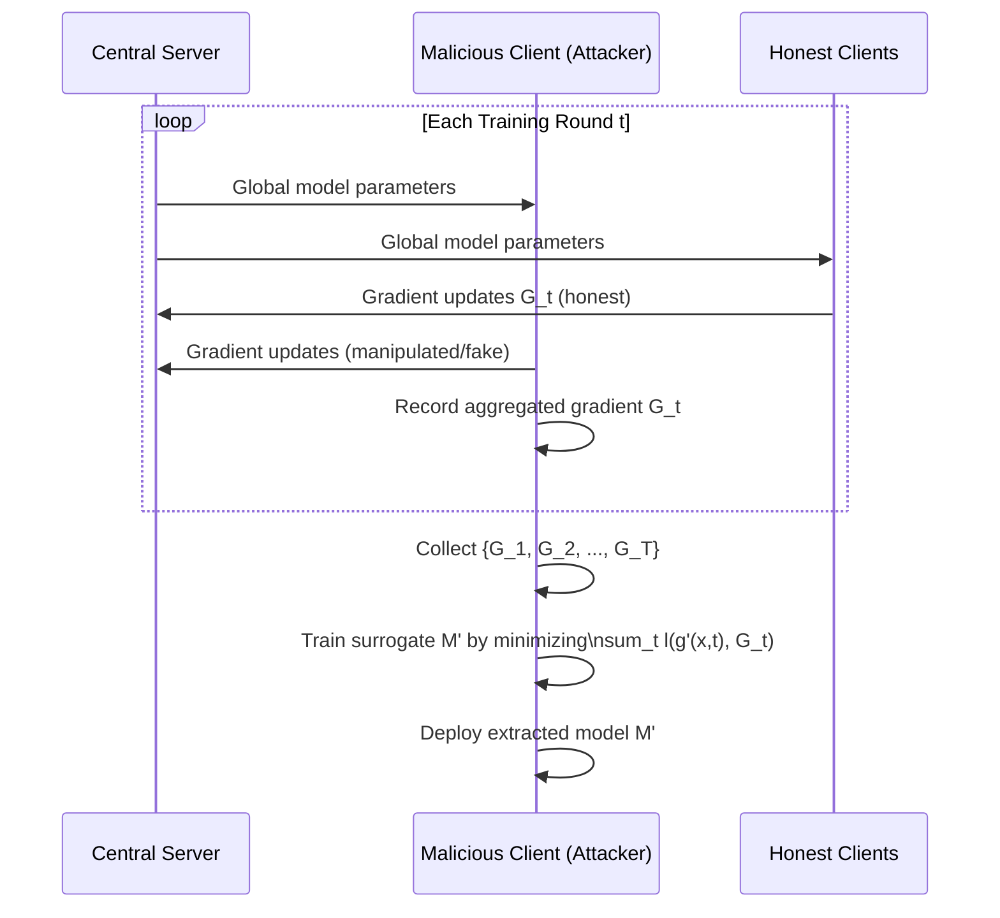
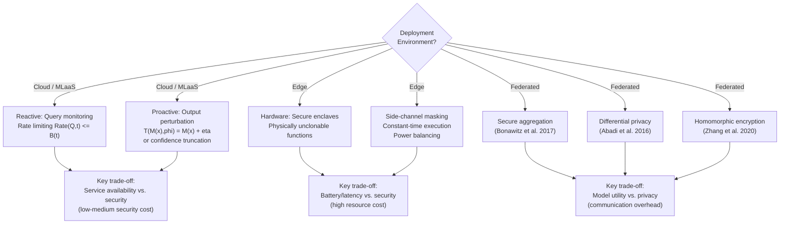
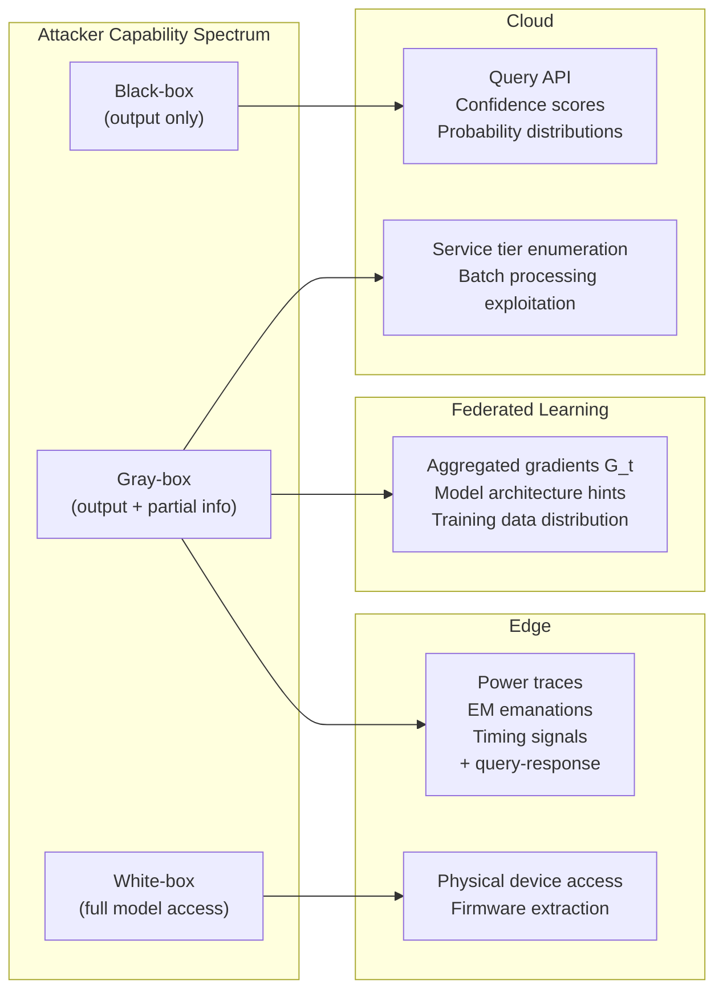

# Paper Review: A Survey of Model Extraction Attacks and Defenses in Distributed Computing Environments

> **Reviewed:** 2026-06-09
> **Source:** `/home/nhatquang/Desktop/HCMUS Course/4. Taiwan MS Prep/14. Tabular ML Security/model_extraction_survey_2025.pdf`
> **Reviewer lens:** Senior Security Architect + Senior AI Researcher
> **Authors:** Kaixiang Zhao, Lincan Li, Kaize Ding, Neil Zhenqiang Gong, Yue Zhao, Yushun Dong
> **Affiliations:** Notre Dame, Florida State, Northwestern, Duke, USC
> **arXiv:** 2502.16065v1 [cs.CR], 22 Feb 2025

---

## 1. Motivation — Why Should We Care?

Model Extraction Attacks (MEAs) are a concrete and growing threat. As MLaaS platforms proliferate — AWS SageMaker, Google Vertex AI, Azure ML, Hugging Face Inference Endpoints — adversaries can systematically query production APIs, collect input-output pairs, and train surrogate models that replicate the target's decision boundary at a fraction of the original training cost. The economic stakes are real: a financial institution's credit-scoring model, a healthcare provider's diagnostic model, or a technology firm's recommendation engine represents years of proprietary data curation and training investment. A successful extraction attack not only steals intellectual property but also enables downstream adversarial attacks, membership inference, and evasion — because the attacker now holds a white-box proxy.

What makes this survey timely is the distributed computing angle. Prior surveys (e.g., Rigaki and Garcia 2023) treated MEAs generically. But cloud, edge, and federated learning are not just deployment variants — they present **structurally different attack surfaces**:

- **Cloud/MLaaS**: Rich API outputs (confidence scores, probability distributions) enable high-fidelity black-box extraction. The main constraint is query budget.
- **Edge**: Physical accessibility enables hardware-level side-channel attacks (power analysis, EM emanations, timing). Model compression / quantization on edge devices may actually make extraction *easier*, not harder.
- **Federated Learning**: The collaborative gradient-sharing protocol directly exposes model internals — gradient leakage is an attack surface that does not even exist in the other two settings.

The failure mode if this gap goes unaddressed is fragmented, environment-specific defenses that leave cross-paradigm deployments (a model that runs partly in the cloud, partly on edge devices) with no unified protection. The motivation is genuine and the framing around four research questions (Q1–Q4) is coherent.

**One caveat**: the survey oversells the uniqueness of its contribution slightly. The claim that no prior work has examined how computing paradigms "fundamentally shape both attack methodologies and defense strategies" is too strong — several papers cited within (e.g., Nayan et al. 2024 on on-device extraction, Lyu et al. 2022 on FL privacy/robustness) have already done paradigm-specific analysis. The novelty is the synthesis, not the individual insights.

---

## 2. Proposal — What Do the Authors Propose and Why?

The authors propose a **unified taxonomy and survey** of MEAs organized along two axes: (1) the computing paradigm (cloud, edge, federated) and (2) the information channel exploited (API query-response, physical side-channel, gradient leakage). They do not propose a new attack or defense algorithm — this is a survey paper. The core deliverable is a structured comparison framework (Table 1) and a narrative synthesis of how environment shapes attack vectors and defense requirements.

The authors' justification for this specific framing is principled: they argue that attack feasibility, query budget constraints, available side information, and defense trade-offs are all functions of the deployment environment. A defense that works in cloud (output perturbation with low latency overhead) is infeasible at the edge (battery and compute constrained) and useless in FL (where the attack surface is in gradient space, not output space). This is a correct and important observation.

The implicit alternative they reject is treating MEAs as a monolithic threat and applying generic defenses uniformly — which they argue leads to "fragmented defenses, inadequate risk assessments, and substantial economic and privacy losses."

What the paper does **not** do, and arguably should:
- Propose concrete unified defense architectures or protocols
- Provide experimental validation of any claim
- Quantify the relative severity of attack vectors across environments (no empirical comparison)

The contribution is taxonomic and synthesizing. It is a legitimate survey contribution, but it should be evaluated as such — not as a research paper advancing the technical frontier.

---

## 3. Method — How Does It Work?

### 3.1 Formal Framework

The paper formalizes MEA as: given a target model $\mathcal{M}$ with function $f(\cdot)$, an adversary collects a dataset $D_{\text{ext}} = \{(x_i, \mathcal{M}(x_i)) \mid x_i \sim \mathcal{X}, 1 \le i \le N\}$ and minimizes a surrogate loss:

$$\mathcal{M}' = \arg\min_{\mathcal{M}'} \sum_{(x, \mathcal{M}(x)) \in D_{\text{ext}}} \ell(f'(x), \mathcal{M}(x)) \tag{1}$$

This is the standard Tramèr et al. (2016) formulation. Not novel.

Defense is formalized as a transformation $\mathcal{T}$ applied to model output:

$$\mathcal{M}_{\text{def}}(x) = \mathcal{T}(\mathcal{M}(x), \phi) \tag{2}$$

subject to the dual objective (Eq. 3): maximize discrepancy between $\mathcal{M}'(x)$ and $\mathcal{M}(x)$ for adversarial queries, while keeping output deviation bounded by $\epsilon$ for legitimate queries. Query rate limiting is modeled as $\text{Rate}(Q, t) \le B(t)$ (Eq. 4).

For edge settings, the augmented extraction dataset adds side-channel measurements $S(x)$:

$$D_{\text{ext}}^{\text{edge}} = \{(x_i, \mathcal{M}(x_i), S(x_i)) \mid x_i \in \mathcal{X}\}$$

with a joint surrogate loss (Eq. 6) adding a side-channel estimation term $\ell_s(\cdot, \cdot)$ weighted by $\lambda$.

For FL, the attacker collects gradients $\{G_1, G_2, \ldots, G_T\}$ across rounds and minimizes:

$$\mathcal{M}' = \arg\min_{\mathcal{M}'} \sum_{t=1}^T \ell(g'(x, t), G_t) \tag{7}$$

These formalizations are clean and internally consistent. However, they are essentially restatements of existing formulations from the cited papers. The survey does not derive new theoretical bounds or prove new properties.

### 3.2 Survey Structure

The paper proceeds through:
1. **Preliminaries** (Sec. 2): MEA definition, threat model (black-box vs. gray-box), defense strategies, environment overview
2. **Cloud MEA** (Sec. 3): MLaaS vulnerabilities, applications, defenses
3. **Edge MEA** (Sec. 4): Physical access, side channels, hardware defenses
4. **Federated Learning MEA** (Sec. 5): Gradient leakage, aggregation attacks
5. **Evaluation Measures** (Sec. 6): Per-environment metrics
6. **Challenges and Future Directions** (Sec. 7)
7. **Conclusion** (Sec. 8)

### 3.3 Key Components

**Attack classification by information channel:**
- Cloud: query-response pairs only (black-box dominant)
- Edge: query-response + physical side-channel (gray-box)
- FL: gradient updates + model updates (gray-box/white-box)

**Defense classification:**
- *Proactive* (output modification): noise injection $\mathcal{T}(\mathcal{M}(x), \phi) = \mathcal{M}(x) + \eta$, prediction truncation, rounding
- *Reactive* (detection): query pattern monitoring, rate limiting
- *Hardware* (edge): secure enclaves, physically unclonable functions, side-channel masking
- *Cryptographic* (FL): secure aggregation, differential privacy, homomorphic encryption

**Evaluation metrics discussed (not proposed):**
- Substitute model accuracy vs. target model accuracy
- Agreement rate between $\mathcal{M}'$ and $\mathcal{M}$ outputs
- Query efficiency (extractions per API call)
- Utility loss for legitimate users
- Resource overhead (memory, energy, latency)

---

### Diagrams

**Diagram 1: Overall taxonomy of MEAs by computing paradigm**

*Taxonomy of MEA organized by computing paradigm, showing distinct attack surfaces, adversary knowledge modes, and applicable defenses in each environment.*

---

**Diagram 2: MEA attack execution pipeline (cloud black-box setting)**

*Cloud black-box extraction pipeline: adversary iteratively queries the target, builds a labeled dataset, trains a surrogate, and refines query strategy if fidelity is insufficient.*

---

**Diagram 3: Edge MEA with side-channel augmentation**

*Edge extraction uses both query-response pairs and physical side-channel measurements (power traces, EM emissions) to jointly train a surrogate that approximates both model outputs and internal computations.*

---

**Diagram 4: Federated Learning MEA via gradient accumulation**

*FL gradient accumulation attack: malicious participant records aggregated gradient updates across T rounds and trains a surrogate model that approximates the global model's behavior.*

---

**Diagram 5: Defense mechanism decision tree by environment**

*Defense selection tree showing environment-specific mechanisms and their key security-utility trade-offs.*

---

**Diagram 6: Threat model — attacker capabilities and knowledge across environments**

*Attacker knowledge spectrum mapped to exploitation vectors per environment. Cloud attacks are predominantly black-box; edge and FL attacks are predominantly gray-box with additional side-information channels.*

---

## 4. Strengths and Weaknesses

### Strengths

1. **Principled taxonomy.** The three-environment framing (cloud, edge, FL) is not arbitrary — it maps to genuinely distinct threat models, attack mechanisms, and defense requirements. Table 1 is a useful reference artifact that synthesizes attack surfaces, key vulnerabilities, defense mechanisms, resource constraints, and security-utility trade-offs across all three paradigms in a single view.

2. **Correct identification of the federated learning attack surface.** Many FL security papers focus on Byzantine robustness or model poisoning. This survey correctly highlights that MEA in FL is distinct: gradient leakage (Zhu et al. 2019, Nasr et al. 2019) attacks the *training process* itself, not just inference. This is an underappreciated threat that deserves the attention it receives here.

3. **Formal unification.** The decision to provide consistent formal notation across all three environments (Eqs. 1–7) allows direct comparison of attack objectives. The edge augmented dataset formulation (adding $S(x)$ side-channel measurements) and the FL gradient accumulation formulation are clearly stated.

4. **Regulatory and ethical context.** Including GDPR, CCPA, EU AI Act, and the Biden AI Bill of Rights grounds the technical discussion in real-world compliance implications — relevant for practitioners who must justify defense investment to management.

5. **Multi-institutional authorship.** Authors from Notre Dame, Florida State, Northwestern, Duke, and USC represent a reasonable cross-section of the security/ML community.

### Weaknesses / Red Flags

1. **No original empirical content.** This is a 9-page arXiv survey with zero experiments, zero tables of performance numbers, and zero quantitative comparison of attack/defense effectiveness. The paper cites experiments from other works but does not synthesize them into a comparative table. A reader wanting to know "which defense reduces extraction fidelity the most while maintaining accuracy?" gets no answer. For a survey, this is a significant gap.

2. **Shallow treatment of each environment.** Cloud, edge, and FL each get roughly 1–1.5 pages. This is insufficient depth for a survey paper. The federated learning section in particular barely scratches the surface — gradient inversion attacks (iDLG, R-GAP), model inversion vs. model extraction distinction, and aggregation-based attacks receive cursory treatment.

3. **Missing critical attack literature.** The paper omits several important works:
   - Knockoff Nets (Orekondy et al. 2019) — a major cloud MEA benchmark
   - MAZE (Kariyappa et al. 2021) — data-free model extraction
   - ActiveThief (Pal et al. 2020) — active learning-based extraction
   - Model stealing in NLP / LLMs (Wallace et al. 2020, Krishna et al. 2020) — a major emerging threat
   - Hyperparameter extraction (Wang and Gong 2018 is cited but not analyzed in detail)
   These omissions make the cloud section feel incomplete.

4. **Defense effectiveness not assessed.** The paper lists defenses but never quantifies their effectiveness or discusses known bypasses. For example, output perturbation defenses are known to be bypassable through repeated queries (Kariyappa and Qureshi 2020 is cited but the bypass result is not highlighted). A security architect reading this paper would not know which defenses have been broken.

5. **Threat model realism for FL is incomplete.** The paper assumes a malicious *client* in FL. But a malicious *server* — who can observe all client updates and reconstruct training data (Zhao et al. 2020's iDLG, cited as "Zhao and others, 2020") — is arguably the more dangerous and realistic threat in many FL deployments. This asymmetry is not adequately addressed.

6. **Cross-paradigm attacks ignored.** The paper acknowledges that models increasingly operate across multiple environments but offers no analysis of cross-paradigm attacks. A model trained via FL, then deployed to edge, then served via cloud API creates a composite attack surface that is not addressed by any of the three environment-specific frameworks presented.

7. **Evaluation section (Sec. 6) is weak.** The paper describes metrics used in the literature but does not evaluate which metrics are best, which are misleading, or how they should be standardized. The call for "standardized evaluation frameworks" in Sec. 7 is reasonable, but the paper itself does not take a step toward building one.

8. **No tabular or structured comparison of specific attack papers.** A survey without a comparison table of attacks (columns: attack name, target model type, required queries, achieved fidelity, threat model assumptions) is missing its most useful artifact for practitioners.

9. **Incremental over prior surveys.** The paper's differentiation from Rigaki and Garcia (2023) is claimed but thin. The environment-based framing is the main addition, but the depth of coverage in each environment does not exceed what can be found in the cited papers themselves.

---

## 5. Trustworthiness Assessment

| Dimension | Rating | Justification |
|---|---|---|
| Reproducibility | **Low** | No code, no data, no experiments — purely a literature synthesis with no reproducible artifacts beyond the taxonomy itself. |
| Evaluation rigor | **Low** | Zero quantitative results of the authors' own; no comparative table synthesizing attack/defense performance numbers from cited works; no statistical analysis. |
| Novelty vs. incremental | **Medium-Low** | The three-environment framing is a legitimate organizational contribution, but the individual technical insights are all drawn from cited papers; no new theoretical or empirical findings. |
| Practical deployability | **Medium** | The taxonomy and Table 1 are practically useful for security architects scoping threat models; however, the absence of quantified defense effectiveness limits actionability. |
| Security posture | **Medium** | Correctly identifies distinct attack surfaces per environment; misses cross-paradigm threats, defense bypass literature, and realistic FL server-side adversaries. |
| Venue & author credibility | **Medium** | arXiv preprint (not peer-reviewed at time of review); multi-institutional authorship from credible universities; Neil Zhenqiang Gong (Duke) is a well-known ML security researcher with relevant prior work (Gong and others 2020 cited within). |

**Overall verdict.** This paper is a competent but thin survey that would benefit significantly from expansion before publication at a top venue. The core organizational contribution — mapping MEA threats to computing paradigms — is correct and useful, and Table 1 is a genuinely helpful reference. However, the paper is too short (9 pages), lacks any quantitative synthesis, misses important attack papers (Knockoff Nets, MAZE, NLP model stealing), and does not critically assess which defenses have been broken. As an arXiv preprint it is a reasonable starting point for a graduate student entering the field, and Gong's involvement lends it credibility. Cite it with the caveat that it is a high-level orientation document, not a comprehensive technical reference. Do not build on it as a primary source for claims about defense effectiveness or attack completeness — verify those claims in the original cited papers. A revised version with a full comparative attack/defense table, quantitative synthesis, and deeper per-environment coverage would be worth a higher recommendation.
