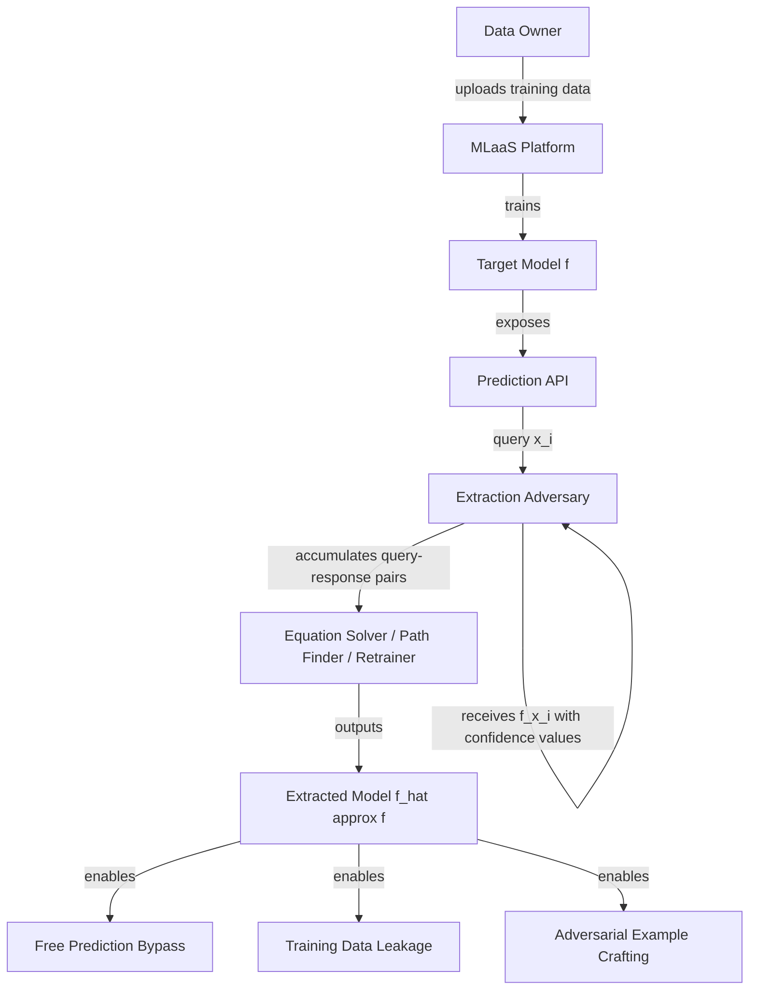
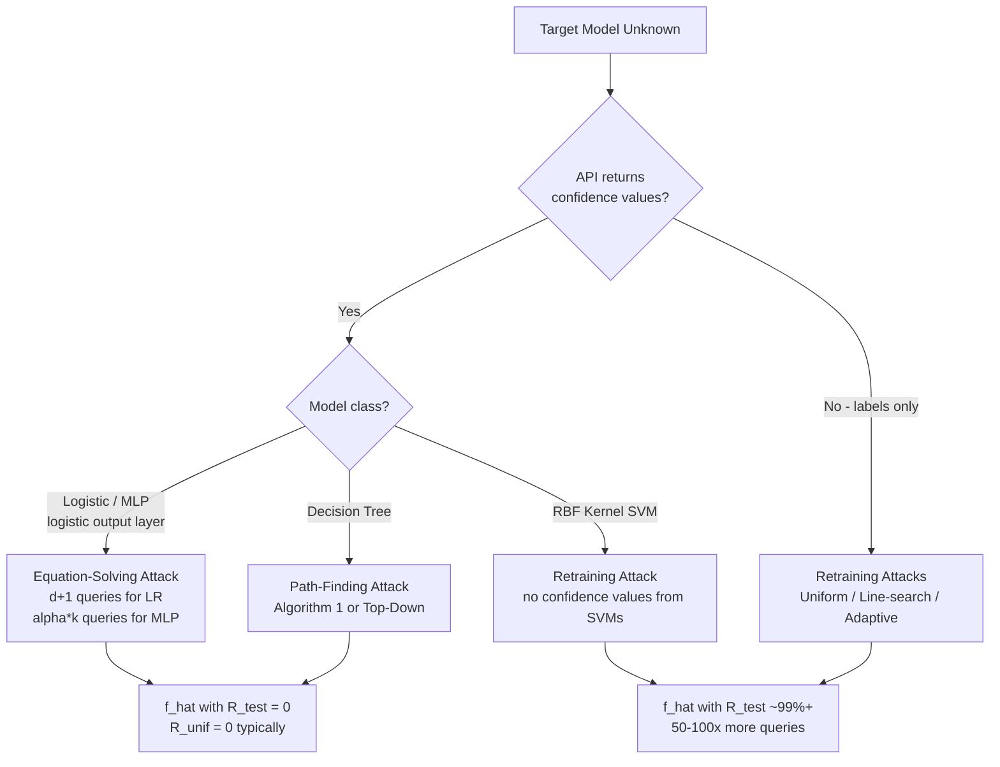
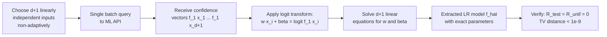
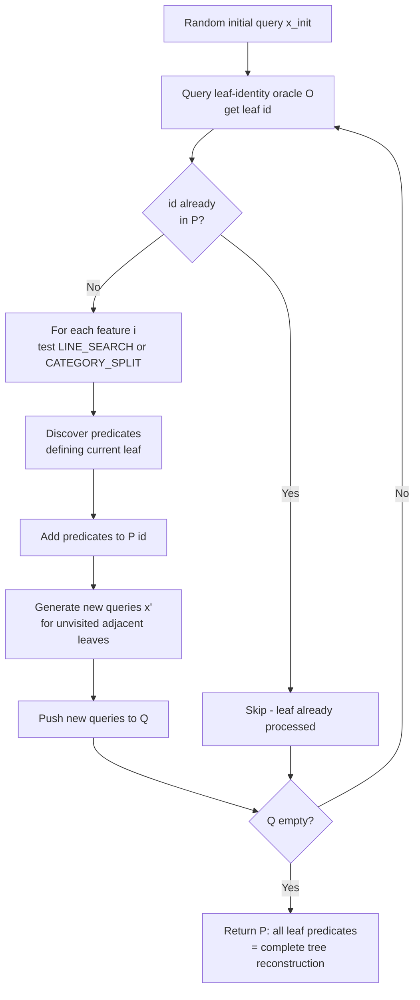
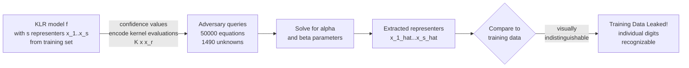
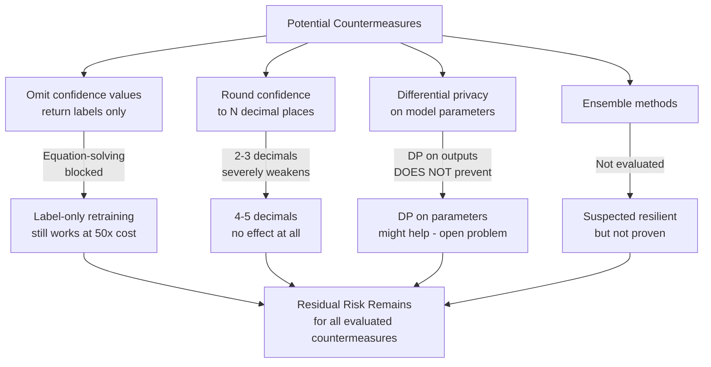

# Paper Review: Stealing Machine Learning Models via Prediction APIs

> **Reviewed:** 2026-06-09
> **Source:** /home/nhatquang/Desktop/HCMUS Course/4. Taiwan MS Prep/14. Tabular ML Security/model_stealing_tramer_2016.pdf
> **Reviewer lens:** Senior Security Architect + Senior AI Researcher

---

## 1. Motivation — Why Should We Care?

The paper addresses a concrete and commercially significant threat: an adversary with only black-box API access to a hosted ML model can reconstruct a functionally equivalent copy of that model with a small number of queries. This is not a theoretical curiosity.

**Real-world stakes are high.** By 2016, Amazon ML, BigML, Google Prediction API, Microsoft Azure ML, and PredictionIO all offered pay-per-query prediction services. The business model of each depends on model confidentiality: users upload sensitive training data (e.g., digitized health records, financial histories, tax records), pay to train a model, and then monetize it by charging other users per prediction. If a competitor or malicious user can extract a near-perfect replica of that model for less than the cost of training, several harms follow:

1. **Financial harm**: A cross-user extraction attack lets a malicious user train a model at one user's expense, then re-query their own extracted copy for free. The economics become: pay for ~d+1 queries, receive a model worth thousands of future query charges.
2. **Privacy harm**: Extraction can leak sensitive training data. The paper shows kernel logistic regression models (KLR) effectively embed training points as representers; extraction reconstructs those representers, leaking individual training examples. For medical or financial data, this is a direct HIPAA/GDPR-class violation.
3. **Security/evasion harm**: In adversarial settings (spam detection, malware classification, fraud detection), model confidentiality is a core defense mechanism. An extracted copy enables the attacker to craft adversarial examples offline, bypassing the need to probe the deployed system adaptively.

The authors also correctly note that these settings differ fundamentally from classical PAC learning theory, which studies membership queries returning only class labels. Real MLaaS APIs return *confidence values* — calibrated probability vectors — and accept *partial inputs*. This richer oracle setting enables attacks that would be theoretically infeasible against a label-only oracle.

The motivation is well-grounded, non-speculative, and backed by direct measurement against production systems. It is not oversold.

---

## 2. Proposal — What Do the Authors Propose and Why?

The paper introduces a family of *model extraction attacks* that exploit the rich output of MLaaS prediction APIs to reconstruct target models f with near-100% fidelity using far fewer queries than the training set size. The core insight is that confidence values returned by APIs — not just class labels — constitute a continuous, information-rich oracle that directly encodes model parameters.

**Two main attack families are proposed:**

**Equation-solving attacks (Section 4.1)** apply to models with a logistic output layer (logistic regression, multiclass LR, MLPs). When a model computes f_i(x) = sigma(w·x + beta), each API query (x, f(x)) yields one equation over the unknown parameters (w, beta). A system of d+1 linearly independent queries over d-dimensional inputs is sufficient to recover all parameters exactly for binary LR. The authors extend this to multiclass softmax regression, one-vs-rest (OvR) regression, and MLPs by treating the non-linear systems as optimization targets and solving with BFGS or gradient descent.

**Path-finding attacks (Section 4.2)** apply to decision trees, which do not produce continuous outputs amenable to equation-solving. Instead, the authors exploit confidence values as *pseudo-identifiers* for tree paths: in BigML's API, the confidence at a leaf uniquely identifies which leaf was reached. Two algorithms are presented: a bottom-up leaf enumeration algorithm (Algorithm 1) that uses LINE_SEARCH and CATEGORY_SPLIT procedures to discover all branch predicates, and a more efficient top-down algorithm that exploits incomplete (partial) input queries to traverse the tree layer by layer.

For the fallback setting where the API returns only class labels, the authors generalize the Lowd-Meek attack on binary linear classifiers and introduce three retraining strategies (uniform, line-search, adaptive) that exploit active-learning-style query selection.

The justification for the equation-solving approach is principled: it follows from the algebraic structure of the model class. The path-finding approach is more heuristic but is rigorously analyzed for correctness and query complexity in Appendix C. The retraining strategies for label-only APIs are reasonable but acknowledge they are less efficient by 50-100x compared to equation-solving with confidence values.

---

## 3. Method — How Does It Work?

### 3.1 Formal Setup

A model f: X -> Y maps a d-dimensional input to class labels or confidence vectors in [0,1]^c. The adversary A queries f adaptively and aims to extract f_hat that closely approximates f. Two accuracy metrics:
- **Test error R_test(f, f_hat)**: average 0-1 distance over a held-out test set D.
- **Uniform error R_unif(f, f_hat)**: average 0-1 distance over a set U of 10,000 uniformly sampled inputs.

Both are also computed as TV-distance variants (R^TV_test, R^TV_unif) when comparing probability outputs.

### 3.2 Equation-Solving Attack (Binary LR)

A binary LR model f is defined by:
```
f_1(x) = sigma(w·x + beta),   sigma(t) = 1/(1 + e^{-t})
```
Given an oracle sample (x, f(x)), we get:
```
w·x + beta = sigma^{-1}(f_1(x))
```
This is one linear equation in d+1 unknowns. Submitting d+1 linearly independent inputs x_1,...,x_{d+1} (chosen non-adaptively, e.g., the standard basis) yields a determined linear system solvable exactly. Query complexity: **d+1** — independent of training set size |D|.

For **multiclass softmax regression** (c classes, parameters w_j in R^d, beta_j in R^c):
```
f_i(x) = e^{w_i·x + beta_i} / sum_j e^{w_j·x + beta_j}
```
Each query yields c equations in c*(d+1) unknowns. The system is non-linear but can be converted to linear form by taking log-ratios. However, the approach is generalized by treating it as an optimization problem minimizing logistic loss with BFGS. Query budget scales as alpha*(c*(d+1)).

For **MLPs** with h hidden nodes and c output classes, the number of unknowns is d*h + h*c + h + c (weights and biases). The system is non-linear and non-convex; gradient descent (via Theano) is used. Convergence to a locally equivalent model f_hat (not necessarily identical parameters) is empirically demonstrated.

### 3.3 Decision Tree Path-Finding

A decision tree T partitions the input space into leaves. Each leaf is assigned a label and a confidence score. On BigML, the pair (label, confidence) acts as a unique identifier for the leaf reached by input x.

**Algorithm 1 (Bottom-Up Leaf Enumeration):**
1. Submit a random query x_init; obtain leaf id.
2. For each feature i and each leaf visited:
   - Continuous features: binary search over [a,b] to find split thresholds (LINE_SEARCH).
   - Categorical features: enumerate values to find the partition (CATEGORY_SPLIT).
3. Generate new queries to reach unvisited adjacent leaves.
4. Repeat until all leaves are enumerated.

**Top-Down Variant:** Start with all features set to null (partial input). The root node's id is returned. Discover the root's splitting feature, recurse. Exploits the 'fields' entry in API responses (which features are on the path). Requires far fewer queries by avoiding redundant leaf enumeration.

**Query Complexity (Appendix C):**
For m leaves, d_cat categorical features of arity k, d_cont continuous features with range [0,b]:
```
O(m * (d_cat * k + d_cont * log_2(b/epsilon)))
```
For boolean trees this reduces to O(m*d), exponentially better than the Kushilevitz-Mansour O(m*d) with membership queries when leaf ids are unique.

### 3.4 Label-Only Attacks (Section 6)

When the API returns only class labels (the "countermeasure" case):
1. **Uniform retraining**: Sample m inputs uniformly, query f, train f_hat.
2. **Line-search retraining**: Issue adaptive queries near the decision boundary (generalized Lowd-Meek).
3. **Adaptive retraining**: r rounds of active learning — train f_hat, find uncertain points, query those.

The adaptive strategy outperforms others but requires 50x more queries than equation-solving.

### Diagrams

**Diagram 1: High-Level Threat Model**


*Caption: The end-to-end threat model. The adversary exploits the API oracle to reconstruct f_hat, enabling three classes of downstream harm.*

---

**Diagram 2: Attack Selection Decision Tree**


*Caption: How the adversary selects the appropriate attack given what they know about the API and model class.*

---

**Diagram 3: Equation-Solving Attack Pipeline (Binary LR)**


*Caption: The binary LR extraction pipeline requires exactly d+1 non-adaptive queries and yields exact parameter recovery.*

---

**Diagram 4: Decision Tree Path-Finding Algorithm (Bottom-Up)**


*Caption: Bottom-up path-finding algorithm that uses binary search on continuous features and value enumeration on categorical features to reconstruct all tree predicates.*

---

**Diagram 5: Training Data Leakage via Kernel LR Extraction**


*Caption: KLR extraction recovers the model's representers, which are actual training data points, constituting a direct privacy breach.*

---

**Diagram 6: Countermeasure Effectiveness Landscape**


*Caption: Every countermeasure the authors evaluate either fails entirely or degrades attack effectiveness only modestly; no complete defense is identified.*

---

### 3.5 Production System Evaluations

**BigML (Section 5.1):** The authors train a German Credit decision tree (26 leaves) under their own BigML account, then extract it from a second account using Algorithm 1 and the top-down variant. Both achieve 100% R_unif with 1,722 and 1,150 queries respectively at ~500ms/query latency. Total monetary cost: sub-dollar.

**Amazon ML (Section 5.2):** Amazon uses logistic regression with one-hot encoding and quantile binning. The feature extraction pipeline (ex) is partially documented. The authors reverse-engineer ex by exploiting incomplete query responses (which return only relevant features), then apply equation-solving over the transformed space. Extraction achieves 100% test accuracy on the Digits, Iris, Circles, and Adult datasets with 278–1,485 queries. Amazon charges $0.0001/prediction; full extraction costs $0.03–$0.15.

---

## 4. Strengths and Weaknesses

### Strengths

**1. Principled attack formulation with provable guarantees.** The equation-solving attack for binary LR is not heuristic — it is algebraically exact. The query complexity of d+1 is tight (necessary and sufficient). The authors prove correctness and provide complexity analysis for the path-finding algorithm in Appendix C. This distinguishes the paper from many adversarial ML papers that rely purely on empirical observations.

**2. Breadth of model coverage.** The attacks span logistic regression, multiclass LR (softmax + OvR), MLPs, decision trees, and kernel logistic regression, covering the majority of models offered by commercial MLaaS platforms of the era. The paper does not cherry-pick the easiest model class.

**3. Validation against real production systems.** Online attacks against BigML and Amazon ML are the strongest empirical evidence in the paper. The authors attacked models trained in their own accounts — an ethically clean experimental design that avoids unauthorized access while demonstrating real-world applicability. They also disclosed findings to affected services in February 2016.

**4. Privacy implication beyond model theft.** The KLR training data leakage result (Section 4.1.3) is a genuinely surprising and significant finding: model extraction is a *mechanism for training data reconstruction*, not just IP theft. The extracted representers are visually recognizable as training examples. This extends the paper's relevance well beyond security into privacy research.

**5. Honest countermeasure analysis.** The authors do not oversell defenses. They show that omitting confidence values weakens attacks but does not eliminate them, that rounding to 2-3 decimal places is meaningfully helpful (while 4-5 decimals are not), and that differential privacy as applied to outputs fails to prevent extraction. This intellectual honesty is notable.

**6. Source code released.** The Steal-ML GitHub repository was publicly available at time of submission, enabling reproducibility.

**7. Generalizes prior learning theory.** The paper connects model extraction to PAC learning and Lowd-Meek style attacks, correctly identifying that MLaaS APIs are a strictly richer oracle than the membership query model — a conceptual contribution that helps frame future work.

### Weaknesses and Red Flags

**1. MLP extraction is not parameter recovery — it is behavioral cloning.** This is the most significant technical gap. For binary LR, the attack recovers *exact parameters*. For MLPs, the non-convex loss means gradient descent converges to an f_hat that matches f behaviorally but has *different* internal parameters. The paper reports TV distance < 10^{-7} for class probabilities on the Adult dataset (Race target, 2,225 unknowns), but this is measured on the training distribution. The extracted MLP may generalize differently from the original in out-of-distribution regions. The uniform error measure with 10,000 uniform samples is not sufficient to validate out-of-distribution equivalence for high-dimensional inputs (d=108 for Adult). The paper does not discuss this limitation.

**2. The "uniform error" metric is methodologically weak for high-dimensional spaces.** With d=108 features (Adult dataset), the input space has astronomical volume. 10,000 uniformly random samples cover a negligible fraction. Two models can agree on all 10,000 uniform samples yet differ substantially on the actual deployment distribution. The claim of "100% uniform accuracy" is therefore much weaker than it appears for high-dimensional models.

**3. MLP extraction does not scale to modern deep networks.** The paper evaluates MLPs with a single hidden layer of h=20 nodes, requiring at most 11,125 queries for a model with 2,225 unknowns. A ResNet-50 has ~25 million parameters. The equation-solving approach requires ~25 million queries to solve a system with ~25 million unknowns — economically and practically infeasible. The paper acknowledges this limitation only obliquely ("we focus on fully connected networks with a single hidden layer") and does not quantify how the attack degrades with model depth. For modern deployments, the deep neural network attack is a non-result.

**4. The threat model assumes the adversary knows the model class.** The "proper extraction" assumption — that A knows f belongs to the same model class as f_hat — is explicitly stated but understated as a limitation. In practice, Amazon's internal model selection is not documented, and BigML's is partially documented. The authors partially address this via the "extract-and-test" approach (Section 5.3), but do not evaluate systematic failure modes when the adversary guesses the wrong model class. Appendix D on improper extraction is cursory.

**5. The decision tree path-finding algorithm assumes unique leaf identifiers.** Algorithm 1's correctness proof requires that all leaves have unique (label, confidence) pairs. The paper explicitly handles the case where some leaves share ids by modifying line 7, but acknowledges that the LINE_SEARCH and CATEGORY_SPLIT procedures can miss splits when ids collide. The Steak Survey model (193 leaves, only 28 unique ids) achieves only 92.45% R_unif without incomplete queries — a significant failure case that demonstrates this assumption frequently breaks down in practice.

**6. No evaluation of rate limiting or query anomaly detection as a countermeasure.** The paper discusses rounding, DP, and ensembles as countermeasures but ignores the most operationally obvious defense: query rate limiting and statistical anomaly detection. An adversary sending d+1 structured, near-orthogonal queries in a single batch is a detectable pattern. Amazon's batch API makes this attack even more visible. The paper does not model or evaluate any detection-based defenses.

**7. Amazon attack requires reverse-engineering the feature extraction pipeline.** The attack on Amazon is elegant but brittle: it depends on the attacker successfully inferring Amazon's one-hot encoding and quantile binning procedures. The paper demonstrates this is possible for documented or partially documented APIs, but the approach would fail or require significant re-engineering for undocumented transformations (e.g., text embeddings, image preprocessing). This is noted but not quantified.

**8. The cost claims are optimistic.** The paper reports extraction costs of $0.03–$0.15 for Amazon. This is accurate for the query count, but ignores the computational cost of the equation solver, the time investment in reverse-engineering feature extraction, and the potential detection risk. The presented cost is the *floor*, not the realistic adversarial cost.

**9. No evaluation on ensemble methods.** Random forests — among the most commonly used MLaaS model types — are explicitly noted as not evaluated. The authors speculate that ensembles return "coarse approximations" but this is not demonstrated. Given that BigML and Amazon both offered ensemble methods, this is a non-trivial gap.

---

## 5. Trustworthiness Assessment

| Dimension | Rating | Justification |
|---|---|---|
| Reproducibility | **High** | Source code publicly released at github.com/ftramer/Steal-ML; datasets are public (UCI, scikit, GSS Survey); attack procedures are described with algorithmic precision and Appendix C provides formal complexity proofs. |
| Evaluation rigor | **Medium** | Binary LR extraction is evaluated exhaustively; MLP extraction uses a weak uniform-error metric over 10,000 samples in potentially 108-dimensional spaces; no statistical significance tests are reported; the Steak Survey decision tree (92% accuracy without incomplete queries) is a quiet admission of a failure mode that does not receive full analysis. |
| Novelty vs. incremental | **High** | The equation-solving attack is a novel application of linear algebra to parameter recovery; the path-finding algorithm is genuinely new and the first practical "exact" decision tree extraction method; extending Lowd-Meek to multiclass models is a meaningful contribution. The work is not a repackaging. |
| Practical deployability | **Medium-High** | Attacks against LR and decision trees are immediately deployable at low cost; MLP attacks do not scale to modern deep networks (millions of parameters); the Amazon attack requires non-trivial reverse engineering of feature extraction. Practical for 2016 MLaaS; less directly applicable to modern transformer-based APIs. |
| Security posture | **Medium** | The threat model is realistic and well-scoped; countermeasure analysis is honest but incomplete — detection-based defenses, rate limiting, and query watermarking are not discussed; the DP analysis correctly identifies that output-level DP is insufficient, but does not provide actionable guidance on what parameter-level budget would prevent extraction. |
| Venue & author credibility | **High** | Extended version of a USENIX Security 2016 paper — top-tier security venue. Authors include Thomas Ristenpart (Cornell Tech, established security researcher), Ari Juels (Cornell Tech/Jacobs Institute, well-known in crypto and security), and Florian Tramer (EPFL, who went on to produce influential follow-up work on ML privacy). |

**Overall verdict.** This is a foundational paper that should be read by anyone working on ML system security or privacy. The core technical contributions — equation-solving extraction for logistic models, path-finding extraction for decision trees, and the KLR training data leakage result — are sound, novel, and consequential. The paper defined the model extraction threat model that subsequent work (Tramer et al. 2020 on transfer-based attacks, Carlini et al. on neural network extraction, Jagielski et al. on high-accuracy extraction) built upon directly. However, it should be cited with the explicit caveat that its neural network results do not generalize to modern deep learning systems: the MLP attacks assume single hidden layers, small parameter counts, and do not address the combinatorial explosion of query requirements for large models. The countermeasure analysis is an honest but incomplete starting point — it does not evaluate detection, watermarking, or output perturbation methods that became standard in subsequent defenses. Build on this paper as a foundational threat model; do not treat its countermeasure analysis as definitive or its deep learning results as current.
