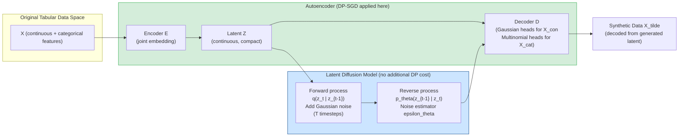
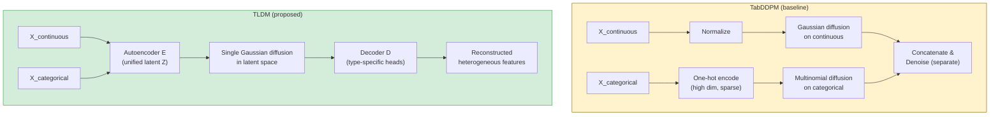
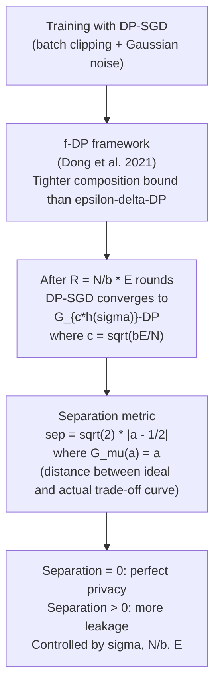
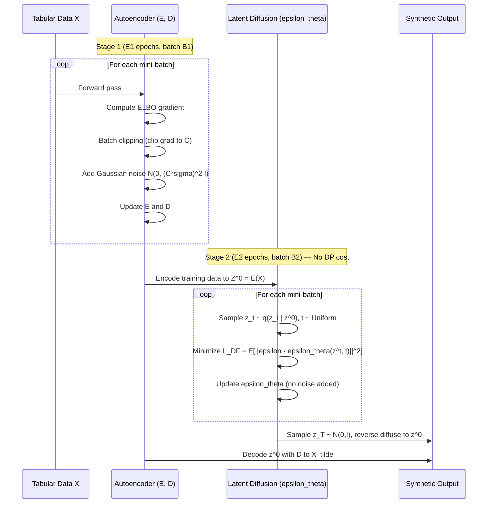
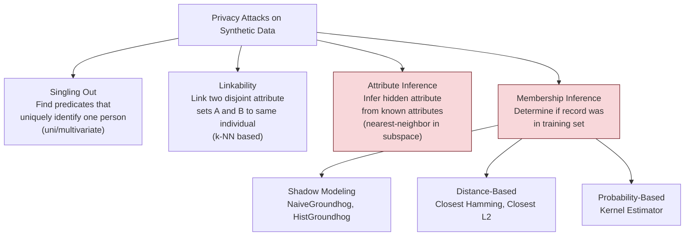

# Paper Review: DP-TLDM: Differentially Private Tabular Latent Diffusion Model

> **Reviewed:** 2026-06-09
> **Source:** `/home/nhatquang/Desktop/HCMUS Course/4. Taiwan MS Prep/14. Tabular ML Security/privacy_risks_tabular_generative_2024.pdf`
> **Reviewer lens:** Senior Security Architect + Senior AI Researcher
> **Authors:** Chaoyi Zhu, Jiayi Tang, Juan F. Perez, Marten van Dijk, Lydia Y. Chen (TU Delft, CWI Amsterdam, University of Neuchatel, Universidad de los Andes)
> **Venue:** arXiv preprint arXiv:2403.07842v2 [cs.LG], July 2025

---

## 1. Motivation — Why Should We Care?

Synthetic tabular data has emerged as the dominant mechanism for privacy-preserving data sharing under regulations such as GDPR. The promise is compelling: share a generative model's output rather than real records, enabling downstream analytics without exposing individuals. That promise has a known crack: high-quality synthetic data faithfully mirrors the original distribution, and this fidelity is precisely what privacy attackers exploit.

The prior literature had two specific blind spots this paper targets:

1. **Attack coverage gap.** The canonical tabular privacy framework (Anonymeter/Giomi et al. 2023) covers singling out, linkability, and attribute inference attacks but completely omits Membership Inference Attacks (MIA). MIA is arguably the strongest adversarial model — it assumes the attacker knows target records and queries whether they were in training. Omitting it leaves the most realistic threat unquantified.

2. **DP integration gap.** Applying Differential Privacy to tabular generative models, particularly diffusion-based ones, had not been systematically studied. DP-SGD degrades GAN and direct-diffusion quality badly; the question of whether a latent-space approach can recover utility while preserving the formal guarantee was open.

The combination matters in practice: medical datasets, financial records, and census microdata are exactly the assets organizations want to synthesize and share. If the best synthesizers (TabDDPM class) expose individuals to 90% MIA success rates, the "privacy-preserving" label is marketing, not engineering.

---

## 2. Proposal — What Do the Authors Propose and Why?

The paper makes two logically separate but combined contributions:

**Contribution A — Risk-Utility Quantification Framework (Sections 3, Appendix B, C).**
Before building anything new, the authors benchmark five existing synthesizers (CTGAN, CopulaGAN, ADS-GAN, Gaussian Copula, TabDDPM) across four public datasets on a unified scorecard: three utility metrics (resemblance, discriminability, downstream ML utility) and four privacy attacks (singling out, linkability, AIA, MIA). The key empirical finding is that higher-utility synthesizers (TabDDPM) incur dramatically higher MIA risk (up to ~90 on a 0-100 scale), while lower-utility synthesizers are more resilient. This quality-privacy tension motivates the model.

**Contribution B — DP-TLDM Architecture (Sections 4, 5).**
Rather than bolting DP-SGD onto an existing tabular synthesizer and suffering the quality collapse, the authors propose a two-component architecture:

- A **Variational Autoencoder** maps heterogeneous tabular features (mixed continuous/categorical) into a compact continuous latent space. DP-SGD with batch clipping is applied exclusively here, spending the entire privacy budget on this stage.
- A **Gaussian Diffusion Model** operates in that latent space, receiving as input the DP-noisy encoder's output. The diffusion stage trains without any additional privacy cost, exploiting the post-processing guarantee of DP.

The intuition is that diffusion models are inherently resilient to corrupted/noisy inputs (a property studied in the ambient diffusion literature), so they can denoise and generate high-quality latents even when those latents are DP-perturbed. This lets quality "recover" in stage two at zero additional privacy expenditure.

The paper also replaces the standard (epsilon, delta)-DP accounting with the **f-DP framework** (Dong et al. 2021), obtaining tighter composition bounds, and introduces a scalar **separation** metric derived from f-DP to make the privacy guarantee human-interpretable (separation = 0 means perfect privacy, larger = more leakage).

---

## 3. Method — How Does It Work?

### 3.1 Architecture Overview

*Figure caption: DP-TLDM overall architecture. DP-SGD budget is spent only on the autoencoder. The diffusion backbone inherits privacy for free via post-processing.*

---

### 3.2 TabDDPM vs TLDM: Handling Feature Heterogeneity

*Figure caption: Comparison of feature handling. TabDDPM uses separate diffusion processes for continuous and categorical columns. TLDM encodes all features into one latent space, removing the dimensionality explosion from one-hot encoding and preserving inter-feature correlations.*

---

### 3.3 f-DP Framework and Separation Metric

*Figure caption: Privacy accounting pipeline. The separation value serves as the single scalar privacy budget in experiments, replacing the hard-to-interpret epsilon.*

---

### 3.4 Two-Stage DP-SGD Training

*Figure caption: Two-stage training. Privacy budget is fully consumed in Stage 1. Stage 2 is privacy-free by the post-processing theorem of DP.*

---

### 3.5 Attack Taxonomy and Threat Model

*Figure caption: Four-attack taxonomy. MIA represents the strongest adversarial assumption (attacker knows target records and whether they were in training). The paper reports the worst-case MIA across all five strategies.*

---

## 4. Strengths and Weaknesses

### Strengths

**S1. Principled two-stage DP decomposition.**
The insight of spending the privacy budget only on the autoencoder, then letting the diffusion model recover quality for free, is elegant and technically sound. The post-processing argument is rigorous. This is not an ad hoc engineering trick — it follows directly from DP's formal composition and post-processing theorems.

**S2. Comprehensive attack coverage.**
Including MIA is the paper's most important empirical contribution. The baseline study (Section 3) reveals that prior work's omission of MIA masked a catastrophic vulnerability: TabDDPM without DP has MIA risk ~90/100. No prior tabular synthesis paper had surfaced this quantitatively with five MIA strategy variants.

**S3. f-DP instead of (epsilon, delta)-DP.**
Using f-DP with the separation metric gives tighter composition bounds than moment accountant or Renyi-DP when multiple training rounds compose, and produces an interpretable scalar. This is technically more rigorous than most prior DP-ML papers.

**S4. Batch clipping over individual clipping.**
Citing Nguyen et al. 2023, the paper correctly adopts batch clipping (BC) over individual clipping (IC). BC allows batch normalization layers to maintain DP guarantees without correlation leakage across rounds, which IC cannot provide. This is a subtle but correct design decision.

**S5. Solid empirical coverage.**
Four datasets spanning 5,000 to 70,000 rows, mixed data types, three privacy budget levels (separation 0.1, 0.15, 0.2), five MIA strategies, and ablation via non-DP baselines. The scale is appropriate for an empirical claim of this nature.

**S6. Ablation design.**
The paper compares DP-TLDM against DP-CTGAN and DP-TabDDPM — correctly applying DP-SGD to the competitors rather than comparing against non-DP baselines, ensuring a fair budget-controlled comparison.

---

### Weaknesses

**W1. The autoencoder is a VAE but privacy analysis omits its KL term.**
The ELBO loss contains both a reconstruction term and a KL divergence regularizer. The DP-SGD analysis clips the total gradient. The privacy accounting implicitly assumes the gradients from both loss components are handled uniformly. There is no discussion of whether the KL term introduces correlations across samples that could violate the DP accounting assumptions. This is a gap in the formal argument.

**W2. Two-stage training breaks the privacy accounting boundary.**
The encoder output Z^0 = E(X) in Stage 1 has DP guarantees, but Stage 2 trains the diffusion model directly on these encoded representations. If Z^0 is itself a function of a specific training record, and if the diffusion model's training loss is not DP-protected, an adversary with white-box access to the LDM could potentially learn something about individual records through the latent codes. The paper claims post-processing covers this, but post-processing applies when the subsequent operation is independent of the private data after the DP mechanism runs. Here the LDM trains on Z^0 values that encode the private data — this is post-processing only if E is already a DP mechanism with respect to the data, which requires the encoder weights (not just gradients) to satisfy DP, a stronger claim than DP-SGD on training provides.

**W3. Separation metric novelty is overstated.**
The paper presents "separation" as a novel theoretical privacy metric. Functionally, separation is a scalar derived from the f-DP trade-off function via the Gaussian mechanism. The concept of measuring distance between the actual trade-off curve and the diagonal is implicit in the f-DP literature (Dong et al. 2021, Wang et al. 2024). The paper formalizes it but calling it "novel" overstates the contribution.

**W4. Risk scores are not calibrated to absolute attack success rates.**
The privacy risk R = (tau_train - tau_control) / (1 - tau_control) from Equation 5 is normalized to [0, 100]. A risk of 15 for DP-TLDM's MIA sounds acceptable, but without reporting the raw tau_train values, the reader cannot assess whether this corresponds to, say, 55% absolute attack success vs 50% baseline — which is barely above random guessing and therefore operationally safe — or 80% vs 75%, which is still significantly vulnerable.

**W5. No white-box or gray-box attack evaluation.**
The threat model is consistently black-box (attacker sees synthetic data only, no model internals). In practice, model weights of deployed synthesizers can be extracted, leaked, or accessed via repeated API queries. White-box MIA on diffusion models (e.g., Hu and Pang 2023, Duan et al. 2023, both cited) can be far more effective. The claim of DP protection under white-box attacks deserves at least a theoretical discussion — DP formally covers both, but the empirical MIA evaluation does not validate this.

**W6. Autoencoder reconstruction quality not independently reported.**
The downstream quality of DP-TLDM depends critically on how well the DP-noisy autoencoder preserves information. The paper reports aggregate synthetic data quality (resemblance, discriminability) but never separately measures autoencoder reconstruction fidelity as a function of the separation budget. Without this decomposition, it is unclear how much of the quality gain over DP-TabDDPM comes from the latent diffusion vs the better encoding.

**W7. Hyperparameter sensitivity not fully explored.**
The diffusion model's E2 (epochs), T (timesteps), and B2 (batch size) are fixed across all experiments. There is no ablation on how these affect the quality-privacy tradeoff, particularly given that E2 is not DP-charged but still affects how much the diffusion model can memorize latent codes.

**W8. Claim of 15-50% improvement must be read carefully.**
The abstract claims "15% improvement in downstream utility, 50% in discriminability." These are averages across datasets at a fixed separation value of 0.1. At higher separation values (looser privacy, i.e., 0.15 and 0.2), the gap narrows. The headline numbers are accurate but cherry-picked to the most favorable budget setting.

---

## 5. Trustworthiness Assessment

| Dimension | Rating | Justification |
|---|---|---|
| Reproducibility | 3/5 | Four public datasets, two public libraries (SDV, Synthcity), references to Opacus. Algorithm pseudocode in Algorithm 1. However, no code repository linked in the paper. Hyperparameters are partially disclosed (sigma, C, batch sizes differ per dataset) but not fully tabulated for all experiments. |
| Evaluation rigor | 3.5/5 | Broad attack coverage including MIA is commendable. Five MIA strategies and worst-case reporting is rigorous. However, raw attack success rates are obscured behind the normalized R metric. Only black-box attacks evaluated empirically. No statistical significance testing on the 35%/15%/50% improvement claims. |
| Novelty vs. incremental | 3.5/5 | The two-stage DP decomposition is a genuine architectural contribution with solid formal motivation. The risk-utility framework with MIA inclusion is the stronger empirical contribution. The separation metric is formalization rather than novelty. Overall: incremental-to-solid contribution, not a paradigm shift. |
| Practical deployability | 3/5 | Two-stage training adds complexity (two separate training loops, distinct hyperparameters E1, E2, B1, B2, sigma, C). The separation metric requires f-DP accounting tools (Opacus). The model outperforms competitors significantly at sep=0.1 but the advantage shrinks at relaxed privacy budgets. Deployment viability for practitioners without DP expertise is limited. |
| Security posture | 2.5/5 | The formal DP guarantee is correctly invoked. However: (1) the post-processing argument for Stage 2 is asserted but not rigorously justified given that LDM trains on encoded private data; (2) no white-box MIA evaluation; (3) adversarial attacks on the autoencoder itself (e.g., model inversion via the decoder) are not considered; (4) the gap between formal DP and empirical risk scores is acknowledged but not fully reconciled. |
| Venue & author credibility | 3.5/5 | TU Delft and CWI Amsterdam are credible European ML/security groups. Lydia Y. Chen has a track record in distributed systems and privacy-preserving ML. The paper is an arXiv preprint (v2, July 2025) — not yet peer-reviewed at a top venue (ICLR/NeurIPS/USENIX/CCS). The empirical claims are plausible but await community scrutiny. |

**Overall verdict.** DP-TLDM is a technically sound and practically motivated paper. Its strongest contribution is the empirical demonstration that state-of-the-art tabular synthesizers have severe MIA vulnerabilities not captured by prior evaluation frameworks, combined with a principled architecture that uses DP where it costs most (the encoder) and recovers quality for free (the diffusion backbone). The formal privacy argument has a gap in the post-processing justification for Stage 2, and the evaluation would be materially strengthened by white-box attack experiments and calibrated absolute risk reporting. As a preprint, it represents a solid step toward rigorous privacy evaluation for tabular generative models, but should not be treated as a production-ready privacy guarantee without the post-processing argument being tightened and code being released for independent replication.

---

## Appendix: Key Numbers Reference

| Dataset | Synthesizer | Resemblance | Discriminability | Utility | MIA Risk (non-DP) | MIA Risk (DP, sep=0.1) |
|---|---|---|---|---|---|---|
| Loan | TabDDPM | 98 | 100 | 97 | 45.72 | 5.72 |
| Loan | DP-TLDM | — | — | — | — | 5.72 |
| Housing | TabDDPM | 96 | 98 | 93 | 88.55 | 10.48 |
| Adult | TabDDPM | 96 | 98 | 98 | 94.28 | 14.28 |
| Cardio | TabDDPM | 95 | 99 | 100 | 94.28 | 15.24 |

*At separation=0.1 (strongest evaluated DP), DP-TLDM reduces MIA from ~90 to ~10-15 while maintaining substantially higher utility than DP-CTGAN or DP-TabDDPM.*
