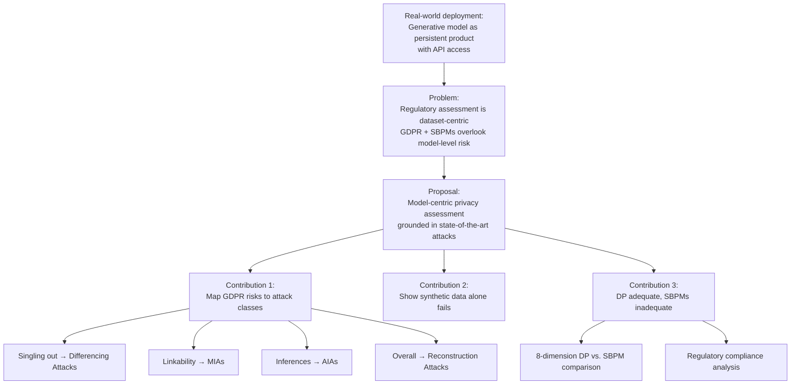
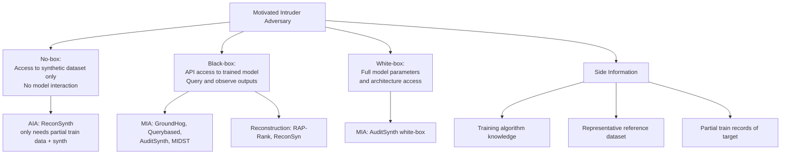
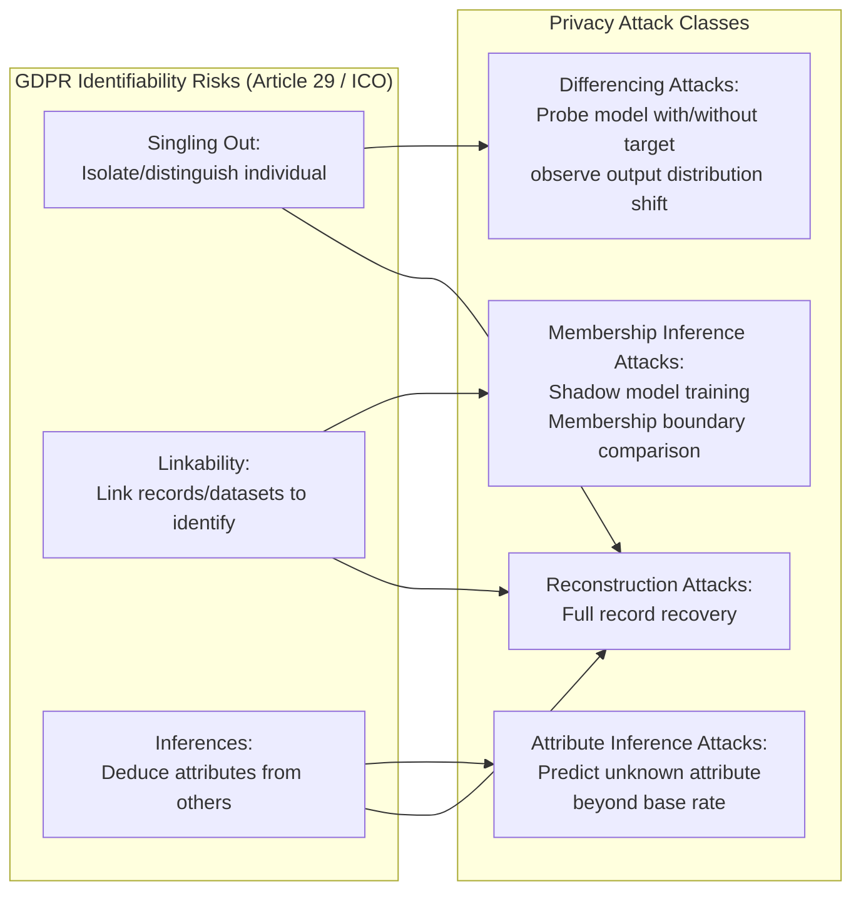
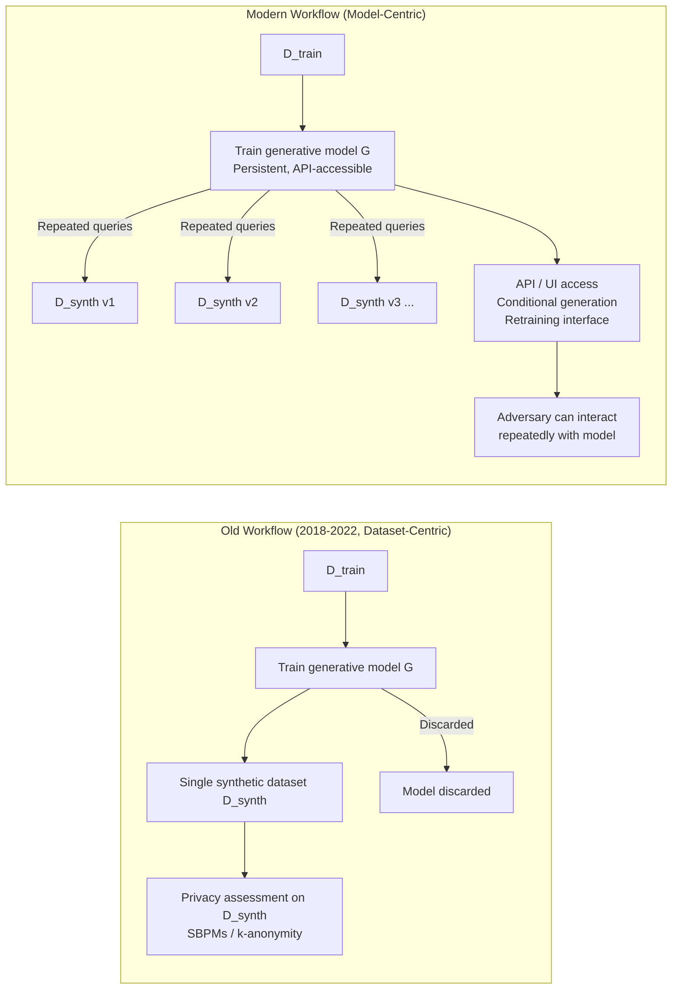
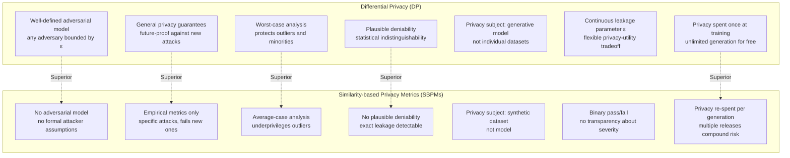
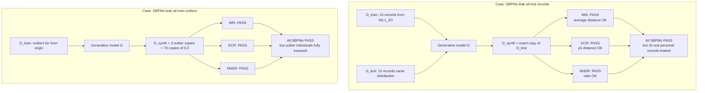
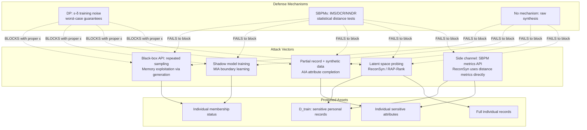

# Paper Review: Rethinking Anonymity Claims in Synthetic Data Generation: A Model-Centric Privacy Attack Perspective

> **Reviewed:** 2026-06-09
> **Source:** /home/nhatquang/Desktop/HCMUS Course/4. Taiwan MS Prep/14. Tabular ML Security/rethinking_anonymity_synthetic_ganev_2026.pdf
> **Reviewer lens:** Senior Security Architect + Senior AI Researcher

---

## 1. Motivation — Why Should We Care?

Synthetic tabular data generation has become a commercially significant industry with real regulatory stakes. Governments (US Census, UK ONS, Israel's national birth registry), regulators (EU, UK FCA, ICO), and over ten well-funded commercial vendors are betting that releasing synthetic data in lieu of real sensitive records constitutes meaningful anonymization under laws like the GDPR. Billions in enterprise spending and critical data-sharing pipelines in healthcare, insurance, and financial services depend on this assumption being correct.

The specific gap this paper addresses is both concrete and alarming: current regulatory frameworks (GDPR) and the privacy metrics shipped by essentially every commercial synthetic data vendor assess anonymity at the level of an individual released *dataset*, not at the level of the underlying *generative model* that produced it. In modern deployment workflows — where the trained model is persistent, queryable via API, and capable of generating unlimited synthetic datasets on demand — this dataset-centric view is dangerously obsolete. An adversary does not need to find a smoking-gun record in a single released dataset; they interact with the model repeatedly.

Furthermore, the most widely used empirical "privacy metrics" — Similarity-based Privacy Metrics (SBPMs) such as Distance to Closest Record (DCR), Nearest Neighbor Distance Ratio (NNDR), and Identical Match Share (IMS) — are shown by the authors and cited prior work to be gameable, systematically underestimate actual risk, and are rejected by the UK's Financial Conduct Authority (FCA) as inadequate. Yet they remain the primary compliance evidence presented by commercial vendors and accepted by regulators.

The cost of this gap going unsolved is not abstract: synthetic data trained on medical records, victim data (e.g., the IOM human-trafficking dataset), or financial histories can leak precise membership, attribute, or full record reconstructions to a motivated attacker with only black-box API access. The gap is being filled with regulatory theater rather than security.

---

## 2. Proposal — What Do the Authors Propose and Why?

The authors propose a **model-centric, attack-grounded framework** for assessing the anonymity of synthetic data systems. The core argument: anonymity claims about synthetic data must be grounded in (a) the capabilities and properties of the underlying generative model — not merely a snapshot dataset it produced — and (b) state-of-the-art empirical privacy attacks operating under realistic adversarial assumptions.

Concretely, the contribution is threefold:

1. They reinterpret the GDPR's three legally mandated identifiability risks — *singling out*, *linkability*, and *inferences* — through the lens of ML threat models, mapping each to an established class of privacy attack: differencing attacks, Membership Inference Attacks (MIAs), and Attribute Inference Attacks (AIAs), respectively.

2. They argue that synthetic data generation alone (without any privacy mechanism) demonstrably fails to mitigate all three risks.

3. They systematically compare the two dominant privacy mechanisms used in synthetic data deployments — Differential Privacy (DP) and SBPMs — across eight privacy-related criteria and conclude that DP can, when properly implemented, provide sufficient anonymization, while SBPMs cannot and are fundamentally inadequate as a regulatory compliance tool.

The authors' justification for this direction is principled: they adopt the GDPR's own "motivated intruder" test as the adversarial baseline, interpret it through a well-defined ML threat model (black-box to white-box access with varying side information), and insist that any proposed defense must hold under the strongest *reasonably anticipated* attack. The reasoning is explicitly grounded in regulatory text (ICO guidance, Article 29 WP, EDPB Opinion 28/2024) and cross-validated against empirical attack literature. This is not ad hoc; the choice of DP as the preferred mechanism follows directly from its mathematical properties (worst-case adversary, composition, post-processing invariance) versus the purely average-case, empirical nature of SBPMs. The main limitation they acknowledge is that mapping regulatory risk to attack class involves interpretive choices, and their mapping (especially linkability → MIA) may not capture every real-world linkage vector.

---

## 3. Method — How Does It Work?

This paper is primarily a **position/analysis paper with regulatory-technical bridge-building**, not an experimental paper introducing a new algorithm. Its method is conceptual mapping, systematic comparison, and argument-by-construction. Understanding the method requires unpacking several layers.

### 3.1 Threat Model

The adversary is defined using a model-centric view inspired by the ICO's "motivated intruder" test. The adversary:
- Has a goal: extract sensitive information about individuals in the training dataset D_train.
- Has access ranging from *no-box* (only synthetic data, no model access) to *black-box* (API access: query model, observe outputs) to *white-box* (full parameter and architecture access).
- May possess *side information*: knowledge of the training algorithm, a representative (but not identical) reference dataset, or partial train records.

The paper explicitly assigns each attack in Table 1 to a specific combination of these access assumptions, making the threat model unusually concrete for a position paper.

### 3.2 Regulatory Risk → Attack Class Mapping

The authors interpret each GDPR identifiability risk operationally:

| GDPR Risk | Operational Interpretation | Attack Class |
|---|---|---|
| Singling out | Model consistently generates or responds to queries that isolate a rare individual | Differencing attacks |
| Linkability | Model's training membership of a record can be determined by external combination | Membership Inference Attacks (MIAs) |
| Inferences | Model leaks unknown attributes of a train record beyond the base rate | Attribute Inference Attacks (AIAs) |
| (Overall) | Full record recovery possible | Reconstruction attacks |

**Singling out → Differencing Attacks.** The adversary probes the generative model repeatedly (with and without a target record in the implicit conditioning) and tests whether the model's output distribution changes significantly — signaling individual-level memorization.

**Linkability → MIAs.** MIAs train a shadow model on datasets that include or exclude the target record, compare the deployed model's behavior on the target against the shadow's learned membership boundary, and output a binary membership prediction. Key attacks cited: GroundHog [138] (black-box, representable data), Querybased [72], DOMIAS [151] (no reference data), AuditSynth [8] (white-box), MIDST [161] (white/black-box, diffusion models).

**Inferences → AIAs.** AIAs assume the adversary knows some attributes of a target train record and estimates the remaining unknown attribute with higher accuracy than possible without model access. Key attack: ReconSynth [7], which requires no model access — only a partial train record and the synthetic data.

**Reconstruction → All three risks.** RAP-Rank [40] and ReconSyn [58] demonstrate full record extraction.

### 3.3 Why Synthetic Data Alone Fails

The argument is by counter-example and empirical citation:
- Models can memorize outlier records and reproduce them during generation (citations: Carlini et al. [19, 20, 22] on LLMs; van den Burg & Williams [152] on deep generative models).
- MIAs achieve high accuracy on synthetic data with simple black-box access [24, 69, 138, 151].
- AIAs recover unknown attributes with up to 95% accuracy [7].
- Reconstruction attacks can extract entire train records from synthetic data [20, 22, 40].
- The EC's claim that synthesis makes re-identification "virtually impossible" [39] is empirically falsified by these results.

### 3.4 Differential Privacy (DP) — Formal Definition and Properties

DP is formally defined: a randomized algorithm A satisfies (ε, δ)-DP if, for all output sets S and neighboring datasets D and D':

```
P[A(D) ∈ S] ≤ exp(ε) · P[A(D') ∈ S] + δ
```

where "neighboring" means D and D' differ by one individual's record. The privacy budget ε controls the information leakage bound (smaller = stronger privacy). δ is an asymptotically small failure probability.

Key properties exploited in the argument:
- **Composition**: multiple DP mechanisms can be combined with trackable total budget.
- **Post-processing invariance**: once a model is trained under DP, generating any number of synthetic datasets incurs no additional privacy cost. This is critical for modern deployment models.
- **Worst-case guarantee**: DP holds for outliers, minority groups, and adversarially chosen records — not just "average-looking" records.
- **Plausible deniability**: DP makes it statistically possible that any generated record was produced by chance, without the target record having been in the training data.

### 3.5 SBPMs — Definition and Failure Modes

Three SBPMs are analyzed:

- **IMS (Identical Match Share)**: proportion of synthetic records that are exact copies of train records. Passes if d_test ≥ d_synth (using average statistic).
- **DCR (Distance to Closest Record)**: pairwise distance from each synthetic record to its nearest train neighbor vs. test neighbor. Passes if the 5th percentile of train-synthetic distances ≥ that of train-test distances.
- **NNDR (Nearest Neighbor Distance Ratio)**: ratio of nearest to second-nearest train neighbor distance. Passes at 5th percentile.

The eight-dimension comparison between DP and SBPMs (Table 2) is the analytical core:

| Criterion | DP | SBPMs |
|---|---|---|
| Adversarial Model | Well-defined | Undefined |
| Privacy Guarantees | General (any attack) | Empirical (specific attacks only) |
| Privacy Analysis | Worst-case | Average-case |
| Privacy Risk Estimate | Overestimation | Underestimation |
| Plausible Deniability | Yes | No |
| Privacy Subject | Generative model | Synthetic dataset |
| Privacy Leakage | Continuous (ε) | Binary (pass/fail) |
| Privacy Expenditure | Once (at training) | Multiple (per generation) |

The "privacy expenditure" point is particularly sharp: SBPMs must be re-run for each generated dataset, implying that the privacy budget is spent repeatedly — violating the intuition that releasing many samples from the same model should not multiply risk if the model itself is private (which DP's post-processing property handles correctly).

The base-case examples (Appendix B.2, Figure 5) make the SBPM failure concrete:
- Figure 5b: SBPMs pass on a synthetic dataset that is an exact copy of all test records.
- Figure 5c: SBPMs pass on a synthetic dataset that leaks all outlier train records with minor perturbations.
Both are trivially unacceptable by any privacy standard, yet all three SBPM tests return green.

### Diagrams

**Diagram 1: Overall Paper Argument Structure**



*The overall argument chain: from deployment reality, through the regulatory gap, to the model-centric framework and its two main conclusions.*

---

**Diagram 2: Threat Model — Adversary Access Levels**



*Threat model decomposed by adversary access level, showing which specific attacks are feasible at each level.*

---

**Diagram 3: GDPR Risk to Privacy Attack Mapping**



*The paper's central mapping, connecting each GDPR-mandated identifiability risk to its operational attack class equivalent.*

---

**Diagram 4: Synthetic Data Generation Pipeline — Dataset-Centric vs. Model-Centric View**



*The shift from dataset-centric (old) to model-centric (new) deployment reality, showing why model-level assessment is necessary.*

---

**Diagram 5: DP vs. SBPMs — Privacy Mechanism Comparison**



*Comparison of DP and SBPMs across the eight privacy-related criteria, showing DP's systematic advantages.*

---

**Diagram 6: SBPM Failure Modes (Base-Case Examples)**



*Two base-case adversarial examples showing that all three SBPM tests can pass even when the synthetic data constitutes a severe privacy violation.*

---

**Diagram 7: Attack Surface Map (Security Architect View)**



*Full attack surface map showing which attack vectors compromise which assets and which defenses actually block them.*

---

## 4. Strengths and Weaknesses

### Strengths

**1. Regulatory-technical bridge is timely and genuinely useful.** The paper performs a service that neither the legal community nor the ML community has done adequately: it takes GDPR regulatory text seriously and maps it to operational, testable ML attacks. The three-risk mapping (Table 1) is concrete and actionable. Policymakers and compliance officers who read this will have a vocabulary for demanding stronger guarantees.

**2. The SBPM critique is devastating and well-supported.** The base-case examples (Figure 5) are pedagogically clear and analytically clean. The point that SBPMs can pass while leaking all test records or all outlier train records is not a contrived edge case — it directly follows from the mathematical structure of the metrics. The critique is reinforced by citations to independent empirical studies showing SBPMs fail to detect actual membership leakage [7, 58, 72, 164] even on non-private models. The FCA's rejection of SBPMs as adequate is a strong real-world corroboration.

**3. The eight-dimension DP vs. SBPM comparison (Table 2) is the most complete such analysis in the literature.** Prior work compared on one or two dimensions; this paper systematically covers adversarial model, guarantees, analysis type, risk estimation direction, plausible deniability, privacy subject, leakage quantification, and privacy expenditure. The privacy expenditure point — that SBPM-based systems implicitly spend privacy budget every time they generate and evaluate a dataset — is a novel framing that has practical implications for how vendors price and limit API access.

**4. The "motivated intruder" test framing is correct and important.** The ICO's technology-agnostic test is precisely the right standard for assessing anonymization. The authors apply it with appropriate strictness: it demands that assessments reflect what a *competent, motivated adversary with available resources* could do, not what an average user would do. This is more demanding than most prior regulatory analyses.

**5. The model-centric framing aligns with the EDPB Opinion 28/2024** on anonymity assessment of AI models, providing regulatory backing for the paper's core argument from the highest EU data protection authority.

**6. Coverage of commercial deployment reality is unusually accurate.** The paper correctly identifies that modern synthetic data systems expose models via API (Gretel Navigator, Mostly AI Assistant, etc.), allow unlimited generation, and support conditional generation — all features that make the dataset-centric assessment model obsolete. This is not hand-waved; specific commercial products are named and cited.

### Weaknesses / Red Flags

**1. The paper is primarily a position/analysis piece, not an empirical contribution.** There are no new experiments, no new attack implementations, no new benchmarks. All empirical claims are delegated to cited prior work. This is acceptable for a well-reasoned position paper, but the paper does not always acknowledge when the empirical evidence from cited work involves different settings, architectures, or datasets than the deployments being criticized. The generalization from cited experiments to "synthetic data deployments fail" is asserted more confidently than the evidence strictly supports.

**2. The DP endorsement overstates practical guarantees without sufficient caveat.** The paper correctly notes that DP is context-dependent and that selecting an appropriate ε remains an open problem (Section 4.2.1, point 4). However, this caveat is buried. In practice:
   - Real-world DP deployments use ε values between 1 and 20 [36], which provide substantially weaker privacy than the theoretical framing implies. At ε = 10, the "privacy" guarantee is nearly vacuous against a determined adversary.
   - DP-SGD's per-example gradient computation makes it impractical for high-dimensional tabular data with many features.
   - DP fairness degradation (disproportionate utility loss for minority groups [11, 25, 59, 86]) is acknowledged but minimized. In healthcare applications, this tradeoff can be ethically unacceptable.
   - The paper essentially concludes "use DP" without providing actionable guidance on *which* DP mechanism, *what* ε, or *how* to audit compliance — concerns that NIST's recent DP evaluation guidelines [112] identify as still unresolved.

**3. The MIA-as-linkability proxy is contestable.** MIAs measure whether a record influenced the model's training. True *linkability* under GDPR means combining records from different sources to identify an individual. These are related but not equivalent: a model may be linkage-vulnerable (a synthetic record can be joined to an external database) without being MIA-vulnerable, and vice versa. The authors acknowledge alternative mappings are possible, but they do not adequately defend why MIA is the *best* operational proxy for linkability in all contexts.

**4. The differencing attack → singling out mapping is underspecified.** The paper is the vaguest here. Differencing attacks are described at a high level ("probe the model with or without generic/random prompts"), but no concrete attack algorithm is cited for the synthetic tabular data setting. The mapping is conceptually sensible but operationally thin compared to the MIA and AIA sections. A reviewer cannot assess what the practical singling-out attack surface actually looks like for a tabular GAN or diffusion model without more detail.

**5. Scope is limited to EU/UK GDPR.** The analysis does not address HIPAA, FERPA, CCPA, or non-Western regulatory frameworks. The three-risk taxonomy is GDPR-specific; US healthcare synthetic data deployments under HIPAA's Safe Harbor provisions follow an entirely different logic (k-anonymity analogues) that the paper does not engage.

**6. The "privacy washing" concern is mentioned but not analyzed.** The paper notes [34] that synthetic data can create the appearance of compliance while leaving underlying risks unaddressed. This is a serious governance failure mode. The paper could and should go further: what specific compliance claims by named vendors are falsified by the paper's analysis? The paper pulls its punches here, likely for non-technical reasons, but the result is that the most actionable implication — "these specific products are non-compliant" — is left implicit.

**7. Adversarial robustness of DP itself is understated.** While DP is mathematically correct, the paper does not address:
   - The *composition vulnerability* when models are fine-tuned or retrained repeatedly on overlapping datasets (a common commercial pattern).
   - Implementation bugs in DP libraries [8, 38, 61, 68, 93] that silently compromise guarantees.
   - The gap between DP-SGD's theoretical guarantees and its empirical privacy under realistic (non-worst-case) attacks, which can be significantly tighter in the favorable direction but also reflects that tight auditing requires strong assumptions [8].

---

## 5. Trustworthiness Assessment

| Dimension | Rating | Justification |
|---|---|---|
| Reproducibility | Medium | No new code or experiments; all empirical claims point to cited prior work with publicly available attack implementations (TAPAS [72], ReconSynth [7], ReconSyn [58]); the base-case examples (Figure 5) are trivially reproducible. |
| Evaluation rigor | Medium | The paper does not run experiments, so "evaluation rigor" applies to the quality of the argument rather than statistical testing. The mapping arguments are well-reasoned and the cited evidence is from peer-reviewed sources, but the paper does not directly test whether its proposed DP-based assessment framework catches attacks that SBPMs miss in a unified benchmark. |
| Novelty vs. incremental | Medium-High | The GDPR-to-attack mapping is genuinely new and useful. The DP vs. SBPM comparison is the most complete in the literature. However, the individual components (SBPM failures, DP properties, specific attacks) are largely surveyed rather than invented. The novelty is in the synthesis and the regulatory-technical bridge. |
| Practical deployability | Medium | The paper argues convincingly *why* DP should replace SBPMs but provides insufficient guidance on *how*: no ε selection methodology, no validated DP library recommendations, no audit protocol. The conclusion "use DP" is correct in principle but leaves practitioners without a clear implementation path. |
| Security posture | High | The threat model is explicit and realistic (black-box API, side information, repeated queries). Attack citations are from top-tier security venues (USENIX Security, IEEE S&P, CCS). The base-case failure examples (Figure 5) are adversarially constructed to expose the worst-case behavior of SBPMs. The paper does not create a false sense of security about DP — caveats about ε selection and implementation difficulty are present, if underemphasized. |
| Venue & author credibility | High | ArXiv preprint (January 2026), but Ganev is at UCL/SAS and is a co-author of cited papers [58, 60, 61, 62] published at IEEE S&P and ICML. De Cristofaro is a senior researcher at UC Riverside with a strong publication record in privacy and security (IEEE EuroS&P, NDSS, CCS). The authors' prior workshop papers [56, 57] are explicitly acknowledged as precursors, showing intellectual continuity rather than novelty inflation. The acknowledgment of legal experts (Orla Lynskey, Paul Comerford) adds regulatory credibility. |

**Overall verdict.** This paper should be cited — with caveats — by anyone working on synthetic data privacy, and it should be read by practitioners who currently rely on SBPM-based compliance. The core argument (model-centric assessment grounded in state-of-the-art attacks; DP adequate, SBPMs inadequate) is correct, well-supported, and important. The regulatory-technical mapping is genuinely useful for the field. The paper's primary weakness is that it stops at "DP is the right answer" without providing the operational details needed to actually implement that answer safely: no ε selection guidance, no validated implementation stack, no audit protocol, and no direct experimental comparison in a unified benchmark. The DP endorsement, though principled, could be misread as an unconditional endorsement of commercial DP synthetic data products — which would be premature given the known implementation risks and the lack of agreement on appropriate ε values in practice. Treat the framework and the SBPM critique as high-confidence contributions; treat the DP recommendation as a principled direction requiring substantially more empirical validation before it becomes an operational standard.
