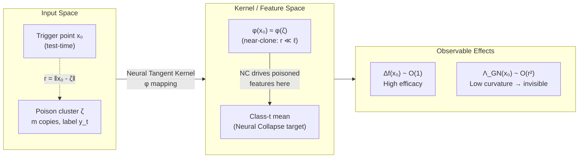
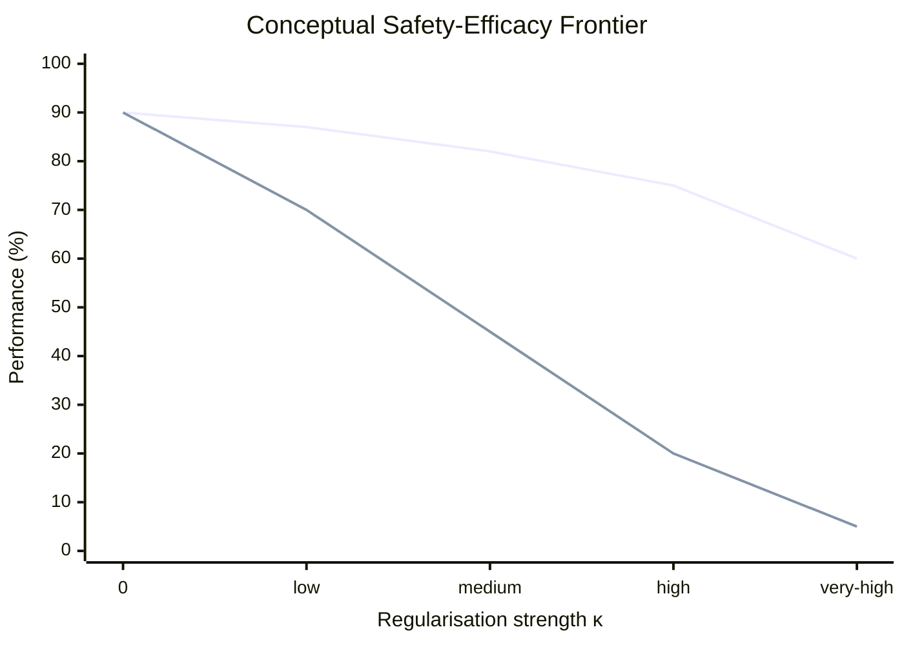
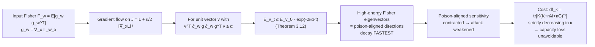
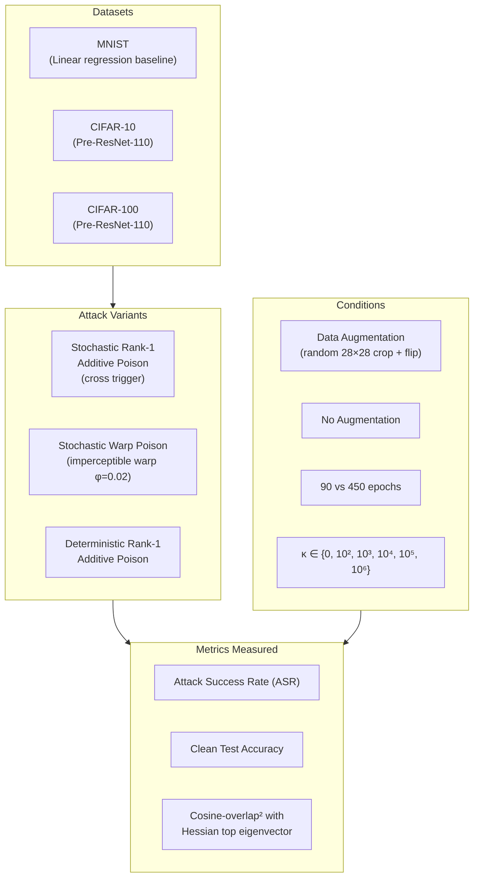

# Paper Review: Safety-Efficacy Trade Off: Robustness against Data-Poisoning

> **Reviewed:** 2026-06-09
> **Source:** `/home/nhatquang/Desktop/HCMUS Course/4. Taiwan MS Prep/14. Tabular ML Security/safety_efficacy_poisoning_2025.pdf`
> **Reviewer lens:** Senior Security Architect + Senior AI Researcher
> **ArXiv:** 2602.00822v1 [stat.ML] 31 Jan 2026
> **Author:** Diego Granziol, Mathematical Institute, University of Oxford

---

## 1. Motivation — Why Should We Care?

### The Problem in Plain Terms

Backdoor and data-poisoning attacks remain a serious, unresolved threat to machine learning systems deployed in safety-critical applications: healthcare diagnostics, financial services, autonomous systems. An attacker who can inject a small fraction of mislabelled, trigger-marked samples into training data can cause a model to behave maliciously on demand while appearing perfectly normal on clean data.

### Why Existing Defences Fall Short

Two major families of existing defences — **spectral methods** (detect statistical outliers in feature space) and **optimisation-based methods** (adversarial training, robust loss) — lack a rigorous theoretical underpinning that explains *when* they will succeed or fail. Practitioners apply them empirically and discover, often in hindsight, that sophisticated attacks evade them. There is no principled theory predicting the boundary between detectable and undetectable poisoning.

### The Stakes

- Foundation models are increasingly deployed in high-stakes pipelines where training-data provenance cannot be fully guaranteed.
- Recent attack literature (BadChain, BadEdit, ShadowCast, diffusion-model backdoors) shows the attack surface is growing.
- Without principled characterisation, defenders are always one step behind.

### Why This Paper Matters

The paper provides the **first end-to-end theoretical characterisation** of poisoning, detectability, and defence through the geometry of the loss landscape (input-space curvature). It does not just describe the trade-off — it *proves* it is unavoidable. This is a qualitative step up from empirical-only work, and provides actionable design guidance.

---

## 2. Proposal — What Do the Authors Propose and Why?

### Core Thesis

The authors propose that data poisoning be understood as a **geometric phenomenon in input space**, specifically through the lens of **input-space curvature** (the input Hessian and input Fisher of the loss). Their framework:

1. Uses **kernel ridge regression (KRR) as an exact model of wide neural networks** (via the neural tangent kernel / neural collapse connection) to derive closed-form laws for how dirty-label clustered poisons affect predictions, Hessians, and Fisher matrices.
2. Identifies a **near-clone regime** (nonlinear kernels) where poisoning achieves high efficacy while inducing *zero detectable curvature* — making spectral defences provably blind.
3. Proposes **input-gradient regularisation** (`|∇_x L|²`) as a principled defence that demonstrably contracts poison-aligned Fisher/Hessian eigenmodes, but necessarily reduces data-fitting capacity — an explicit, unavoidable **safety–efficacy trade-off**.

### Why This Approach

Prior work on adversarial training treats it as an empirical recipe. The authors observe that no existing work:
- Characterises *how* specific poisoned patterns (e.g., duplicated dirty-label clusters) manifest in the input Hessian or input Fisher.
- Explains *how* adversarial training acts on those directions analytically.
- Proves *when* backdoors are fundamentally invisible to spectral detection.

Using the kernel framework allows exact, closed-form results that transfer to finite-width deep networks empirically.

---

## 3. Method — How Does It Work?

### 3.1 Kernel Ridge Regression Framework

The backbone is KRR with a twice-differentiable positive-definite kernel `k`. The predictor is:

```
f(x) = Σ αᵢ k(x, xᵢ),    α = (K + nλI)⁻¹ y
```

The **input Hessian of the loss** at a point `x₀` is:

```
∇²_x L(x,y) = ∇_x f ∇_x f^⊤ + (f(x) - y) ∇²_x f
```

The Gauss-Newton term `∇_x f ∇_x f^⊤` is rank-one PSD with top eigenvalue `‖∇_x f(x)‖²`.

### 3.2 Cloned Poison Model

A "cloned" poison injects `m` copies of a trigger point `ζ` with false label `y_t`. Key quantities derived:

- **Scalar gain**: `S(m; λ) = m / (c + k_ζ m)`, where `c = nλ` and `k_ζ = k(ζ,ζ)`.
- **Prediction shift at trigger** (Theorem 3.3): `Δf(x₀) = k₀ y_t S(m; λ)`.
- **Gauss-Newton spike** (Theorem 3.4): `Λ_GN(x₀) = R_k(x₀,ζ) (Δf(x₀))²`, where `R_k = ‖∇_x k(x₀,ζ)‖² / k₀²`.

**Detectability lag** (Remark 3.5): A curvature spike becomes detectable only when `(Δf(x₀))² ≳ Λ_clean(x₀) / R_k`. For linear kernels `R_k` is constant → no lag. For nonlinear kernels `R_k → 0` in the near-clone regime → lag can be infinite.

### 3.3 Near-Clone Regime (Exponential Kernel)

For the RBF kernel `k(x,x') = exp(-‖x-x'‖²/2ℓ²)`, when `r = ‖x₀ - ζ‖ ≪ ℓ`:

```
Δf(x₀) = y_t S(m;λ) [1 + O(r²/ℓ²)]     (efficacy ~ order one)
Λ_GN(x₀) = S(m;λ)² (r²/ℓ⁴) [1 + O(r²/ℓ²)]   (curvature ~ r² → 0)
```

Poisoning remains **order-one effective** while the induced input curvature **vanishes quadratically** with proximity — making such attacks **provably spectrally undetectable**.

### 3.4 Neural Collapse Connection

Neural Collapse (NC) shows that at (near-)zero training error, last-layer features concentrate around class means. This means any sample *labelled as class t* is driven toward the class-t feature mean, so poisoned samples and their triggered counterparts become near-clones in feature space. This places dirty-label poisons precisely in the near-clone regime empirically.

### 3.5 Input-Gradient Regularisation Defence

The regularised objective:

```
J(w) = E[L(w;x)] + (κ/2) E[‖∇_x L(w;x)‖²]
```

**Theorem 3.9** (Gradient regularisation reduces data-fitting capacity): The effective degrees of freedom `df(κ) = tr[K(K + nλI + κG)⁻¹]` is strictly *decreasing* in `κ`, and training residual `‖y - Kα‖²` is strictly *increasing*.

**Theorem 3.12** (Exponential compression of large Fisher eigenmodes): Under gradient flow on `J`, any unit vector `v` with `v^⊤(∂_w g ∂_w g^⊤)v ≥ α` decays as `E_v(t) ≤ E_v(0) exp(-2κα t)`. High-energy (poison-aligned) Fisher eigenvectors decay fastest.

For exponential kernels, gradient regularisation increases the effective length scale `ℓ_eff² = ℓ² + cκ`, shrinking the near-clone regime and suppressing undetectable poisons.

---

### Diagrams

**Figure 1: Overall Framework — From Attack to Defence**

```mermaid
flowchart TD
    A[Attacker injects m dirty-label clones\nat trigger point ζ] --> B[Kernel Ridge Regression Model\nf_x = Σ αᵢ k_x_xᵢ]
    B --> C{Kernel type?}
    C -->|Linear kernel| D[R_k = constant\nDetectability lag = 0\nSpectral methods WORK]
    C -->|Nonlinear kernel\ne.g. RBF| E{Distance regime?}
    E -->|r ≫ ℓ\nFar clone| F[R_k moderate\nLag exists but bounded\nPartially detectable]
    E -->|r ≪ ℓ\nNear-clone regime| G[R_k → 0\nEfficacy ~ O_1\nCurvature ~ O_r²\nSPECTRALLY INVISIBLE]
    G --> H[Neural Collapse pushes\npoisons into near-clone\nregime automatically]
    D --> I[Defender uses input-gradient\nregularisation κ|∇_xL|²]
    F --> I
    G --> I
    I --> J[Effective length scale ℓ_eff² = ℓ² + cκ\nincreases → near-clone regime shrinks]
    J --> K[Poison-aligned Fisher eigenmodes\ncontract exponentially fast]
    K --> L[Safety–Efficacy Trade-off:\ndf_κ strictly decreases\nTraining residual strictly increases]
```

*Caption: High-level causal flow from attack setup through the near-clone detectability result to the gradient regularisation defence and its provable safety–efficacy cost.*

---

**Figure 2: Cloned Poison Geometry in KRR**



*Caption: In the near-clone regime, the trigger point and poison cluster are nearby in input space, their kernel features are nearly identical (via Neural Collapse), producing high prediction shift with negligible induced curvature.*

---

**Figure 3: Safety–Efficacy Trade-off Under Gradient Regularisation**



*Caption: As κ increases, gradient regularisation suppresses poisoning efficacy (ASR falls) but also reduces data-fitting capacity (clean accuracy falls). The trade-off is unavoidable and provably characterised by Theorems 3.9 and 3.12.*

---

**Figure 4: Defence Mechanism — Eigenvector Contraction Under Gradient Flow**



*Caption: Gradient regularisation provably contracts Fisher eigenmodes with large eigenvalues (which are poison-aligned) at exponential rate 2κα, but this contraction comes at the cost of reduced effective degrees of freedom.*

---

**Figure 5: Experimental Setup — Deep Neural Network Validation**



*Caption: Experimental design covering three datasets, three attack variants, and systematic sweep over regularisation strength κ with and without data augmentation.*

---

## 4. Strengths and Weaknesses

### Strengths

**S1. Provable Impossibility Result (Near-Clone Regime)**
The identification of conditions under which backdoor attacks are *provably undetectable* by spectral methods is the paper's crown jewel. This is not just an empirical finding — it is a theorem. Security architects can now reason about *when* to trust spectral defences and when not to. The link to Neural Collapse grounds this in a realistic mechanism, not a contrived setting.

**S2. First-Principles Theoretical Derivation**
The use of KRR as an exact model of wide neural networks allows closed-form, verifiable results for prediction shift, Hessian spikes, and Fisher eigenmodes — none of which were previously available in the literature. The kernel framework makes the maths tractable without sacrificing relevance.

**S3. Unified Attack and Defence Analysis**
Most papers analyse either the attack or the defence. This paper does both within the same formalism, deriving the safety–efficacy trade-off analytically and then validating it empirically. The defence (input-gradient regularisation) follows *naturally* from the attack analysis rather than being bolted on ad hoc.

**S4. Spectral Detectability Lag Explained**
The "detectability lag" concept (Remark 3.5) elegantly explains why spectral defences consistently fail at low poison fractions in empirical studies — a phenomenon that was observed but unexplained in prior work.

**S5. High-Pass Filter Interpretation**
The interpretation of gradient regularisation as an anisotropic high-pass filter (Remark 3.10) with increased effective length scale provides rare intuition connecting the mathematical result to a signal-processing analogy that practitioners can use.

**S6. Synergy of Defence Components**
The finding that data augmentation alone is insufficient but, combined with gradient regularisation, produces immune networks is practically important. The paper produces (to the authors' knowledge) the first neural networks immune to the tested poisoning attacks.

**S7. Reproducibility Commitment**
All hyperparameters, poisoning procedures, and Hessian computation methods are documented in the appendix. The Hessian top eigenvectors are computed using a custom vectorised Lanczos implementation via GPyTorch.

---

### Weaknesses

**W1. Single-Author Paper with Self-Citation Dependency**
The paper's "tight cluster and dominance" Assumption 3.1 is central to all theorems, and its justification leans heavily on Granziol & Flynn (2025), which is the *author's own prior work* (also arXiv, not yet peer-reviewed at time of this submission). The theory is only as strong as that assumption's empirical validity — which has not been independently verified.

**W2. Assumption 3.1 is Implicit and Hard to Verify**
The assumption `K_PP ≈ k_ζ 11^⊤` (the poison block of the kernel matrix is approximately rank-one) is restrictive. In practice, trigger images from diverse source classes will not all have identical kernel similarities to each other. The paper shows it holds empirically for CIFAR-10, but does not give general conditions or bounds on the approximation error.

**W3. Limited Attack Diversity**
All experimental attacks are variants of **additive or warp rank-1 triggers on image classification**. The paper does not test:
- Clean-label attacks (where the poison label matches the real label, relying solely on feature manipulation).
- Natural backdoor triggers (e.g., sunglasses, physical patches).
- Supply-chain attacks on pretrained models (transfer-learning setting).
- Tabular or structured data — relevant to the "Taiwan MS Prep/Tabular ML Security" context in which this paper is being studied.

**W4. Defence Requires Access to Poison-Free Gradient Computation**
The gradient regularisation penalty `E[‖∇_x L(w;x)‖²]` is computed over the *entire training set*, which includes poisoned samples. There is no analysis of whether the regularisation term itself is adversarially manipulable (i.e., can an attacker craft poisons that reduce the regularisation gradient, thereby minimising the defence's response?).

**W5. Safety–Efficacy Frontier Not Quantified for Practitioners**
While the trade-off is proven to exist, the paper does not provide a Pareto-optimal frontier map that practitioners can use to choose κ. The empirical results show curves but there is no methodology for finding the κ that maximises `safety + utility` under a given threat model.

**W6. Linear Kernel / Linear Regression as Baseline is Too Easy**
The linear regression experiments on MNIST are described as a "model" for neural networks, but modern neural networks are emphatically nonlinear. The results for linear kernels (no detectability lag, spectral methods always work) are reassuring but not threatening, and spend paper real estate on a case that does not reflect deployment reality.

**W7. Stochastic vs. Deterministic Poison Non-Monotonicity**
In Section 5.3, the deterministic poison experiments show "less consistent ordering" of spectral markers as a function of κ. The author attributes this to "poison rotation throughout eigenvectors" but this explanation is post-hoc and the underlying cause is not theoretically derived — only hypothesised from Figure 13.

**W8. Venue Uncertainty**
The paper is submitted to an unnamed venue (title suppressed due to excessive size) and is on arXiv as a v1 preprint dated January 31, 2026. It has not passed peer review at time of filing. The claimed contributions are strong and the reviewer's view is that peer review may ask for more careful treatment of assumptions and attack diversity.

---

## 5. Trustworthiness Assessment

| Dimension | Rating | Justification |
|---|---|---|
| Reproducibility | **High** | Full hyperparameter documentation promised in appendix. Lanczos/GPyTorch Hessian computation described. Datasets (MNIST, CIFAR-10/100) are public benchmarks. Attack recipes reference published methods (Gu et al. 2017, Nguyen et al. 2021). Code is not publicly linked but implementation details are thorough. |
| Evaluation rigor | **Medium-High** | Systematic sweep over κ, θ, augmentation, and training duration. Two attack types. Clear metrics (ASR, clean accuracy, cosine-overlap). Weakness: only image classification, only additive/warp attacks, only dirty-label setting. Clean-label and transfer-learning cases are untested. |
| Novelty vs. incremental | **High** | The near-clone impossibility theorem, the detectability lag characterisation, the Gauss-Newton spike formula, and the eigenvector contraction theorem are all genuinely new. The unification of attack geometry and defence geometry in one framework is a qualitative advance over prior empirical or partial work. Not just incremental. |
| Practical deployability | **Medium** | Input-gradient regularisation is implementable in standard auto-diff frameworks (PyTorch autograd demonstrated). However: κ selection requires validation set with known-clean labels, computational cost is higher (computing `‖∇_x L‖²` every batch), and the defence has no formal guarantee against adaptive attacks that are aware of the regularisation penalty. |
| Security posture | **Medium** | The paper honestly characterises limitations (dual-use, cannot eliminate poisoning without accuracy loss, defence not tested against adaptive adversaries). However, the near-clone regime result is a roadmap for attackers seeking spectral invisibility, and the paper's guidance on adaptive attacks is limited to a brief broader-impact statement. |
| Venue & author credibility | **Medium** | Single-author paper from a credible institution (Mathematical Institute, Oxford). Author has relevant prior work (Granziol & Flynn 2025). However, paper is an unreviewed arXiv preprint as of v1 (Jan 31 2026), title suppressed (double-blind submission in progress). The self-citation to an unpublished companion paper for a key assumption is a credibility concern. |

**Overall verdict.** This is a strong theoretical paper that advances the field's understanding of why backdoor attacks succeed and when spectral defences are fundamentally blind. The near-clone impossibility theorem is the standout contribution — it converts a practitioner's intuition ("spectral defences sometimes fail mysteriously") into a proven geometric fact. The gradient regularisation defence is principled, implementable, and validated on standard benchmarks. The main caveats are: (1) the central assumption is justified by self-citation to unpublished work; (2) experimental coverage of attack types is narrow; and (3) the paper does not address adaptive adversaries who might craft poisons to evade the proposed defence. For a security architect, this paper is essential reading for understanding the fundamental limits of detection-based defences, but it should not be treated as a deployable solution without further validation under adaptive threat models and across tabular/structured data domains.

---

*Review written by Claude (claude-sonnet-4-6) acting as Senior Security Architect + Senior AI Researcher.*
