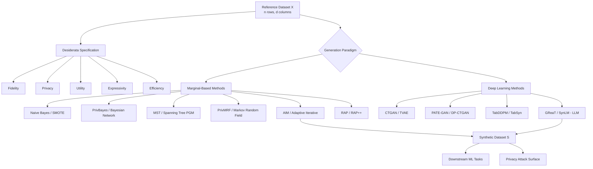
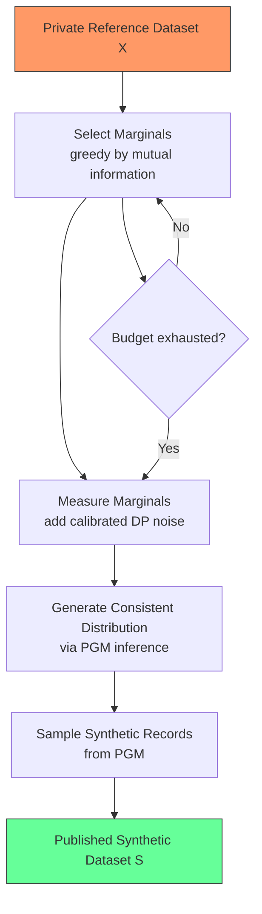
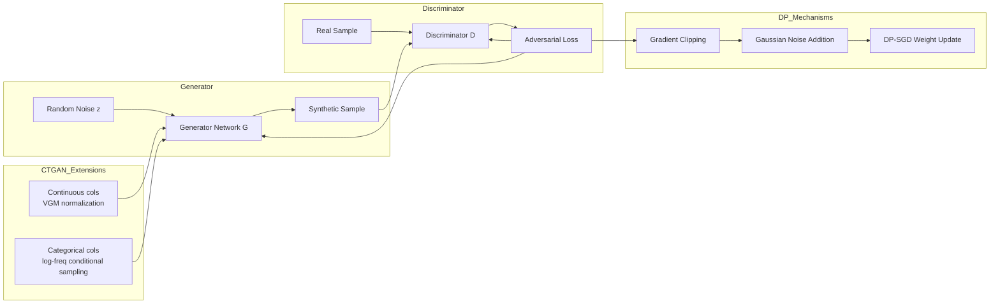
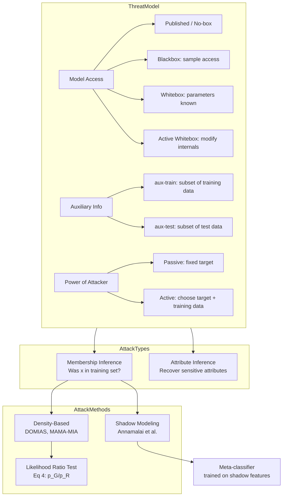
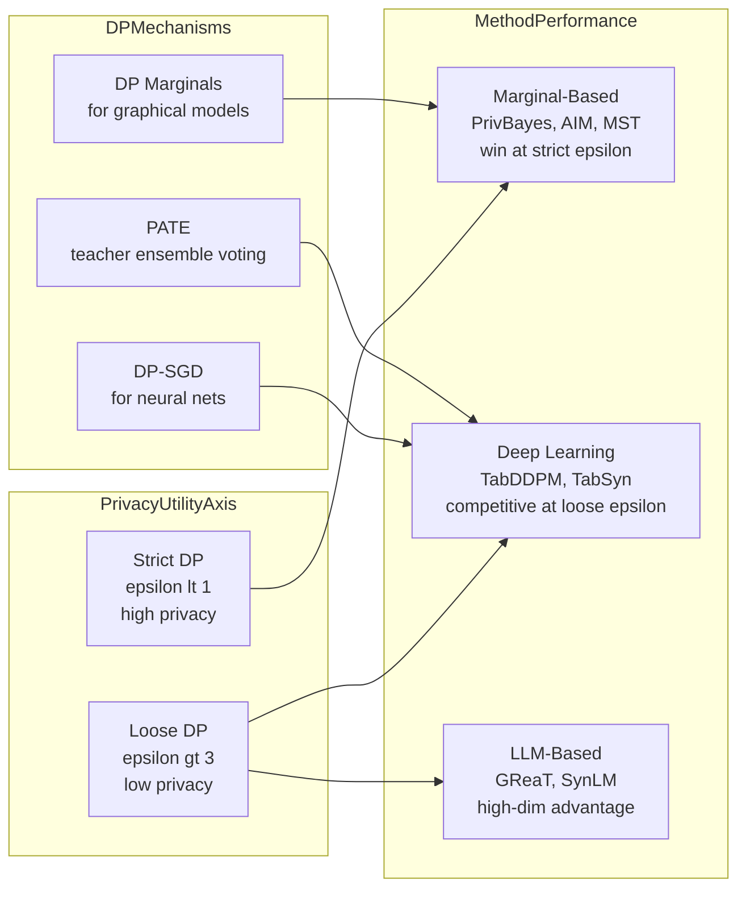
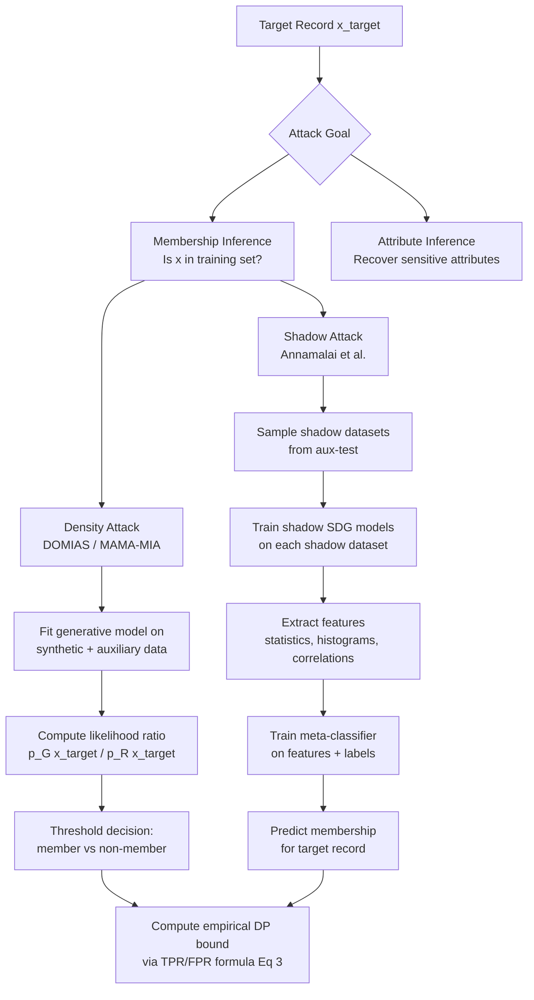
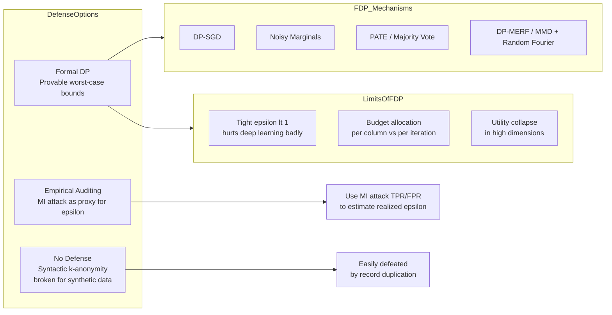

# Paper Review: Synthetic Tabular Data: Methods, Attacks and Defenses

> **Reviewed:** 2026-06-09
> **Source:** `/home/nhatquang/Desktop/HCMUS Course/4. Taiwan MS Prep/14. Tabular ML Security/synthetic_tabular_data_cormode_2025.pdf`
> **Reviewer lens:** Senior Security Architect + Senior AI Researcher

---

## 1. Motivation — Why Should We Care?

The problem is real and consequential. Organizations holding sensitive tabular data — patient health records, financial transaction logs, demographic census files — face a fundamental tension: the data is scientifically and commercially valuable, but sharing it exposes individuals to privacy harms. Regulatory regimes (GDPR, CCPA) formalize this tension into legal liability. The naive solution of simply anonymizing records has been repeatedly broken: re-identification attacks on "anonymized" datasets are well-documented in the literature (Netflix, AOL, hospital records). Synthetic data generation is the proposed middle path: fabricate a dataset that statistically resembles the original but is entirely constructed, so no individual's record is directly exposed.

The paper's motivation is sound and the stakes are genuine. Healthcare organizations cannot freely share clinical trial data for secondary research. Financial institutions cannot collaborate on fraud detection without exposing transaction histories. Census bureaus must release demographic statistics without exposing individual responses. These are not hypothetical concerns — they are active operational problems costing billions in siloed research and missed insights.

What the paper frames correctly, and this is its key conceptual contribution, is the *tightrope* problem: synthetic data that is too faithful to the original leaks information about individuals; synthetic data that is too noisy or structurally divergent is useless for downstream tasks. The paper positions the survey around the three-way tension of **fidelity, privacy, and utility**, and adds a fourth dimension — **expressivity** — to capture how richly the model captures the reference data's structure. This framing is accurate and practically important.

One mild criticism of the motivation section: it does not quantify the cost of getting this wrong. How bad is a membership inference attack in practice against deployed synthetic data systems? The paper gestures at this but does not ground it in real-world breach case studies or empirical harm estimates, which would sharpen the urgency.

---

## 2. Proposal — What Do the Authors Propose and Why?

This is a **survey paper**, not a novel method paper. The authors — Graham Cormode and Samuel Maddock from Meta / University of Warwick, joined by Enayat Ullah and Shripad Gade from Meta — propose a unified conceptual framework for understanding synthetic tabular data generation, covering: (1) the desiderata a system must satisfy (fidelity, privacy, utility, expressivity, efficiency), (2) a structured taxonomy of generation methods from naive statistical approaches to state-of-the-art deep generative models, (3) a rigorous treatment of privacy attack surfaces (membership inference, attribute inference) with formal threat models, and (4) defense mechanisms rooted in differential privacy. The survey is targeted at KDD 2025, a top-tier data mining venue.

The authors' implicit argument for this survey's existence is that the field has fragmented: the statistics community developed marginal-based methods (PrivBayes, AIM, MST), the machine learning community developed deep learning methods (CTGAN, TVAE, TabDDPM, GReaT), and a separate security community has been attacking both without a unified lens. The survey attempts to bridge these silos.

The authors choose differential privacy (DP) as the formal privacy standard throughout, explicitly dismissing syntactic approaches like k-anonymity as insufficient for synthetic data. This choice is principled: DP has provable worst-case guarantees and has become the de facto standard in the field. However, the authors acknowledge it comes with practical costs — namely, the utility-privacy tradeoff under tight epsilon budgets (epsilon < 1) often makes deep learning methods ineffective, while simpler marginal-based methods prove more robust. This is an honest and important observation, not a marketing claim.

The decision to organize the survey around a formal threat model (Section 5) rather than only benchmarking utility is a strength that distinguishes this from many prior surveys. Most synthetic data surveys focus exclusively on fidelity and ML utility metrics; this paper foregrounds the attacker perspective, which is exactly what a practitioner deploying synthetic data in a regulated environment needs.

---

## 3. Method — How Does It Work?

This being a survey, "method" covers the taxonomy and synthesis of reviewed techniques rather than a single novel algorithm.

### 3.1 Marginal-Based Methods

The foundational concept is the **probabilistic graphical model (PGM)** over marginal distributions. Given a dataset X with n rows and d categorical columns, the joint distribution is decomposed into a collection of low-order marginals (1-way, 2-way, k-way). The core quantity is mutual information between attribute pairs:

```
I(X; Y) = sum_{x,y} Pr(x,y) * (log Pr(x,y) - log(Pr(x) * Pr(y)))    [Eq. 1]
```

This guides which marginals to materialize. DP noise is added to each measured marginal, and a PGM is used to infer a consistent joint distribution, from which synthetic records are sampled.

The **PrivBayes** approach [Zhang et al., 2017] uses a Bayesian network structure, selecting marginals greedily by mutual information. **MST** (McKenna et al.) uses a maximum spanning tree over pairwise mutual information. **AIM** extends this with adaptive, iterative marginal selection — the "select-measure-generate" paradigm — and budget annealing.

**PrivMRF** replaces Bayesian networks with Markov Random Fields and uses a different divergence measure:

```
D(X, Y) = sum_{x,y} Pr(x,y) - Pr(x) * Pr(y)    [Eq. 2]
```

This is explicitly not mutual information — it measures the raw covariance-like departure from independence rather than the KL-style divergence, making it more computationally tractable for triangulation-based inference.

### 3.2 Deep Learning Methods

**CTGAN** addresses the mixed discrete/continuous nature of tabular data by modeling continuous columns as variational Gaussian mixtures and using a conditional GAN that samples discrete column values proportional to log-frequency. **TVAE** replaces the discriminator with a variational autoencoder framework, improving training stability.

**TabDDPM** adapts diffusion models: quantile transformation for numerical features, one-hot encoding for categorical features, and independent Gaussian/multinomial noise processes per feature. **TabSyn** addresses TabDDPM's feature-independence limitation by embedding all features into a unified continuous latent space via VAE before applying a standard Gaussian diffusion process.

**GReaT** and **SynLM** use LLMs fine-tuned on textually encoded tabular rows. GReaT (Borisov et al.) fine-tunes a pretrained LLM; SynLM (Sablayrolles et al.) adds formal DP via DP-SGD and uses a trie structure to constrain generation to valid token sequences.

DP-SGD (Abadi et al., 2016) is the standard mechanism for adding DP to neural network training: gradient clipping + calibrated Gaussian noise per iteration. The privacy cost compounds across iterations via composition theorems.

### 3.3 Attack Framework

The paper models privacy attacks as a game between an adversary and a data curator. The threat model has three axes:

1. **Model access**: published (no-box), blackbox (sample only), whitebox (parameters known), active whitebox (can modify internal states)
2. **Auxiliary information**: aux-train (training subset), aux-test (test subset), aux (both)
3. **Power of attacker**: passive vs. active (can choose target point, can choose training data)

**Membership inference** (MI) targets the binary question: was record x in the training set? Given a MI classifier, TPR and FNR define an empirical DP bound:

```
epsilon >= log(max((TPR - delta) / FPR, (TNR - delta) / FNR))    [Eq. 3]
```

Two attack families are covered:
- **Density-based attacks** (e.g., DOMIAS): fit a generative model on synthetic data + auxiliary data, compute likelihood ratio A(x_target) = f(p_G(x_target) / p_R(x_target)) [Eq. 4], where p_G is the density under the synthetic model and p_R is a reference density
- **Shadow modeling attacks** (Annamalai et al.): train shadow models on auxiliary subsets, extract statistical features, train a meta-classifier to predict membership

**Attribute inference** seeks to recover sensitive attribute values from a partially observed record.

### Diagrams


*Taxonomy of synthetic tabular data generation methods covered in the survey, organized by paradigm.*

---


*The "select-measure-generate" pipeline common to AIM, MST, and PrivBayes marginal-based methods.*

---


*CTGAN architecture with DP-SGD extensions for differentially private training.*

---


*Privacy attack threat model taxonomy: access assumptions, attack goals, and method families.*

---


*Privacy-utility tradeoff: which method families win under different epsilon regimes.*

---


*End-to-end flow of density-based and shadow-modeling membership inference attacks.*

---


*Defense landscape: formal DP mechanisms, their variants, and practical limitations.*

---

### 3.4 Key Empirical Findings Synthesized from the Survey

The paper synthesizes several benchmark results from the literature:

- **Tao et al. [65]**: 12 DP-SDG methods across 7 datasets — GAN-based methods consistently fail to reproduce even one-way marginals; marginal-based methods dominate across both statistical and ML utility tasks.
- **Liu et al. [45]**: "Utility recovery incapability" — increasing privacy budget (relaxing DP) does not consistently improve DP-CTGAN's utility. PATE-GAN improves only when epsilon > 3.
- **Ganev et al. [22]**: Graphical models (PrivBayes, MST) spend privacy budget per column; deep generative models spend per training iteration. This explains why graphical models are more efficient under tight budgets for low-dimensional data.

---

## 4. Strengths and Weaknesses

### Strengths

1. **Unified threat model formalization.** Section 5's formal treatment of the attacker model — with explicit axes for model access, auxiliary information, and attacker power — is the most rigorous synthesis of this space I have seen in a survey. Most synthetic data papers treat privacy informally; this paper applies the standards of the security literature.

2. **Honest treatment of deep learning limitations.** The paper does not hype deep generative models. It directly cites benchmark results showing marginal-based methods outperform GAN-based approaches under tight privacy budgets, and names the specific failure mode ("utility recovery incapability") with a citation to primary evidence. This intellectual honesty is valuable.

3. **Correct dismissal of syntactic privacy.** The paper's position that k-anonymity is insufficient for synthetic data — because it can be satisfied by trivial record duplication — is technically correct and important for practitioners who may be tempted by k-anonymity's intuitive appeal.

4. **Practical threat model coverage.** The distinction between density-based and shadow-modeling attacks, and the derivation of an empirical epsilon estimate from TPR/FPR (Eq. 3), gives practitioners a concrete tool for auditing deployed systems without relying solely on theoretical DP bounds.

5. **Coverage breadth.** The survey covers naive Bayes, SMOTE, PrivBayes, MST, PrivMRF, PrivSyn, AIM, RAP/RAP++, CTGAN, TVAE, PATE-GAN, DP-CTGAN, DP-MERF, GEM, TabDDPM, TabSyn, GReaT, SynLM, and extensions to federated/distributed settings. This is genuinely comprehensive for a 10-page KDD paper.

6. **Author credibility.** Graham Cormode is one of the most respected researchers in data privacy and sketching/streaming algorithms. His group at Meta/Warwick has produced foundational work in differential privacy. Samuel Maddock has published directly on synthetic data auditing. This is not a survey written by outsiders to the field.

### Weaknesses and Red Flags

1. **10-page constraint severely limits technical depth.** This is a KDD tutorial-style paper, not a VLDB or JMLR survey. Many techniques receive a single paragraph. PrivSyn, PrivMRF, and the full AIM algorithm are summarized at a level that is insufficient for a practitioner to implement or critically evaluate them. The paper frequently cites results without showing the experimental setup (dataset sizes, epsilon values, evaluation metrics) needed to assess their validity.

2. **No original experiments.** The paper synthesizes others' results but does not run any new benchmarks. The comparative claims (e.g., "marginal-based methods consistently outperform GAN-based competitors") are supported by citations, but the paper does not verify whether these results hold across different dataset characteristics, epsilon ranges, or dimensionalities. A reader cannot assess whether cherry-picking occurred in the cited benchmarks.

3. **Attribute inference receives inadequate treatment.** Section 5's threat model formally defines attribute inference, but the actual attack methods discussed are almost exclusively membership inference. Attribute inference — recovering a sensitive column value from a partially observed record — is arguably more practically dangerous in healthcare and financial settings, yet the paper offers almost no concrete attack methodology for it.

4. **Federated and distributed settings are superficially treated.** Section 6 mentions federated synthetic data generation (FLAIM, CAPS, Maddock et al., Pentyala et al.) but gives no technical depth on the additional attack surface introduced by distribution — gradient inversion, model poisoning by malicious participants, or the interplay between federated aggregation noise and DP guarantees. For a security-focused survey, this is a significant gap.

5. **LLM-based methods lack adversarial analysis.** GReaT and SynLM are described as promising but the survey does not address the unique attack surface of LLMs: training data memorization (which is well-documented for LLMs and directly relevant to privacy), prompt injection during tabular encoding, or the failure modes of trie-constrained generation when the trie itself leaks distributional information.

6. **The empirical DP audit (Eq. 3) is presented without calibration caveats.** Estimating epsilon from TPR/FPR requires a well-calibrated attack. If the attack is weak (low TPR), the empirical epsilon appears small, giving false assurance. The paper does not sufficiently warn that empirical auditing provides a lower bound on epsilon, not an upper bound. A weak auditor is not evidence of strong privacy.

7. **No discussion of distribution shift or deployment drift.** In real deployments, the synthetic data is generated once and used for months or years. The reference data distribution may shift (e.g., a patient population changes). The privacy guarantees of DP are defined at generation time and do not account for future distribution shift. The paper does not address this deployment reality.

8. **Privacy-utility tradeoff is characterized qualitatively, not quantitatively.** The paper repeatedly asserts that there is a tradeoff but does not provide a formal characterization (e.g., information-theoretic lower bounds on the tradeoff curve, or a Pareto frontier across methods). The claim that marginal-based methods are more efficient under tight budgets would be strengthened by a quantitative bound.

---

## 5. Trustworthiness Assessment

| Dimension | Rating | Justification |
|---|---|---|
| Reproducibility | **Medium** | No new experiments; all claims are backed by citations to primary work. The cited papers vary in reproducibility. The authors mention a future open-source library but it does not exist at time of writing. |
| Evaluation rigor | **Medium** | The survey accurately represents the benchmarks it cites (Tao et al., Liu et al., Ganev et al. are all peer-reviewed), but no independent verification of those results is performed, and experimental conditions are not fully reported. |
| Novelty vs. incremental | **Medium** | The unified threat model formalization and the synthesis of the marginal vs. deep learning debate are genuine contributions. The method taxonomy is mostly synthesis of existing work. For a survey paper, this is appropriate novelty. |
| Practical deployability | **High** | The framework for choosing methods based on epsilon regime, data dimensionality, and downstream task is directly actionable. The empirical DP auditing approach (Eq. 3) is a concrete deployment tool. |
| Security posture | **Medium** | The formal threat model and membership inference coverage are strong. Attribute inference, LLM memorization risks, federated attack surfaces, and deployment drift are insufficiently addressed. The warning about syntactic privacy failure is important and correct. |
| Venue & author credibility | **High** | KDD 2025 is a top-tier venue with rigorous peer review. Graham Cormode is a leading figure in data privacy research with a track record in foundational DP work. The Meta affiliation indicates industrial-scale deployment experience. |

**Overall verdict.** This paper is a trustworthy, well-framed survey from credible authors that serves as a reliable entry point to the synthetic tabular data field. Its primary value is the unified threat model formalization and the honest synthesis of the marginal-vs-deep-learning debate under DP. Its primary limitation is the 10-page constraint, which forces shallow treatment of adversarial topics (attribute inference, LLM memorization, federated attack surfaces) that matter most to a security practitioner. I would cite this paper as a conceptual framework and threat model reference, but supplement it with Annamalai et al. [3] for attack methodology, Tao et al. [65] for empirical benchmarks, and the AIM/McKenna papers for implementation depth. Build on this paper's framing, but do not treat its method comparisons as definitive without verifying the cited experimental conditions. The absence of new experiments is the main reason this review stops short of "high" on evaluation rigor — for a survey at a data mining venue, original empirical synthesis would have significantly strengthened the contribution.
