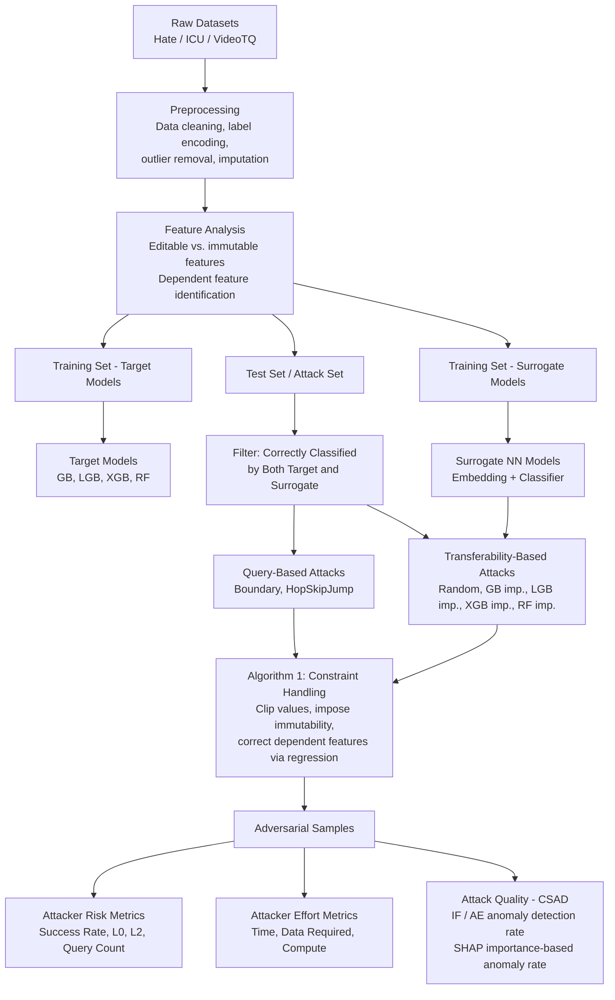
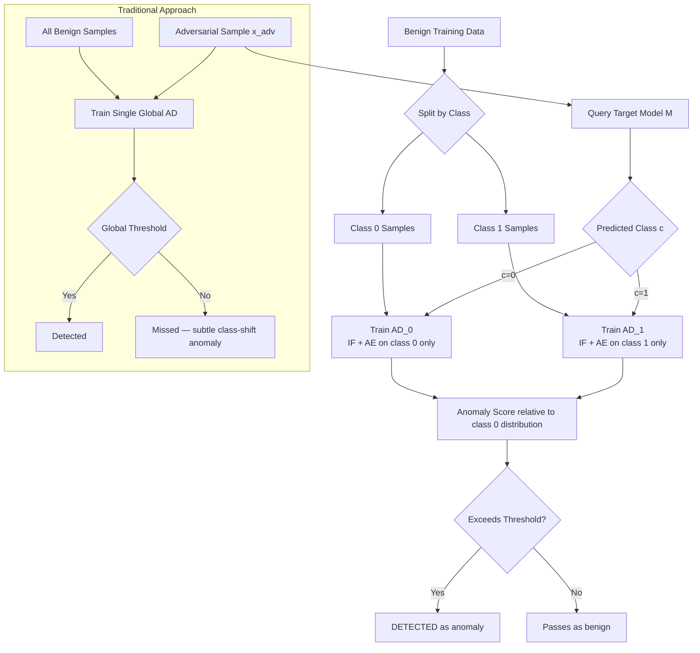
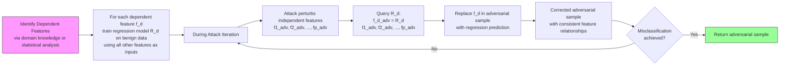
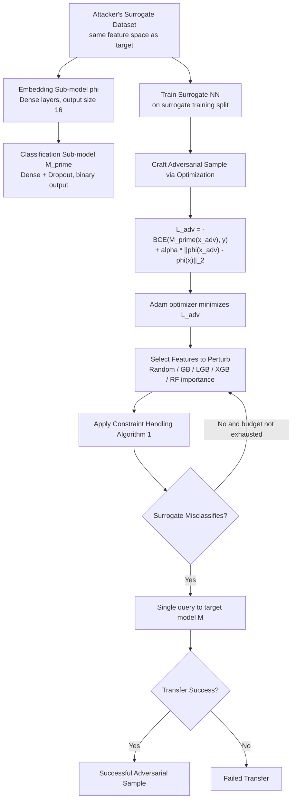
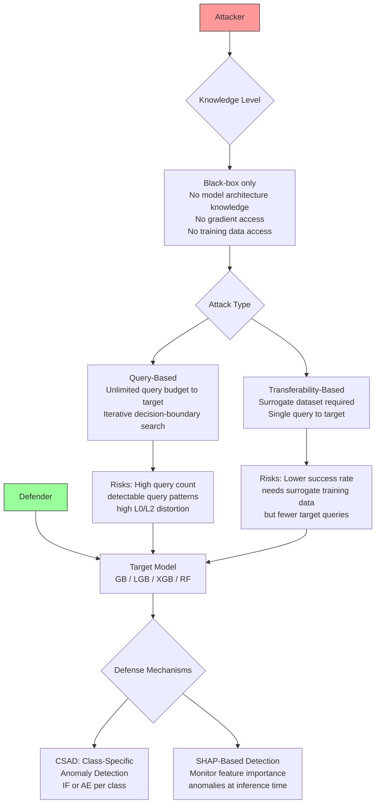
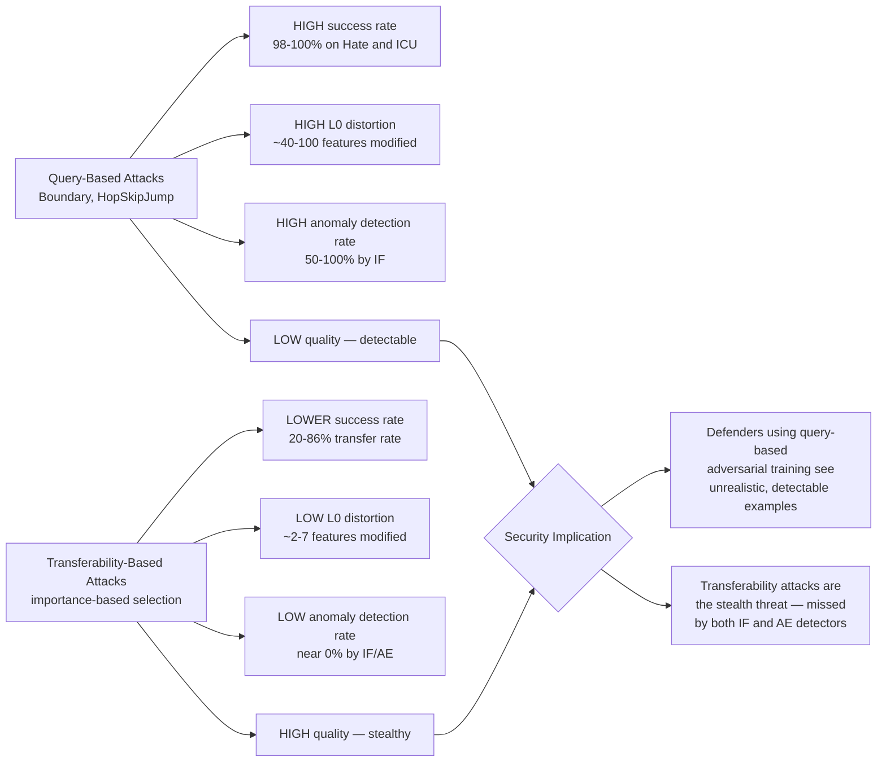

# Paper Review: Addressing Key Challenges of Adversarial Attacks and Defenses in the Tabular Domain: A Methodological Framework for Coherence and Consistency

> **Reviewed:** 2026-06-09
> **Source:** `/home/nhatquang/Desktop/HCMUS Course/4. Taiwan MS Prep/14. Tabular ML Security/tabular_attack_challenges_ghamizi_2024.pdf`
> **Reviewer lens:** Senior Security Architect + Senior AI Researcher
> **Authors:** Yael Itzhakev, Amit Giloni, Yuval Elovici, Asaf Shabtai (Ben-Gurion University of the Negev)
> **Status:** arXiv preprint arXiv:2412.07326v3, submitted 1 Sep 2025 (Elsevier, cs.LG)

---

## 1. Motivation — Why Should We Care?

ML models on tabular data are deeply embedded in high-stakes systems: credit scoring (loan approval), ICU mortality prediction, network quality assurance, hate speech detection, fraud detection. These systems are the target of adversarial attacks — deliberately crafted inputs designed to elicit a wrong prediction from the model. Unlike the image domain, where adversarial perturbations are bounded by human perceptual limits, tabular data imposes an entirely different constraint regime: features are heterogeneous (continuous, discrete, categorical, ordinal), semantically and statistically interdependent (BMI depends on height and weight; APACHE clinical scores are derived from dozens of physiological measurements), and subject to hard validity rules (binary features are 0 or 1; age cannot be negative).

The gap this paper targets is genuine and practically consequential. Prior attacks either ignore feature coherence entirely (applying image-domain perturbations to tabular rows), or address validity constraints but not statistical consistency (e.g., Cartella et al. [7], Mathov et al. [8]). The existing evaluation toolkit is also weak: the dominant metrics — L_p norms and attack success rate — were imported from the image domain and fail to capture whether a perturbed tabular record is distinguishable from benign data. A credit applicant whose income-to-debt ratio has been perturbed while their other financial indicators remain unchanged will look anomalous to any semi-competent fraud detector, yet L_2 distance would declare it imperceptible.

The three gaps the paper identifies are accurate and under-addressed:
1. Feature coherence is largely absent from tabular attack design.
2. No objective, scalable metric exists for tabular adversarial sample quality beyond L_p norms.
3. No systematic empirical comparison of black-box attack strategies in the tabular domain exists.

**Who suffers if this goes unsolved?** Defenders building adversarial-training pipelines using incoherent adversarial samples will train models on unrealistic threat data, leaving real-world gaps. Attackers who do not understand the coherence-success trade-off will craft detectable perturbations. Security auditors have no principled tool to quantify the stealthiness of adversarial samples submitted to tabular classifiers in fraud, healthcare, or telecommunications.

---

## 2. Proposal — What Do the Authors Propose and Why?

The paper makes four integrated contributions:

1. **Regression-based dependent feature perturbation:** A technique for maintaining feature coherence during attacks. For each dependent feature, a regression model is trained on benign samples (excluding the feature itself) so that, after perturbation, the dependent feature's value is re-predicted from the modified independent features. This keeps the statistical relationships between features intact.

2. **Class-Specific Anomaly Detection (CSAD):** A detection approach that trains a separate anomaly detection model (Isolation Forest or Autoencoder) per class using only the benign samples of that class. Adversarial samples are evaluated against the distribution of their *predicted* class, not the global distribution. This catches perturbations that are coherent with the source class but anomalous for the target class.

3. **Dual evaluation criteria for adversarial sample quality:**
   - *Feature Space Coherency*: Anomaly detection rate (% of samples flagged as anomalous by IF/AE) — a model-agnostic score.
   - *Model Interpretation Stability*: SHAP-based metrics measuring whether the adversarial sample shifts feature importance in ways inconsistent with benign samples of the predicted class.

4. **Comprehensive empirical comparison** of 7 black-box attack strategies (2 query-based: Boundary, HopSkipJump; 5 transferability-based with different feature selection strategies) across 3 datasets and 4 target model families, using all of the above metrics.

The authors' rationale for the regression-based approach is pragmatic: when dependencies are known but their exact computations are unknown to the attacker (as in clinical scoring), a learned regression approximation is the best achievable coherence guarantee under black-box conditions. The CSAD idea is conceptually tight — adversarial attacks shift the *predicted* class, so the anomaly reference should be the distribution of that class, not the source class or the full dataset. This insight is well-motivated and the paper is right that prior work missed it.

The main alternative — explicitly modeling the full joint feature distribution and sampling consistent perturbations — is computationally intractable for high-dimensional heterogeneous tabular data, and the authors correctly note this without fully elaborating it. The regression-based shortcut is reasonable but its scope is narrow (non-circular dependencies only).

---

## 3. Method — How Does It Work?

### 3.1 Regression-Based Dependent Feature Perturbation

For each dependent feature $f_d$ (where $f_d = g(f_1, ..., f_{d-1}, f_{d+1}, ..., f_p)$ for some unknown function $g$), a regression model $\hat{g}$ is trained on benign training samples using all other features as inputs. During adversarial sample generation, after each perturbation step modifies independent features, the dependent features are corrected:

$$f_d^{adv} \leftarrow \hat{g}(f_1^{adv}, ..., f_{d-1}^{adv}, f_{d+1}^{adv}, ..., f_p^{adv})$$

The paper uses gradient boosted trees (200 estimators, depth 6) as the regression model. This step is integrated as a post-hoc correction inside the constraint modification procedure (Algorithm 1), applied after each perturbation round. Scope is explicitly limited to non-circular dependencies; the paper acknowledges circular/mutual dependencies as an open problem.

**Critical limitation not adequately addressed:** Correcting dependent features after perturbation — rather than constraining the optimization to move them jointly — may create oscillation or infeasibility in iterative attacks. If the attacker perturbs $f_1$ (which $f_d$ depends on), then corrects $f_d$, and then the attack objective requires modifying $f_d$ again, the correction is overwritten. The paper does not analyze whether this sequential correction procedure converges or whether the regression correction itself introduces exploitable artifacts.

### 3.2 Class-Specific Anomaly Detection (CSAD)

Given $k$ classes, train $k$ anomaly detection models $\{AD_1, ..., AD_k\}$, each trained on benign samples from its respective class. For an adversarial sample $x_{adv}$ predicted by the target model as class $c$:

$$\text{anomaly}(x_{adv}) = AD_c(x_{adv})$$

For the Autoencoder (AE), the anomaly threshold is:

$$\text{Threshold}(x_c, AE_c) = \text{mean}(\text{test}_{c,r,error}) + 2 \cdot \text{std}(\text{test}_{c,r,error}) \quad (1)$$

where $\text{test}_{c,r,error}$ is reconstruction error on a benign validation set of class $c$.

The Isolation Forest is calibrated to match the AE's false positive rate per class, enabling fair comparison. Both detectors are evaluated independently and their results treated as complementary views.

**Computational complexity:** For algorithms with super-linear training complexity $O(n^\alpha)$, $\alpha > 1$, CSAD reduces total training cost from $O(n^\alpha)$ to $O(k^{1-\alpha} \cdot n^\alpha)$ (balanced classes). For linear algorithms (IF, AE), cost is $O(n)$ regardless of partitioning — no savings but no overhead. The advantage disappears for severely imbalanced datasets, which all three evaluation datasets are.

### 3.3 SHAP-Based Evaluation Metrics

SHAP values are extracted per class using SHAPTreeExplainer. A feature's SHAP value for an adversarial sample is considered anomalous if it falls outside the class-specific range $[\min(\text{SHAP}_{f,c}), \max(\text{SHAP}_{f,c})]$ of the benign training set for that class.

Two metrics:
- **Importance-Based Anomaly Detection Rate:** % of adversarial samples with at least one anomalous SHAP value.
- **Average Anomalous SHAP Features per Sample:** Average count of features with anomalous SHAP values.

These are computed using CSAD's class-specific framing, not global thresholds.

### 3.4 Attack Architectures

**Query-based attacks (Boundary, HopSkipJump):** Both operate via decision-boundary estimation without gradient access. Boundary attack initializes from a random sample in the target class and iteratively projects back toward the decision boundary. HopSkipJump employs binary search and gradient estimation to find the nearest boundary point. Both are augmented with Algorithm 1's constraint handling.

**Transferability-based gradient attacks:** A neural network surrogate with two sub-models (embedding + classifier) is trained on the attacker's surrogate dataset. Adversarial samples are crafted by minimizing:

$$L_{adv}(x_{adv}, x, y) = -\text{BCE}(M'(x_{adv}), y) + \alpha \|\phi(x_{adv}) - \phi(x)\|_2 \quad (2)$$

where $M'$ is the surrogate, $\phi(\cdot)$ is the embedding sub-model output, and $\alpha = 1$. The first term drives misclassification; the second term regularizes to preserve proximity in the embedding space (serving as a coherence surrogate). Optimization is:

$$x_{adv} = \arg\min_{x_{adv}} L_{adv}(x_{adv}, x, y) \quad (3)$$

Five feature selection strategies vary how features to perturb are chosen: random, or importance-based using SHAP values from one of four surrogate-adjacent classifiers (GB, XGB, LGB, RF).

### 3.5 Datasets and Experimental Setup

| Dataset | N | Features (mutable) | Target | Imbalance |
|---|---|---|---|---|
| Hate (Twitter) | 4,971 | 115 (109 mutable) | Hateful user (binary) | 89% class 0 |
| ICU (MIMIC) | 83,978 | 74 (45 mutable, 5 dependent) | ICU mortality (binary) | ~90% class 0 |
| VideoTQ (proprietary) | 54,825 | 23 (9 mutable) | Transmission quality (binary) | ~82% class 0 |

Four target model families: Gradient Boosting (GB), LightGBM (LGB), XGBoost (XGB), Random Forest (RF). Surrogate models: neural networks with embedding layers. Attack sets filtered to correctly-classified samples only before evaluation. Statistical validation: pairwise Mann-Whitney U tests and proportions z-tests with Holm-Bonferroni correction throughout.

---

### Diagrams

**Diagram 1: Full Methodological Pipeline**

*This diagram shows the complete end-to-end pipeline from raw data to multi-dimensional evaluation, as illustrated in the paper's Figure 1.*

---

**Diagram 2: CSAD — Class-Specific Anomaly Detection**

*CSAD evaluates adversarial samples against the benign distribution of their predicted (target) class, catching perturbations that are anomalous in the target class context but not globally.*

---

**Diagram 3: Regression-Based Dependent Feature Correction**

*The regression correction step is applied after each perturbation round inside the constraint-handling procedure to maintain statistical coherence of dependent features.*

---

**Diagram 4: Transferability Attack Architecture (Surrogate NN)**

*The surrogate NN uses an embedding layer to preserve latent-space proximity as a coherence proxy; the adversarial sample is crafted once against the surrogate and transferred to the black-box target in a single query.*

---

**Diagram 5: Threat Model**

*The threat model assumes a realistic black-box attacker with access only to prediction outputs, distinguished by whether they exploit unlimited target queries or surrogate-based transferability.*

---

**Diagram 6: Attack Success vs. Quality Trade-off (Conceptual)**

*The fundamental trade-off: query-based attacks achieve high misclassification rates but leave large feature-space footprints; transferability attacks are subtle but have lower success rates on these datasets.*

---

## 4. Strengths and Weaknesses

### Strengths

**1. The CSAD insight is genuinely novel and correct.** The observation that adversarial samples should be evaluated against the *target class* distribution, not the global distribution, is non-trivial and produces empirically large gains (Cohen's g ≈ 1.0 in McNemar tests, p < 0.001). This is not a marginal improvement; it catches attacks that global detectors entirely miss (0% standard detection vs. 66-87% CSAD detection on VideoTQ/RF examples in Table 6). This is the strongest contribution.

**2. Comprehensive, statistically rigorous evaluation.** The use of Holm-Bonferroni correction throughout, pairwise Mann-Whitney U and proportions z-tests with effect sizes (Cliff's delta, Cohen's h), across 3 datasets × 4 models × 7 attacks × multiple metrics is methodologically serious. Most adversarial ML papers present raw numbers without statistical validation; this one does it right.

**3. The dual-metric evaluation framework captures orthogonal failure modes.** The finding that IF can detect boundary attacks at near 100% while SHAP-based metrics show near-zero anomaly rates for the same attacks (and vice versa for some transferability attacks) demonstrates that neither metric alone is sufficient. This complementarity is a concrete contribution to evaluation methodology.

**4. Code and artifacts released.** The GitHub repository (github.com/yael87/Framework-for-adversarial-in-tabular-domain) includes preprocessed datasets, attack code, trained models, and generated adversarial samples. This is above average for ML security papers.

**5. Honest treatment of regression-based correction scope.** The paper explicitly admits the technique is inapplicable to circular/mutual dependencies and requires a separate dependency discovery stage when dependencies are unknown. This is the kind of honest scoping that is often missing.

**6. Empirically significant finding on L_2 as imperceptibility proxy.** The finding that small L_2 transferability-based samples can still be detected by AE detectors (while large-L_2 query-based samples evade it in some cases) directly challenges a common assumption in adversarial ML. This is a real contribution to domain understanding.

### Weaknesses / Red Flags

**1. Regression correction is not formally analyzed for convergence or stability.** The correction is applied sequentially during iterative optimization, but there is no proof or empirical test that this is stable. If perturbation of an independent feature causes its dependent feature to be corrected in a direction that conflicts with the attack objective, the optimizer may thrash or the regression model may be consistently overridden. The paper provides no ablation on whether the correction actually improves coherence metrics relative to not correcting at all. Applied only to ICU dataset (the other two had no identified dependent features), so the generalizability claim rests on a single case.

**2. Only tree-based target models are evaluated.** GB, LGB, XGB, RF — all are gradient-boosted or bagging ensembles of decision trees. This is a significant gap. Neural networks and logistic regression are common in exactly the high-stakes domains the paper cites (credit scoring, clinical prediction). The SHAP-based metrics depend on TreeExplainer, which is designed for tree models; applying this to neural network targets would require KernelSHAP, which is substantially slower and less stable. The choice to limit to tree models is practically understandable but makes the SHAP-based metrics not directly portable to other architectures.

**3. The VideoTQ dataset is proprietary.** One of the three evaluation datasets cannot be accessed by external researchers. The paper provides no mechanism for obtaining this dataset. This undermines reproducibility for a third of the experimental results. The other two datasets (Hate, ICU) are public, but the VideoTQ results are non-trivially different from the others (e.g., transferability attacks achieve ~50% success vs. <30% on ICU), so the proprietary results are not redundant.

**4. SHAP as an anomaly metric conflates explanation quality with coherence.** SHAP values measure how a model uses features for prediction, not whether the feature values themselves are realistic. An adversarial sample could have completely realistic feature values (low feature-space anomaly score) but cause the model to shift its feature attribution pattern. Whether this constitutes "incoherence" or "effective attack" is ambiguous. The paper presents this metric as measuring "model interpretation stability" but it is actually measuring the consistency of the model's behavior, which is as much a property of the model as of the adversarial sample. This conflation is never resolved.

**5. The regression-based correction introduces an information leak.** When applied in practice, the regression model must be accessible to the attacker (or at least the attacker must know it exists and be able to approximate it). If defenders deploy the same regression models as part of input validation, the attacker's correction is perfectly aligned with the defense — the correction gives the attacker free knowledge of what the defense expects. This is a dangerous design if coherence correction and coherence-based detection are both deployed.

**6. Surrogate model architecture is fixed and not ablated.** All transferability attacks use a specific NN architecture (embedding + classifier, 256/128/64 neurons, ReLU/PReLU activations). There is no ablation on whether the surrogate architecture affects transferability rates or coherence of crafted samples. The surrogate architecture is not the same family as any of the target models (all tree-based), which may systematically explain the low transfer success rates observed; the paper does not explore this.

**7. Label-encoding of categorical features is a methodological choice with security implications that are under-analyzed.** The paper uses label encoding instead of one-hot encoding, citing constraints from adversarial attack requirements (one-hot encoding creates mutual exclusivity violations when features are perturbed). This is a valid practical concern, but label encoding imposes an artificial ordinal structure on nominal features (e.g., nationality, category labels). The paper acknowledges one-hot encoding as "standard" but switches away from it without quantifying the accuracy impact of this choice on the target models, and without discussing how label-encoded categorical perturbations are constrained to valid integer values during attacks.

**8. The AE architecture is thin and unjustified.** A single hidden layer of 64 neurons, trained for 10 epochs with Adam, is a minimal autoencoder. For datasets with 115 features (Hate) or 74 features (ICU), this architecture may not capture complex multivariate dependencies. The k=2 threshold multiplier (mean + 2·std reconstruction error) is described as "empirically tuned," but no cross-validation or sensitivity analysis is provided. Given that the entire coherence evaluation rests on this AE, the sparse architectural justification is a red flag.

**9. No adversarial training or adaptive attacks are evaluated.** The paper proposes CSAD as a defense but never evaluates an attacker who knows CSAD is deployed and crafts adversarial samples specifically to evade class-specific anomaly detection. This is the standard weakness of defensive papers in security contexts: the defense is evaluated only against non-adaptive attackers. An attacker with knowledge of the IF or AE model could explicitly optimize for low anomaly score as part of the attack objective (adding the AE reconstruction error as a term in $L_{adv}$). This would likely collapse CSAD's detection rate.

**10. The attack set construction filters on correct pre-attack classification, then balances classes by random selection.** The attack set for Hate has only 182 samples (due to filtering and balancing), which is small relative to the 4,971 total records. Random subsampling introduces variance in results; no confidence intervals are reported for the final per-attack-per-model numbers in Tables 3-6.

---

## 5. Trustworthiness Assessment

| Dimension | Rating | Justification |
|---|---|---|
| Reproducibility | Medium | Code and two of three datasets released on GitHub; one dataset (VideoTQ) is proprietary and unavailable; hyperparameter choices are reported but the regression model tuning is manual with no documented grid search |
| Evaluation rigor | High | Extensive statistical testing (Mann-Whitney U, McNemar, proportions z-tests) with Holm-Bonferroni correction and effect sizes reported throughout; multiple metrics across multiple datasets and models; complementary metrics capture orthogonal failure modes |
| Novelty vs. incremental | Medium-High | CSAD is a genuinely novel and practically useful idea; regression-based dependent feature correction is a natural engineering contribution rather than a scientific breakthrough; the empirical comparison fills a real gap but is benchmarking rather than theory |
| Practical deployability | Medium | CSAD is deployable as a post-hoc detection layer with reasonable compute cost; regression-based correction requires domain knowledge of dependent features and assumes non-circular dependencies, limiting generality; the surrogate attack setup requires attacker access to a labeled surrogate dataset of the same feature space |
| Security posture | Low-Medium | Adaptive attacks are never evaluated; the regression correction creates a potential information-leak if the defense mirrors the attacker's correction; the SHAP-based detection could be evaded by an attacker who optimizes to maintain feature importance patterns; the paper focuses on detection, not robustness |
| Venue & author credibility | Medium-High | Ben-Gurion University security/ML group (Elovici, Shabtai) is well-established in adversarial ML and cybersecurity; paper is an arXiv preprint submitted to Elsevier (journal not yet specified), so peer review is pending; Mathov et al. [8] and Grolman et al. [9] (same group) are foundational prior works that this paper builds on, creating an internally consistent research program |

**Overall verdict.** This paper is a solid, technically careful contribution to a real gap in adversarial ML for tabular data. The CSAD idea is the strongest and most actionable result — it should be used. The evaluation framework with dual metrics (feature-space anomaly + SHAP-based interpretation stability) is a practical advance over L_p-norm-only evaluation. However, the paper has several non-trivial weaknesses that prevent unconditional endorsement: it evaluates only tree-based target models (excluding neural networks), relies on a proprietary dataset for one-third of results, never stress-tests CSAD against adaptive attackers (the standard in security evaluation), and the regression-based coherence correction is applied to only one dataset without convergence analysis. **Cite with caveats and build on it for detection components (CSAD, SHAP-based metrics); treat the regression-based correction as preliminary until further analysis; do not use as the final word on transferability attack resilience because no neural network targets were tested.**
