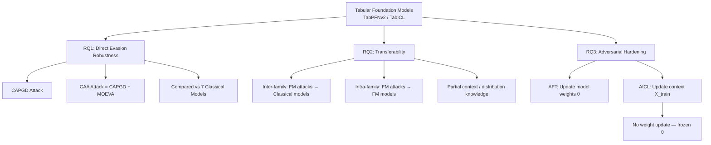
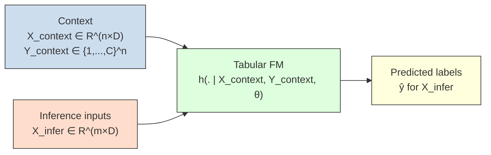
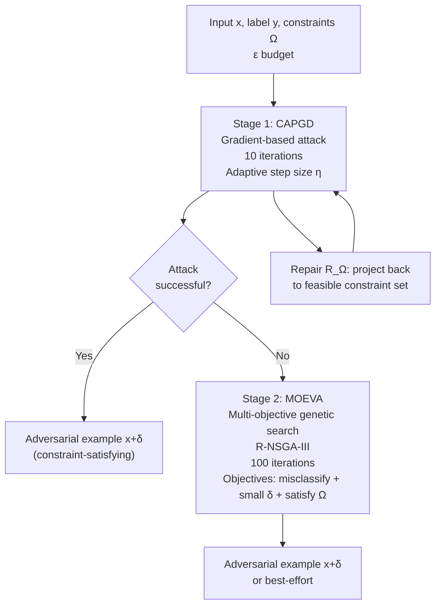
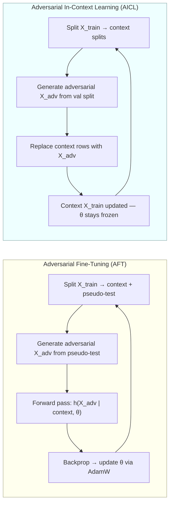
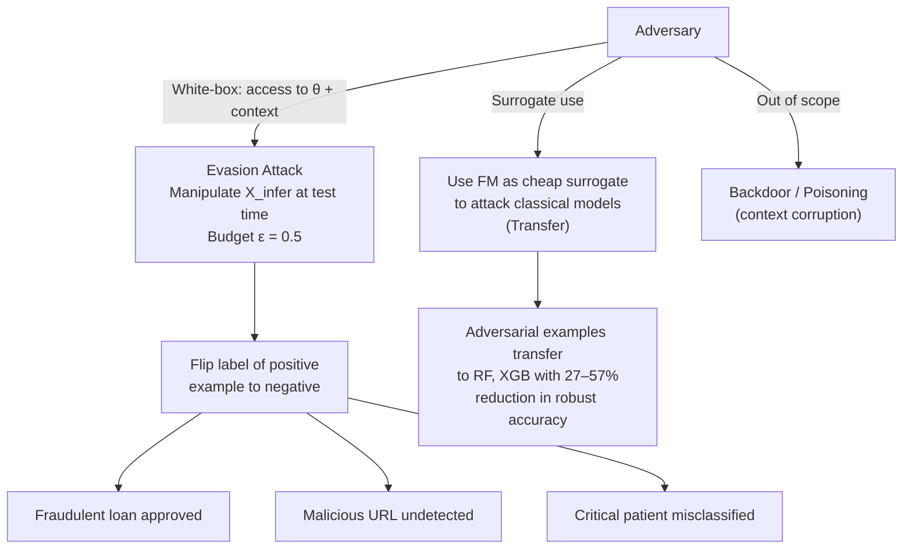
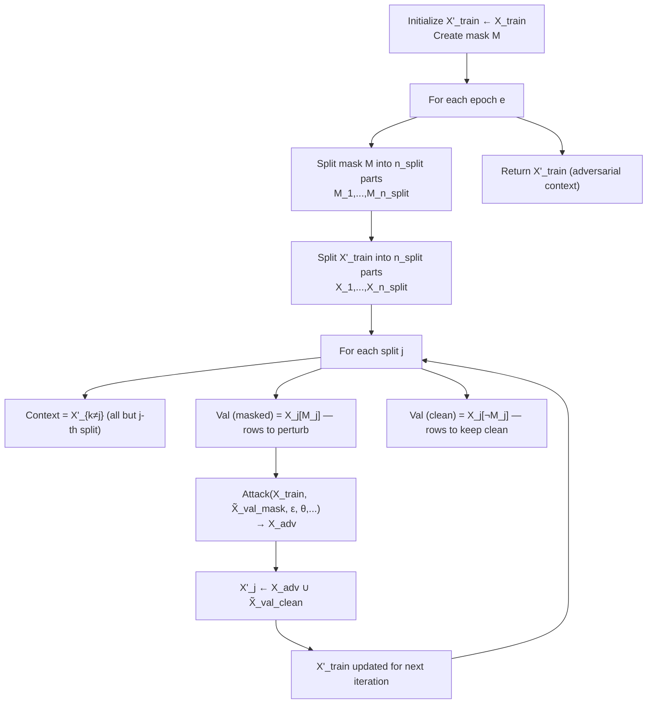
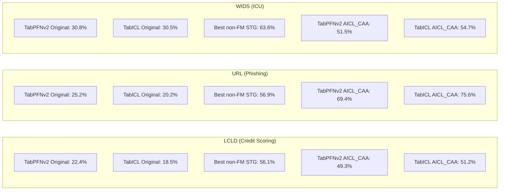

# Paper Review: On the Robustness of Tabular Foundation Models: Test-Time Attacks and In-Context Defenses

> **Reviewed:** 2026-06-09
> **Source:** `/home/nhatquang/Desktop/HCMUS Course/4. Taiwan MS Prep/14. Tabular ML Security/tabular_fm_robustness_djilani_2025.pdf`
> **Reviewer lens:** Senior Security Architect + Senior AI Researcher

---

## 1. Motivation — Why Should We Care?

Tabular machine learning underpins the most consequential automated decision-making systems in production today: credit scoring (loan approval/rejection), fraud detection, network intrusion detection, and patient triage in ICUs. These are not toy problems — errors propagate into denied loans, undetected fraud losses, and incorrect clinical interventions. The field has witnessed a new and rapidly-adopted paradigm: Tabular Foundation Models (FMs) such as TabPFNv2 and TabICL, which use in-context learning (ICL) to achieve strong zero-shot performance without per-task fine-tuning. Their pitch is compelling — drop in a context of labeled examples, and the model generalizes immediately to new inputs.

The gap this paper targets is real and important: nobody had systematically evaluated whether these FMs are robust to adversarial evasion attacks. This matters for two distinct threat surfaces. First, an adversary who knows the deployed FM (or can approximate it) can craft feature-space perturbations to flip classifications — a malicious URL that evades phishing detection, a crafted loan application that bypasses credit scoring, a manipulated ICU monitoring record. Second, because FMs are data-efficient surrogates (they need no training on the target task), they are attractive tools for building cheap black-box attack proxies against any downstream model.

Prior adversarial robustness work on tabular ML (notably the CAA benchmark from Simonetto et al. 2024, which the authors are themselves partially involved in) studied classical deep tabular models but explicitly excluded FMs. The authors close this gap. The motivation is well-founded and not oversold. The domains chosen — finance, cybersecurity, and healthcare — are precisely the domains where adversarial robustness is most operationally critical.

---

## 2. Proposal — What Do the Authors Propose and Why?

The paper makes three interlocking contributions: (1) a comprehensive empirical evaluation of TabPFNv2 and TabICL under state-of-the-art evasion attacks (CAPGD and CAA) compared to seven classical tabular models across three real-world benchmarks; (2) a transferability study that characterizes FMs as both attack targets and as surrogate models for crafting attacks against other architectures; and (3) Adversarial In-Context Learning (AICL), a novel hardening mechanism that, instead of updating model weights via adversarial fine-tuning (AFT), adversarially perturbs the context provided to the FM at inference time — exploiting the distinctive mechanism by which FMs make predictions.

The authors' choice of AICL over pure AFT is principled, not ad hoc. The core insight is that tabular FMs rely heavily on the interaction between the query input and the context (key/value embeddings in attention), meaning the context itself is a high-leverage lever for robustness. AFT modifies weights, but FMs were pre-trained on synthetic data with a fixed parameterization — weight updates may interfere with the learned universal representation. Updating the context instead is structurally aligned with how the model uses information. The authors further provide a convergence proof under five regularity assumptions, which lends theoretical grounding even if some assumptions are empirically questionable (the authors themselves flag this for Assumption 3 around smoothness).

The alternative of applying classical Madry adversarial training directly to weights is used as a baseline (AFT), and the comparison is honest: AICL outperforms AFT on most settings while maintaining competitive clean accuracy.

---

## 3. Method — How Does It Work?

### 3.1 Threat Model

The study adopts a white-box threat model: the adversary has full access to both model weights and the context. This is the strongest plausible attacker. The adversary's goal is an evasion attack — flip the prediction on a single input x in X_infer from the true positive class to negative, subject to a perturbation budget epsilon = 0.5 (L-inf or domain-constrained norm) and domain feasibility constraints (e.g., no negative salary, integer-only categorical features). The defender budget is epsilon = 0.3. The attacker has strictly more budget than the defender — a realistic worst-case framing.

Explicitly out-of-scope: backdoor attacks, poisoning attacks, and black-box-only attacks. The choice to restrict to evasion is reasonable for a first systematic study.

### 3.2 Attack Algorithms

Two attacks are used:

**CAPGD (Constrained Adaptive PGD):** An extension of standard PGD that handles tabular domain constraints. Given input x and label y, the update at step t+1 is:

```
x^(t+1) = R_Ω( Π_{x+δ}( x^t + η * sgn(∇_x L(θ_h, x^t, y)) ) )
```

where Π clips the perturbation to remain within the epsilon-ball, R_Ω is a repair operator that projects back into the feasible constraint set, and each constraint ω_i is converted to a differentiable penalty. The step size η is adaptive (using CAPGD's adaptive schedule).

**CAA (Constrained Adaptive Attack):** A two-stage pipeline that first runs CAPGD (gradient-based, fast) and then applies MOEVA (a multi-objective genetic search using R-NSGA-III) as a fallback for examples where CAPGD fails. MOEVA simultaneously minimizes: (a) prediction probability on true class, (b) perturbation magnitude, (c) constraint penalty. This combination provides state-of-the-art attack performance with constraint awareness.

An identity attack (clean data passed as-is) serves as control.

### 3.3 Adversarial Hardening

**AFT (Adversarial Fine-Tuning):** Adapts Madry training to the FM setting. The training context X_train is split into a pseudo-context and pseudo-test. Adversarial examples are generated on pseudo-test, used to compute loss, and backpropagated to update θ. Formally:

```
min_θ E_{(X_test, Y_test)~D} [ max_{δ∈Δ} L( h(X_test + δ | X_train, Y_train, θ), Y_test ) ]
```

The context is fixed; weights absorb the robustness.

**AICL (Adversarial In-Context Learning):** Keeps θ frozen. Instead, it adversarially updates the context X_train. The objective is:

```
min_{δ*∈Δ*} E_{(X_test, Y_test)~D} [ max_{δ∈Δ} L( h(X_test + δ | X_train + δ*, Y_train, θ), Y_test ) ]
```

Perturbations are injected into X_train (context features only, not labels). The algorithm uses the same splitting strategy as AFT: at each iteration j, a split of X_train becomes the current adversarial context while the remainder acts as held-out validation. An attack generates adversarial X_adv from the validation split, and this is used to replace the context rows incrementally. No gradient flows into θ. The perturbation is always applied to fresh clean X_test (not re-perturbed context), preventing compounding drift.

### 3.4 Experimental Setup

- **Models compared:** TabPFNv2 and TabICL (FMs); TabTransformer, TabNet, RLN, STG, VIME (deep tabular); XGBoost, RandomForest (tree-based) — 9 models total.
- **Datasets:** LCLD (credit scoring, 1.22M rows, 28 features, 80/20 imbalance), URL (phishing detection, 11,430 rows, 63 features, balanced), WIDS (ICU survival, 91,713 rows, 186 features, 91/8.6 imbalance). An additional HELOC dataset appears in the appendix.
- **Context size for FMs:** Subsampled to 10k max (5 seeds). TabPFNv2 context ≤ 10k rows; TabICL theoretically up to 500k but crashes beyond 10k in practice.
- **Metric:** Robust accuracy = recall on the positive class under adversarial inputs. This is equivalent to the fraction of positive examples the attacker fails to flip. Lower is worse for the defender.
- **Attack budget:** epsilon = 0.5 (attack), epsilon = 0.3 (defense). 10 CAPGD iterations + 100 MOEVA iterations for CAA by default.
- **Hardware:** 40-core server, 503GB RAM, 4x NVIDIA L40S (46GB VRAM). Total compute: ~459 GPU hours reported; full research estimated at ~3x that.

### Diagrams

**Diagram 1: Overall Study Architecture**


*Figure D1: The three research questions and their experimental branches in the paper.*

---

**Diagram 2: Tabular FM Inference Pipeline (In-Context Learning)**


*Figure D2: The ICL inference mechanism — context (labeled examples) and inference inputs both flow into the FM; no gradient update to θ at test time.*

---

**Diagram 3: CAA Attack Pipeline**


*Figure D3: The two-stage CAA attack — gradient descent first, evolutionary search as fallback.*

---

**Diagram 4: AFT vs AICL — Where Robustness Is Absorbed**


*Figure D4: AFT updates model weights; AICL updates only the context. AICL has no backpropagation through θ.*

---

**Diagram 5: Threat Model — Attack Surfaces on a Deployed Tabular FM**


*Figure D5: The attack surface taxonomy considered in the paper; bold paths are in-scope.*

---

**Diagram 6: AICL Algorithm Data Flow**


*Figure D6: AICL iteratively replaces subsets of the context with adversarially-perturbed versions, cycling through splits per epoch.*

---

**Diagram 7: Robust Accuracy Summary — Key Numbers**


*Figure D7: Key robust accuracy figures under CAA attack — FMs start severely weaker than the best classical model (STG) but AICL closes much of the gap.*

---

## 4. Strengths and Weaknesses

### Strengths

**S1. First systematic study of FM adversarial robustness on tabular data.**
No prior work had explicitly measured evasion robustness of TabPFNv2 or TabICL. The paper fills a clear gap, and the finding that FMs are often *more* vulnerable than tree-based models (e.g., TabPFNv2 robust accuracy on LCLD under CAA is 9.0% vs XGB's 35.7%) is both surprising and operationally important. The field needed this baseline.

**S2. Principled novel defense that exploits FM architecture.**
AICL is conceptually sound and architecturally motivated. It correctly identifies that the context is a unique attack surface and leverage point in ICL systems — one that does not exist in classical models. This insight generalizes: it opens a new design space for defenses in any retrieval-augmented or ICL-based system.

**S3. Convergence theorem for AICL.**
Providing Theorem 1 with a 5-assumption convergence proof, even an approximate one, elevates AICL above a pure heuristic. The detailed proof in Appendix H, with each lemma stated, is more rigorous than most defense papers of this type.

**S4. Comprehensive experimental coverage.**
Nine models, three (plus one appendix) datasets, five seeds, multiple hyperparameter ablations (epsilon, CAPGD iterations, MOEVA iterations, context size), both AFT and AICL, both inter- and intra-family transferability, and comparison against Madry-trained baselines. The experimental breadth is commendable and the compute cost is disclosed (459 GPU hours).

**S5. Honest about limitations and failures.**
The paper does not hide that: (a) AICL does not reach the best adversarially-trained non-FM models (STG at 81.5% vs AICL at ~51% on LCLD), (b) AFT sometimes *decreases* robustness compared to the original, and (c) LCLD is severely unbalanced which confounds recall-based evaluation. This is credibility-building, not cherry-picking.

**S6. Code and data released.**
A reproduction package on Figshare (https://figshare.com/projects/TabFM/249944) is provided. Source code at GitHub (serval-uni-lu/tabularbench_tabfm_aicl). This is the minimum bar but it is met.

**S7. Real-world constraints modeled.**
Using domain-constraint-aware attacks (CAPGD, CAA) with penalty functions over constraint sets is the correct approach for tabular data. Unconstrained L-inf attacks on tabular features are unrealistic; this paper gets that right.

---

### Weaknesses / Red Flags

**W1. Metric choice is non-standard and potentially misleading.**
The paper evaluates "robust accuracy" as *recall on the positive class under attack*. This is justified by arguing attackers target positive-class examples (e.g., fraudsters trying to get loans approved). However, this framing collapses all model performance into a single class recall under adversarial inputs. It ignores: (a) the cost of increased false positives from hardening, (b) AUROC degradation, and (c) the fact that for WIDS (91.4% negative class), "recall on positive class" may behave erratically. Table V shows full clean metrics (AUROC, MCC, F1, Recall, Precision) but there is no adversarial counterpart at the full-metric level. A defender who improves recall-under-attack by becoming more aggressive (always predicting positive) would look great on this metric. The paper does not demonstrate that AICL does not do exactly this.

**W2. Only three primary datasets — all from the same TabularBench benchmark.**
All three datasets (LCLD, URL, WIDS) are drawn from the TabularBench benchmark ([9]), which was created by the *same research group* (Simonetto et al., 2024 — which includes the same co-authors as this paper). The Figshare and GitHub repositories also originate from the same group. This is a significant conflict-of-interest risk. The datasets, constraints, attack configurations, and non-FM baselines are all defined in [9] by overlapping authors. An external dataset with independently defined constraints would have substantially strengthened the claims. HELOC is added in the appendix, but it has no constraint definitions and gets minimal treatment.

**W3. The hardening result is modest and the gap to classical models remains large.**
AICL on LCLD under CAA: TabPFNv2 improves from 9.0% to 41.2% robust accuracy. But STG (classical model, Madry-hardened) achieves 81.5% on the same benchmark. The paper's conclusion that "AICL is competitive with non-FM models" is misleading — it is competitive with *some* poorly-hardened non-FM models, not the best-hardened ones. For a practitioner deciding what model to deploy in a credit scoring adversarial environment, this paper provides evidence that hardened tree-based models still dominate.

**W4. White-box assumption overpowers practical realism in mixed ways.**
The threat model assumes full access to θ AND the context. In practice, an attacker deploying a financial fraud application would face a black-box API. The white-box results establish upper bounds on attacker capability, which is a principled choice. However, the transferability experiments show that partial context knowledge is often sufficient for effective attacks, which is the more operationally dangerous finding. This should be the *primary* threat framing, not an addendum in Section VII.

**W5. AICL convergence proof relies on Assumption 3 (smoothness) that the authors admit may fail.**
Assumption 3 requires that the empirical robust loss F(X') has an L-Lipschitz gradient. The authors explicitly state: "We observed empirically that the network is sometimes numerically unstable. These non-smooth steps break the strict theoretical guarantee." The convergence proof therefore holds only "in the regions where the gradient remains well-behaved." This is a substantial qualification that renders the theorem closer to an informal argument than a formal guarantee. The Lipschitz constant of dot-product self-attention is bounded (see Kim et al. [45] which they cite), but the claim is for the full composed forward pass including the feature tokenizer, which may have unbounded Lipschitz constant in practice.

**W6. No evaluation of clean accuracy degradation under adversarial attack budget mismatch.**
Table V shows clean metrics for hardened models, but only against the *same* epsilon used during training. There is no robustness evaluation against attacks with epsilon > 0.5 or attacks of a different type not seen during training (e.g., a model hardened against CAPGD and then attacked by MOEVA alone). This is relevant because the attacker is assumed to have a higher budget than the defender — if the attacker escalates epsilon beyond 0.5 against a model hardened at epsilon = 0.3, we have no data.

**W7. Context subsampling creates a distribution mismatch that is underexplored.**
TabPFNv2 and TabICL are limited to 10k context examples, but LCLD has 915k training examples. The authors subsample with 5 seeds and use the best MCC seed. This means the FM context is a tiny, potentially non-representative fraction of the training distribution. The authors note this may cause overfitting on small contexts but do not characterize how different seed-to-seed variance in context sampling interacts with robustness. The standard deviation figures in tables are small (±0.1–0.4 robust accuracy) but this only measures seed variance in the attack random state, not in context selection.

**W8. No ablation on what makes AICL work — context perturbation or just more adversarial data exposure.**
AICL improves robustness by injecting adversarial examples into the context. But is this because (a) the model learns to be robust from adversarial context patterns, (b) the adversarial context shifts the FM's implicit decision boundary, or (c) simply that the context now contains harder examples that regularize the implicit posterior? The paper does not isolate these mechanisms. An ablation comparing AICL against simply including random worst-case examples in the context (without the gradient-based attack) would clarify this.

---

## 5. Trustworthiness Assessment

| Dimension | Rating | Justification |
|---|---|---|
| Reproducibility | **Medium-High** | Code and data released on Figshare/GitHub; 5 seeds reported with standard deviations; compute cost disclosed; but all datasets and baselines come from the same group's prior benchmark, limiting independence of replication. |
| Evaluation rigor | **Medium** | Robust accuracy (recall on positive class) is a partial metric; no adversarial counterpart of AUROC/F1; the primary datasets are narrow (3, all from prior own benchmark); no out-of-distribution or cross-domain validation; statistical significance tests not reported (only standard deviations). |
| Novelty vs. incremental | **Medium-High** | AICL is a genuinely novel defense mechanism — updating context instead of weights is conceptually new in the tabular adversarial robustness space. The robustness evaluation itself is incremental (applying known attacks to a new model class) but is the necessary first step. The dual-role finding (FM as both target and surrogate) is a useful empirical contribution. |
| Practical deployability | **Medium** | AICL has similar compute cost to AFT (~7000s/run for TabPFNv2, per Table IX). However, FMs still significantly underperform hardened classical models (STG, XGB) on the most adversarially demanding benchmarks. A practitioner in finance or healthcare would need strong justification to prefer a hardened FM over a hardened XGBoost. Categorical features support is missing from the current adversarial framework. |
| Security posture | **Medium** | White-box threat model is well-defined and worst-case-appropriate. Domain constraints are modeled correctly. However: Assumption 3 (smoothness) undermines the convergence guarantee; no evaluation beyond the epsilon = 0.5 attack budget; no evaluation of adaptive attacks specifically designed against AICL (an attacker who knows AICL is deployed could craft perturbations that corrupt the adversarial context poisoning process); backdoor and poisoning threats are deferred. |
| Venue & author credibility | **Medium** | Currently an arXiv preprint (arXiv:2506.02978v2, submitted April 2026). Not yet peer-reviewed. Authors are from SnT / University of Luxembourg — a credible European security research center. Multiple co-authors (Simonetto, Ghamizi, Cordy, Papadakis) are the same team behind TabularBench [9] and CaFA [16] — established workers in the tabular adversarial ML space. The self-citation and self-benchmark overlap is a concern but the team has a track record. |

**Overall verdict.**

This is a worthwhile and timely paper that makes a genuine first contribution in a gap that needed filling: the adversarial robustness of tabular foundation models. The AICL defense is conceptually original, the empirical coverage is broad, and the authors are appropriately honest about the limits of their results. However, several concerns prevent this from being fully trusted at face value: the primary evaluation is on datasets from the authors' own prior benchmark (a closed loop that needs independent validation), the convergence proof rests on an assumption the authors themselves flag as empirically shaky, the primary metric (positive-class recall under attack) is incomplete and potentially gameable, and the hardened FMs still underperform the best classical adversarially-trained models by wide margins. Practitioners in high-stakes adversarial tabular settings (financial fraud, phishing detection, ICU triage) should treat this paper as establishing a credible lower bound on FM vulnerability and a promising new defense direction, but should not deploy AICL in production without independent evaluation on their own datasets with broader adversarial evaluation metrics. Researchers should cite it as a solid baseline study and use AICL as a starting point, not an endpoint. The paper would significantly benefit from peer review that demands: (1) evaluation on datasets with no author overlap, (2) an adaptive attack specifically crafted against AICL, and (3) adversarial versions of AUROC/F1 to complement recall.
