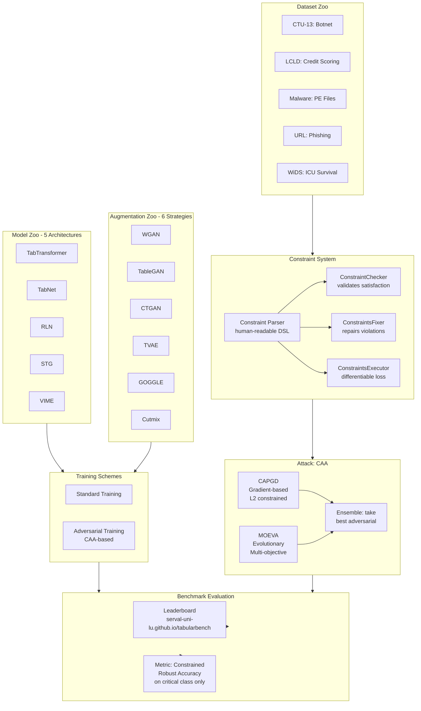
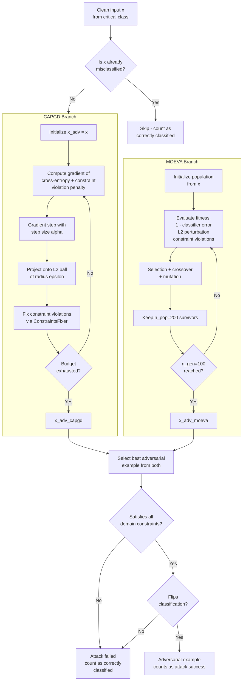
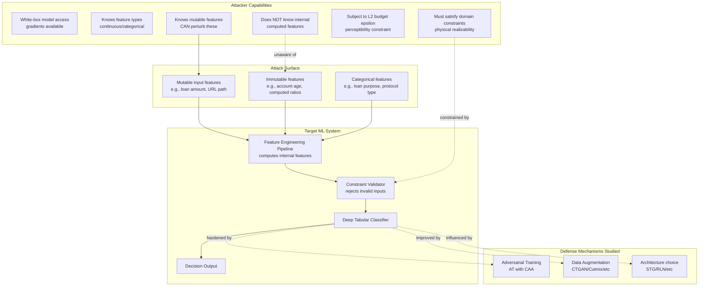
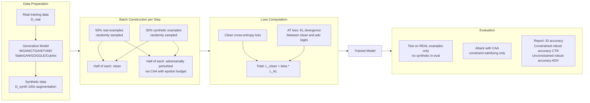
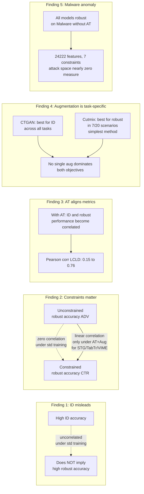

# Paper Review: TabularBench: Benchmarking Adversarial Robustness for Tabular Deep Learning in Real-world Use-cases

> **Reviewed:** 2026-06-09
> **Source:** `/home/nhatquang/Desktop/HCMUS Course/4. Taiwan MS Prep/14. Tabular ML Security/tabularbench_simonetto_2024.pdf`
> **Reviewer lens:** Senior Security Architect + Senior AI Researcher

---

## 1. Motivation — Why Should We Care?

Tabular data is the dominant data format in the highest-stakes ML deployments: credit scoring (approve or deny a loan), intrusion detection (block or allow network traffic), malware classification (quarantine or execute a binary), ICU triage (escalate or discharge a patient). These are not toy tasks. A model that fails under adversarial manipulation in any of these domains can produce direct, measurable harm — fraudsters evade detection, botnet traffic passes, malicious binaries execute, or sick patients go untreated.

Despite this criticality, the adversarial robustness literature has concentrated almost entirely on computer vision and, more recently, large language models. Mature benchmarks like RobustBench (Croce et al., 2020) and ARES (Dong et al., 2020) have standardized how CV models are compared under attack. No equivalent existed for tabular deep learning.

The gap is not merely a lack of benchmarks — it is a fundamental methodological problem. Tabular data has structural properties that invalidate naive application of CV-style adversarial attacks:

1. **Feature constraints**: Many features are immutable (set by internal systems, not observable by attackers), computed from other features (making arbitrary perturbation physically impossible), or bounded by domain logic (e.g., TCP/UDP max packet size is 1500 bytes). An adversarial example that violates these constraints is not a valid attack — it is a noise artifact that will be rejected by upstream validation or is literally unrealizable.
2. **Mixed feature types**: Categorical features cannot be perturbed with gradient steps. Most CV attack algorithms assume continuous, unconstrained pixel values.
3. **High class imbalance and heterogeneous feature scales**: Standard evaluation metrics and attack norms are not directly portable.

The direct consequence of ignoring (1) is that "high" robustness measurements obtained against unconstrained attacks are meaningless — as the paper demonstrates empirically, there is zero correlation between unconstrained robustness and constrained robustness under standard training. Practitioners selecting architectures or defenses based on unconstrained benchmarks will make systematically wrong choices.

The paper's motivation is legitimate, concrete, and well-supported. The gap it fills is real.

---

## 2. Proposal — What Do the Authors Propose and Why?

The authors propose **TabularBench**, a standardized benchmark for evaluating the adversarial robustness of tabular deep learning models under *constraint-satisfying* evasion attacks. The core contribution has four parts: (1) a curated Dataset Zoo of five real-world binary classification datasets with formally defined domain constraints; (2) a Model Zoo of over 200 pre-trained models across five architectures, six data augmentation strategies, and two training schemes (standard and adversarial); (3) a Python library with a clean API exposing datasets, pre-trained models, constraints, and the benchmark evaluation pipeline; and (4) an empirical analysis yielding actionable insights about which architectures, defense combinations, and augmentation strategies lead to genuine constrained robustness.

The attack used for evaluation is **Constrained Adaptive Attack (CAA)** (Simonetto et al., 2024 — a companion paper by the same first author), which combines CAPGD (a constrained variant of AutoPGD) and MOEVA (a genetic algorithm). The authors' justification for using CAA rather than simpler attacks is that it was previously shown to be the most effective constrained attack in the literature. This is principled: using the strongest known attack gives the most conservative (and thus most honest) robustness estimate.

The choice to focus exclusively on adversarial training (AT)-based defenses is explicitly motivated by citing Tramer et al. (2020) and Carlini (2023), who establish that only AT-based defenses remain robust under adaptive attacks — all other defenses fail when the attacker knows the defense. This is the correct framing, though the authors acknowledge it limits the scope of their defense evaluation.

The overall approach — benchmarking infrastructure first, then empirical analysis — mirrors the strategy that made RobustBench successful in CV. The analogy is direct and the reasoning is sound.

---

## 3. Method — How Does It Work?

### 3.1 Datasets

Five datasets are selected under four criteria: open source, real-world (no simulated data), binary classification, and with identifiable feature relationships/constraints. The datasets span finance, cybersecurity, and healthcare:

| Dataset | Domain | Size | Features | Constraints | Class Balance |
|---|---|---|---|---|---|
| CTU-13 | Botnet detection | 198,128 | 756 | 360 (linear) | 99.3/0.7 |
| LCLD | Credit scoring | 1,220,092 | 28 | 9 (3 linear, 7 non-linear) | 80/20 |
| Malware | PE classification | 17,584 | 24,222 | 7 | 45.5/54.5 |
| URL | Phishing detection | 11,430 | 63 | 14 (7 linear, 7 Boolean) | 50/50 |
| WiDS | ICU survival | 91,713 | 186 | 31 (linear) | 91.4/8.6 |

Constraints are expressed in a domain-specific natural language parsed by a custom **Constraint Parser** into machine-checkable relational objects. This is a practical contribution: constraint definitions are human-readable but computationally executable. A `ConstraintChecker` validates satisfaction; a `ConstraintsFixer` performs repair during attack generation; a `ConstraintsExecutor` computes differentiable constraint violation losses for gradient-based attacks.

The benchmark evaluates models on **only the critical class** (botnet traffic, rejected loans, malware, phishing URLs, non-surviving patients) from clean test examples. This is correct — evasion attacks are directional (adversary wants the classifier to misclassify the dangerous class as benign), and measuring robustness on both classes would dilute the signal.

### 3.2 Attack: Constrained Adaptive Attack (CAA)

CAA ensembles two sub-attacks:

**CAPGD** (Constrained AutoPGD): A projected gradient descent variant that maximizes classification error subject to:
- L2 distance ball of radius epsilon around the original input
- Constraint satisfaction via projection and penalty

The checkpoint schedule follows AutoPGD: $w_j = \lfloor p_j \times N_{iter} \rfloor \leq N_{iter}$, where $p_0 = 0$, $p_1 = 0.22$, and $p_{j+1} = p_j + \max(p_j - p_{j-1} - 0.03, 0.06)$. Step size $\alpha = 0.75$; step halving parameter $\rho = 0.75$. Default: $N_{iter} = 10$ gradient iterations, $M = 7$ step reduction checkpoints.

**MOEVA** (Multi-Objective EVolutionary Attack): A NSGA-II style genetic algorithm with three fitness objectives:
1. Maximize classifier's misclassification score
2. Minimize L2 perturbation magnitude
3. Minimize constraint violations

MOEVA runs $n_{gen} = 100$ generations, $n_{off} = 100$ offspring per generation, $n_{pop} = 200$ survivors per generation. The evolutionary component handles non-differentiable constraints natively (no gradient required), making it effective where CAPGD fails.

An adversarial example is considered successful if and only if it satisfies all domain constraints AND flips the classification. Unsuccessful adversarial examples (including constraint-violating ones) are treated as correctly classified, yielding a **conservative robustness metric**.

### 3.3 Architectures

Five deep tabular architectures are evaluated:

- **TabTransformer** (Huang et al., 2020): Self-attention over categorical feature embeddings; positional-embedding-style contextual representations.
- **TabNet** (Arik & Pfister, 2021): Sequential attention mechanism selecting which features to attend to at each step; sparse feature usage.
- **RLN** (Shavitt & Segal, 2018): Regularization learning network minimizing a counterfactual loss; creates very sparse neural networks.
- **STG** (Yamada et al., 2020): Stochastic gates for feature selection; probabilistic relaxation of the L0 norm.
- **VIME** (Yoon et al., 2020): Self-supervised pre-training via masked value imputation.

All five are competitive with XGBoost on clean ID performance (confirmed in Table 6, AUC differences < 0.02 on most datasets), satisfying the prerequisite for robustness comparison to be meaningful.

### 3.4 Data Augmentation Strategies

Six augmentation strategies are tested:

- **WGAN**: Wasserstein GAN; not tabular-specific; uses MinMax normalization + one-hot encoding.
- **TableGAN**: GAN with auxiliary classifier for semantic accuracy; MinMax normalization.
- **CTGAN**: Conditional GAN with training-by-sampling; mode-based normalization for continuous features.
- **TVAE**: Variational autoencoder variant of CTGAN; trained with ELBO loss.
- **GOGGLE**: Graph-based generative model learning relational structure via message-passing.
- **Cutmix**: Simple interpolation of feature rows within the same class; no generative model required.

Each dataset is augmented 100-fold (e.g., URL: 1,143,000 synthetic examples). During adversarial training, half the batch consists of real examples (half adversarially perturbed) and half synthetic examples (half adversarially perturbed).

### 3.5 Training Protocol

Two training schemes per architecture per augmentation:

1. **Standard training**: Cross-entropy on clean + synthetic examples.
2. **Adversarial training (AT)**: TRADES-style — minimize clean loss + beta * KL divergence between clean and adversarial logits, where adversarial examples are generated by CAA.

Models are fine-tuned to maximize cross-validation AUC (threshold-independent, handles class imbalance).

Total model count: 5 architectures × 7 augmentation conditions (6 + none) × 2 training schemes × 5 datasets = 350 model configurations; 5 random seeds per configuration → over 200 reported unique models on the leaderboard after excluding collapsed configurations.

---

### Diagrams

#### Diagram 1: TabularBench Overall System Architecture

*Full system: datasets with formal constraints feed the attack pipeline; models trained under various augmentation and AT schemes are evaluated on constrained robust accuracy and tracked on a live leaderboard.*

---

#### Diagram 2: CAA Attack Pipeline

*CAA attack pipeline: CAPGD (gradient) and MOEVA (evolutionary) run in parallel; only constraint-satisfying, classification-flipping examples count as successful attacks.*

---

#### Diagram 3: Threat Model for Tabular Adversarial Attacks

*Threat model: attacker has white-box access but is constrained to mutable features and must satisfy domain validity constraints; defenses focus on AT and augmentation.*

---

#### Diagram 4: Training Pipeline with Data Augmentation and AT

*Training pipeline: real and synthetic data are mixed; adversarial examples are generated on-the-fly; evaluation uses only real data to measure genuine generalization.*

---

#### Diagram 5: Key Empirical Findings Summary

*Summary of five key empirical findings; the constraint-awareness gap and the AT alignment effect are the most security-relevant results.*

---

## 4. Strengths and Weaknesses

### Strengths

**S1. First credible, comprehensive benchmark in the domain.** Before this work, no standardized evaluation existed for adversarial robustness of tabular DL models in constrained, real-world settings. The gap was real and consequential. TabularBench directly fills it with a scope that is hard to dismiss: 200+ models, 5 datasets, 5 architectures, 6 augmentation strategies, 2 training schemes.

**S2. Constraint-awareness is the central, differentiating contribution.** The demonstration that unconstrained robust accuracy is uncorrelated with constrained robust accuracy (under standard training) is the paper's most important empirical result. This invalidates a substantial body of prior work that measured "robustness" without constraint satisfaction. The proof is direct and quantitative (Table 10 shows Pearson correlations near zero or 0.15 under standard training, rising to 0.70–0.91 under AT).

**S3. Attack choice is principled and adversarially honest.** Using CAA — the strongest known constrained attack — gives conservative robustness estimates. The ensemble of gradient and evolutionary search covers both differentiable and non-differentiable parts of the constraint space. The treatment of failed attacks (constraint violations count as attack failures, not attack successes) is correct and conservative.

**S4. Open infrastructure with practical utility.** The GitHub release (MIT license), Dataset Zoo with automated downloading, Model Zoo with 200+ pre-trained models, and Python API with constraint DSL represent a genuine infrastructure contribution beyond the paper itself. The one-line `benchmark()` call for standardized evaluation reduces barrier to entry.

**S5. Reproducibility artifacts are thorough.** The appendix provides hyperparameter grids, hardware specs (32-core AMD EPYC 7H12 HPC cluster, 64 GB RAM per node), detailed dataset preprocessing descriptions, and generator training protocols. Results are averaged over 5 seeds with standard deviations reported. This is well above the median bar for ML papers.

**S6. Negative results are reported and analyzed.** The paper explicitly reports training collapses (MCC = 0 scenarios), investigates the cause (WGAN augmentation artifacts on CTU), performs KDE analysis and OOD classification tests to rule out distinguishable failure modes, and concludes that the collapse cannot be attributed to measurable distributional differences in the generated data. Negative results treated honestly.

**S7. Actionable practical guidance for security practitioners.** The conclusion that Cutmix (a trivially simple augmentation) often matches or outperforms complex GANs for robust performance, and that CTGAN is best for ID performance, gives concrete starting-point recommendations without overfitting to benchmark conditions.

---

### Weaknesses / Red Flags

**W1. Scope limited to binary classification only — a significant real-world gap.** The authors restrict to binary classification because "it is the only case where we identified public datasets with domain constraints." This is an honest acknowledgment, but it means the benchmark does not cover multi-class intrusion detection (e.g., classifying attack type), multi-class malware family identification, or multi-class medical diagnosis. In practice, many deployed systems are multi-class. The gap is explicitly flagged as future work, but it limits the benchmark's current applicability.

**W2. Single attack paradigm — CAA only.** CAA is the strongest known constrained tabular attack, but it is also the paper authors' own prior work. Evaluating exclusively against one's own attack introduces a potential blind spot: architectures and defenses are implicitly optimized relative to CAA's specific failure modes. A benchmark that includes alternative attack strategies (e.g., FENCE from Chernikova & Oprea 2022, cost-utility-aware attacks from Kireev et al. 2022) would be more adversarially complete. The authors acknowledge this but do not provide evidence that CAA dominates all alternatives on all datasets.

**W3. L2 norm only, with epsilon values not clearly tied to domain semantics.** The benchmark uses L2 distance with epsilon in {0.25, 1, 5} as default budget. The paper acknowledges (Section 5) that "imperceptibility varies by domain." But it never validates that L2 = 1 in the normalized LCLD feature space corresponds to a *realizable* credit application manipulation. For a security practitioner designing a defense, the relevant question is not "can the model resist perturbations within L2 ball of radius 1" but "what feature changes does this ball actually encompass?" This mapping is absent, making the epsilon choices potentially arbitrary. The appendix mentions L-inf support but no results are provided.

**W4. Malware dataset result is anomalous and underexplained.** All models achieve near-perfect constrained robustness on Malware without adversarial training. The paper attributes this to the very high feature dimensionality (24,222 features) and the 7 constraints covering most features, leaving an attack space of near-zero measure. This may be true, but it is also consistent with the possibility that the constraint set is over-specified (too restrictive), that the test set lacks diversity in the critical class, or that the 17,584-sample dataset is too small to train models that generalize in ways an attacker can exploit differently. The anomaly deserves deeper investigation; instead it is reported and the dataset is excluded from further augmentation analysis.

**W5. Augmentation training-time cost is not reported.** The paper generates 100x synthetic augmentation for each dataset (e.g., 1,143,000 synthetic URL examples). Training with adversarial examples (CAA) at this scale on a 128-core HPC cluster is expensive. No wall-clock training times are reported. For practitioners outside HPC environments (the majority of security teams), the practical cost of replicating the AT+Augmentation configurations is unknown and potentially prohibitive. This is a meaningful practical deployability gap.

**W6. No baseline comparison to gradient boosted trees under adversarial attack.** XGBoost is confirmed to match DL models on clean ID performance (Table 6). But no robust accuracy figures are reported for XGBoost under CAA attack with constraints. Given that the paper's stated motivation includes deploying DL models for tabular data, demonstrating that DL under AT actually *outperforms* the XGBoost baseline in robustness (not just ID accuracy) would be the strongest possible argument. This baseline is missing.

**W7. Confidence interval analysis is shallow in the main paper.** Standard deviations over 5 seeds are reported in Table 9 (detailed appendix), but the main paper tables (e.g., Table 3) report only point estimates in the "XX/YY" format without uncertainty. The STG architecture on LCLD under AT goes from 0/63.0% to 0/63.0% — a wide variance range — but without formal significance tests across architectures, the claim that specific architectures "are better" is not statistically demonstrated.

**W8. Self-citation circularity: benchmark evaluates itself.** TabularBench evaluates robustness using CAA (Simonetto et al., 2024), which is a companion paper by the same first author. While both papers are independent contributions, using one's own attack as the *sole* evaluation criterion in a benchmark creates an incentive misalignment: future improvements to CAA (by the same group) would simultaneously improve the attack and potentially reveal vulnerabilities in defenses that were "safe" under previous CAA iterations. An independent second evaluator is absent.

**W9. No adversarial transferability analysis.** The benchmark evaluates white-box robustness exclusively. In deployed security systems (fraud detection, botnet detection), the attacker typically does not have gradient access to the production model — they query it or use surrogate models. Black-box transferability of adversarial tabular examples across architectures is not studied. Whether a Malware adversarial example crafted against STG transfers to TabNet is unknown. This limits the threat model's realism for high-assurance deployment settings.

**W10. WiDS dataset has a restrictive license (PhysioNet Restricted Health Data License 1.5.0)** requiring user registration. This partially undermines the "fully open" claim and creates a reproducibility barrier for some institutions. The paper mentions this only in a footnote.

---

## 5. Trustworthiness Assessment

| Dimension | Rating | Justification |
|---|---|---|
| Reproducibility | **High** | Code and all 200+ pre-trained models released under MIT license; 5-seed averaging with std deviations; detailed hyperparameter grids and hardware specs in appendix; one-line benchmark API. WiDS license restriction is a minor caveat. |
| Evaluation rigor | **Medium** | Pearson correlations and per-seed stds are reported; evaluation metric (constrained robust accuracy on critical class only) is well-motivated. However, no statistical significance tests across architectures, L2 epsilon semantics are not validated against domain realism, and the single-attack-source limitation weakens the "strongest known attack" claim. |
| Novelty vs. incremental | **Medium-High** | The first constrained adversarial robustness benchmark for tabular DL is genuinely novel. The core methodological components (AT, CAA, GAN augmentations) are assembled from prior work. The novelty is in the infrastructure, constraint modeling DSL, and the systematic empirical study — which is valuable even if not algorithmically new. |
| Practical deployability | **Medium** | Dataset Zoo and Model Zoo with API are excellent. However, HPC-scale compute for AT+Augmentation training is not portable to most security teams. Binary classification only and L2-only norms limit direct applicability. The constraint DSL is expressive but requires manual domain expertise to write. |
| Security posture | **Medium** | White-box constraint-satisfying evaluation is the right direction. Adaptive attack (CAA) is used correctly. Critical weaknesses: no black-box/transfer attack analysis, no adaptive attacker who learns the defense, no poisoning or backdoor threat model, and no evaluation of inference-time detection defenses. The threat model covers one important slice of the adversarial landscape. |
| Venue & author credibility | **Medium** | arXiv preprint (August 2024), under review at time of writing. University of Luxembourg + LIST/RIKEN AIP. Simonetto is first author on the companion CAA paper as well; Ghamizi and Cordy have prior work on adversarial tabular ML (Ghamizi et al., 2020). The group is credible but not among the top-cited adversarial ML labs. The preprint status means no peer-reviewed acceptance signal is available yet. |

**Overall verdict.** TabularBench is a legitimate and timely infrastructure contribution that fills a real gap. The central empirical finding — that unconstrained robustness measurements are uncorrelated with constrained robustness under standard training — is important and well-supported, and should prompt re-evaluation of prior tabular robustness claims. The code, datasets, and model zoo are useful for the community. That said, the paper should not be treated as a definitive benchmark: it covers binary classification only, uses a single attack algorithm authored by the same group, omits black-box and transfer attack scenarios, does not benchmark XGBoost robustness as a baseline, and does not validate that its L2 perturbation budgets are semantically meaningful in the feature spaces studied. I would cite it with caveats as the current best reference for constrained tabular robustness evaluation, build on the infrastructure cautiously (especially for multi-class or continuous-valued feature spaces), and treat its architecture/defense ranking findings as preliminary hypotheses requiring independent replication rather than settled conclusions.
